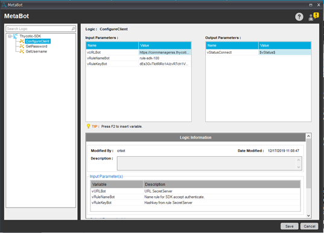
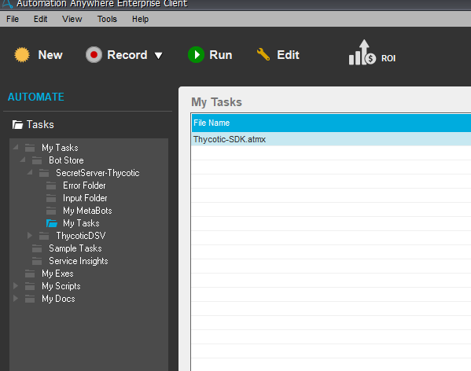
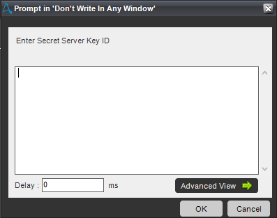
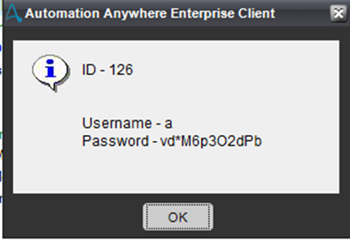

[title]: # (Retrieving a Secret UserID and Password)
[tags]: # (retrieving, secret userid)
[priority]: # (103)
# Retrieving a Secret UserID and Password

1. Configure the connection information for your Thycotic Server in the MetaBot Designer.

   
1. Run the provided Automation Anywhere Task File (Thycotic-SDK.atmx) in the Enterprise Client.

   
1. In the window prompt, enter in a Secret Server Key ID.

   
1. Secret Server will return the username and Password for the Secret ID.

   