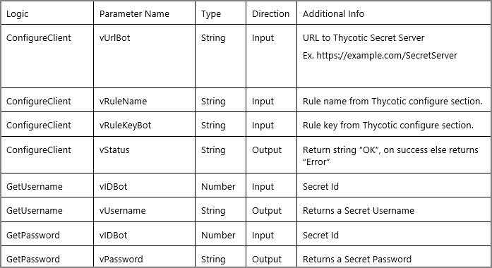

[title]: # (Implementation Considerations)
[tags]: # (introduction)
[priority]: # (11)
# Implementation Considerations

The provided .mbot file contains 3 logic assets that can be called form a Task Solution in Automation Anywhere.

* ConfigureClient - connects to the secret server, obtains an authorization token and fills in the secret structure.
* GetUsername - returns username field from structure for the secret Id.
* GetPassword – returns password field from structure for the secret Id.

Below is a list of available Inputs and Outputs:

   