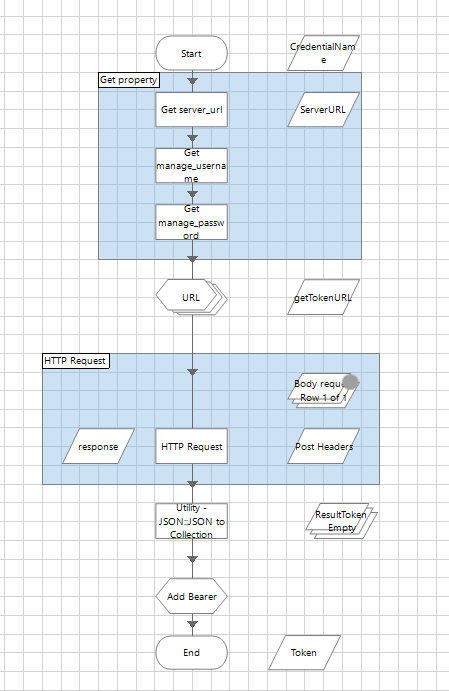
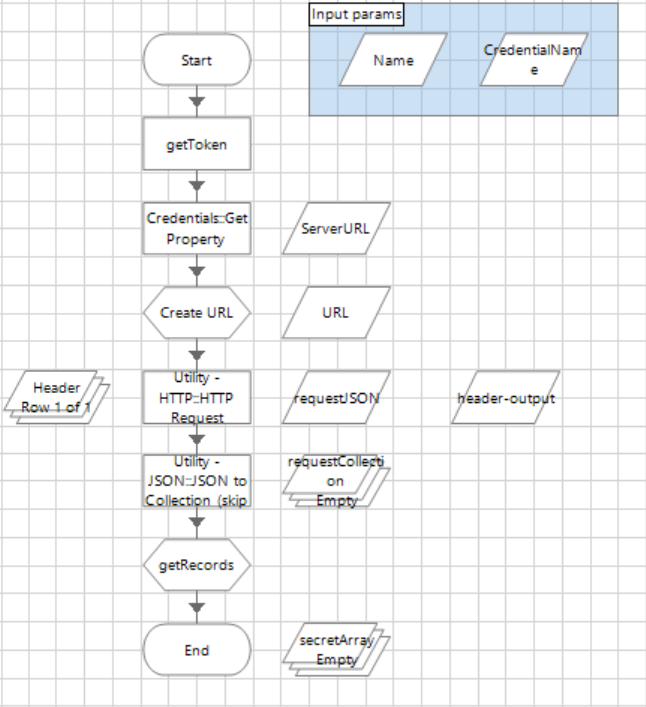
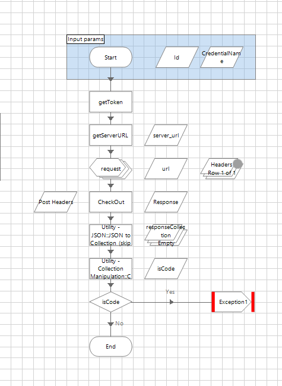

[title]: # (Implementation Considerations)
[tags]: # (introduction)
[priority]: # (103)
# Implementation Considerations

Blue Prism Visual Business Object Studio allows you to call Thycotic Secret
Server REST APIs. You can find additional information regarding the available
APIs [here](https://updates.thycotic.net/secretserver/restapiguide/TokenAuth).
Some common examples are included below.

## GetToken

Implements retrieve an access token for use with other API requests [API
OAuth2](https://updates.thycotic.net/secretserver/restapiguide/OAuth/)

*REST API URL* /oauth2/token

_Input params_

CredentialName credential name where store access params

property username access params store in the credential vault Blue Prism

property password access params store in the credential vault Blue Prism

property server_url access params store in the credential vault Blue Prism

*Output params* string Token authenticate Bearer token

_Example_

```
bearer
gLv3yXL4uf2g004_JfNwqcKciSB30JJ9aXFiAJGzdqpeQrYtIiZ2vbiIkag0bVMQ6Ic-v2r4ugpcKfW2wCpLWia3Gh0uwYDjoFeFpQ-DZFzz56TNptwud8WWM6S2YVBzYVCek_5QevLpHar897vl-iSHUlM4nYd4YcyGwIdhtiy_pEb-UaAXfjXN8aJcxNGuvHb0aZ5DjPIJH6ynKlImoRGKd2A897z3fdesAxcBpcUjDfBcRx-Q7eSOcykKxFUfsJrcpgWJHdhz5xzxvB2kERsLVxBVcn_FE3JMRyprA4DiSFYEsf1KIKEBql57MpC8zyj2tPg1sS0Zp-mH6ZERIIn9JqjIwixfMxZeSUxQ4677ffZVLgjWrGcjnnuqAXDmqARt_3uTljMVMoXXqut9BToJXG8AY7wjW0z29HH6D70vZ3s70bPozAEu8k6oK8f0EsSFoUhjEwI7T3oGdRNNWNhncGp4VHqtxUYqw-EnaUY2PPq2hub10hQ1UODDyoE0j8CrVgZXDChlKKjljNtdEAavw-mawqbjo7t7KUmFVO0GGjnYun_9rR6WG2ZlM5z200
````

__Scheme__

   

## GetIdByName

This method searches for a Secret ID using a Secret name field (string value)

*REST API
URL* /api/v1/secrets?filter.searchField=name&filter.searchText=\<search name\>

_Input params_

`<secret name>` search value, secret name string

CredentialName credential name where store access params

property username access params store in the credential vault Blue Prism

property password access params store in the credential vault Blue Prism

property server_url access params store in the credential vault Blue Prism

*Output params* collection Secret Model, where key collection ID secret.

__Scheme__

   

## GetIdByNameAndTemplate

This method searches for a Secret ID using Secret Name and Template ID

*REST API
URL* /api/v1/secrets?filter.searchField=name&filter.secretTemplateId=\<templateID\>&filter.searchText=\<search
name\>

_Input params_

\<secret name\> search value, secret name string

\<TemplateID\> restricted template for search, number TemplateID

CredentialName credential name where store access params

property username access params store in the credential vault Blue Prism

property password access params store in the credential vault Blue Prism

property server_url access params store in the credential vault Blue Prism

*Output params* collection Secret Model, where key collection ID secret.

__Scheme__

   

## GetUsernameById

This method retrieves the current password from a secret using an ID

*REST API URL* "/api/v1/secrets/\<secretid\>"

*Input params*

`<secret ID>` secret ID value number

CredentialName credential name where store access params

property username access params store in the credential vault Blue Prism

property password access params store in the credential vault Blue Prism

property server_url access params store in the credential vault Blue Prism

*Output params* username string field from secret

*Exception* - if secret is in checkOut status, throws an exception and returns
an error code

__Scheme__

   

## GetPasswordById

This method retrieves the current password from a secret an ID.

*REST API URL* "/api/v1/secrets/\<secretid\>"

*Input params*

`<secret ID>` secret ID value number

CredentialName credential name where store access params

property username access params store in the credential vault Blue Prism

property password access params store in the credential vault Blue Prism

property server_url access params store in the credential vault Blue Prism

*Output params* password invisible string password

*Exception* - if secret is in checkOut status, throws an exception and returns
an error code

__Scheme__ 

   

## Check-Out

This method checks out a secret

*REST API URL* /api/v1/secrets/\<ID\>/check-out

*Input params*

\<ID\> ID secret for operation, ID number

CredentialName credential name where store access params

property username access params store in the credential vault Blue Prism

property password access params store in the credential vault Blue Prism

property server_url access params store in the credential vault Blue Prism

*Output params* - none

*Exception* - if request returns error code, throws an exception

__Scheme__

   

## Check-In

This method checks out a secret

*REST API URL* /api/v1/secrets/\<ID\>/check-in

*Input params*

`<ID>` ID secret for operation, ID number

CredentialName credential name where store access params

property username access params store in the credential vault Blue Prism

property password access params store in the credential vault Blue Prism

property server_url access params store in the credential vault Blue Prism

*Output params* - none

*Exception* - if request returns error code, throws an exception

__Scheme__

   