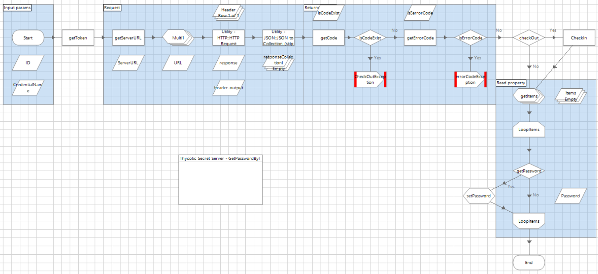

[title]: # (Check-Out)
[tags]: # (checkout)
[priority]: # (206)
# Check-Out

This method checks out a secret

*REST API URL* /api/v1/secrets/\<ID\>/check-out

*Input params*

`<ID>` ID secret for operation, ID number

   * __CredentialName__: Credential name where the store accesses the parameters.

   * __Property username__: Accesses parameters store in the credential vault for Blue Prism

   * __Property password__: Accesses parameters store in the credential vault for Blue Prism

   * __Property server_url__: Accesses parameters store in the credential vault for Blue Prism

Please see the settings below for the output parameters:

   * _Exception_: if request returns error code, throws an exception

__Scheme__

   