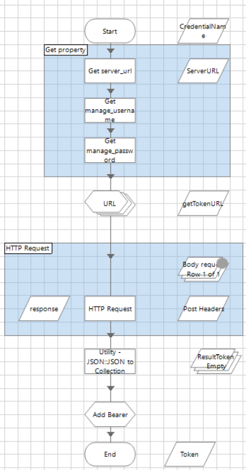

[title]: # (GetIdByName)
[tags]: # (getidbyname)
[priority]: # (202)
# GetIdByName

This method searches for a Secret ID using the Secret name field (string value)

*REST API
URL* /api/v1/secrets?filter.searchField=name&filter.searchText=\<search name\>

Please see the settings below for the input parameters:

`<secret name>` search value, secret name string

   * __CredentialName__: Credential name where the store accesses the parameters.

   * __Property username__: Accesses parameters store in the credential vault for Blue Prism

   * __Property password__: Accesses parameters store in the credential vault for Blue Prism

   * __Property server_url__: Accesses parameters store in the credential vault for Blue Prism

Please see the settings below for the output parameters:

   * __Collection Secret Model__: where key collection ID secret.

__Scheme__

   
