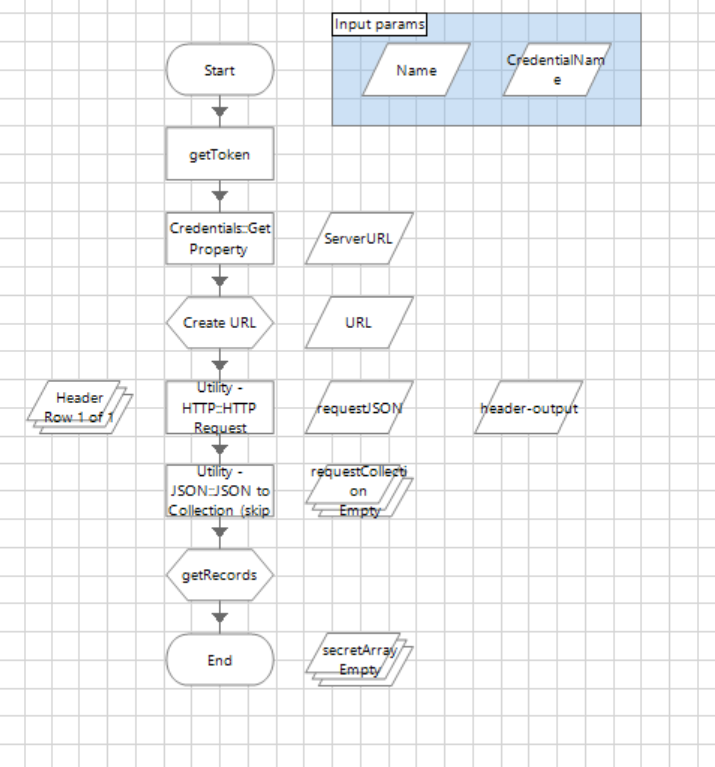

[title]: # (GetUsernameById)
[tags]: # (getusernamebyid)
[priority]: # (204)
# GetUsernameById

This method retrieves the current password from a secret using an ID.

*REST API URL* "/api/v1/secrets/\<secretid\>"

Please see the settings below for the input parameters:

`<secret ID>` secret ID value number

   * __CredentialName__: Credential name where the store accesses the parameters.

   * __Property username__: Accesses parameters store in the credential vault for Blue Prism

   * __Property password__: Accesses parameters store in the credential vault for Blue Prism

   * __Property server_url__: Accesses parameters store in the credential vault for Blue Prism

Please see the settings below for the output parameters:

   * Username string field from the secret

   * _Exception_:  if secret is in checkOut status, throws an exception and returns an error code

__Scheme__

   