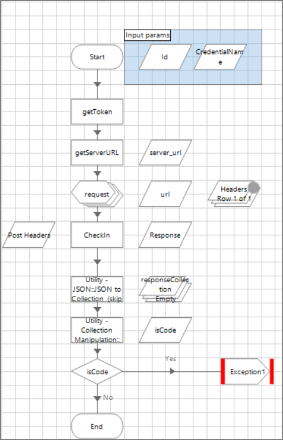

[title]: # (Implementation Considerations)
[tags]: # (introduction)
[priority]: # (104)
# Implementation example

Executing an automated process on a Blue Prism Runtime
Resource**

The VBO LoginAgent allows a process to operate under the context of the logged in user and provides access to all local applications and network resources that
it may need.

   

More detailed information regarding Login Agent can be found
[here](ehttps://usermanual.wiki/Pdf/Blue20Prism20User20Guide2020Login20Agent.779174028/html).

1.  Should Ctrl-Alt-Del be sent [SAS]?

2.  Get target host name [Get hostname]

3.  Retrieve Windows Account ID from Secret Server corresponding to host name
    [GetIdByNameAndTemplate] filtered by Windows Account TemplateID=6003)

4.  If more than 1 ID returned, trigger exception [Multi result]

5.  Retrieve username from Secret [GetUsernameById]

6.  Retrieve password from Secret [GetPasswordById]

7.  Log in to resource [Log In].
