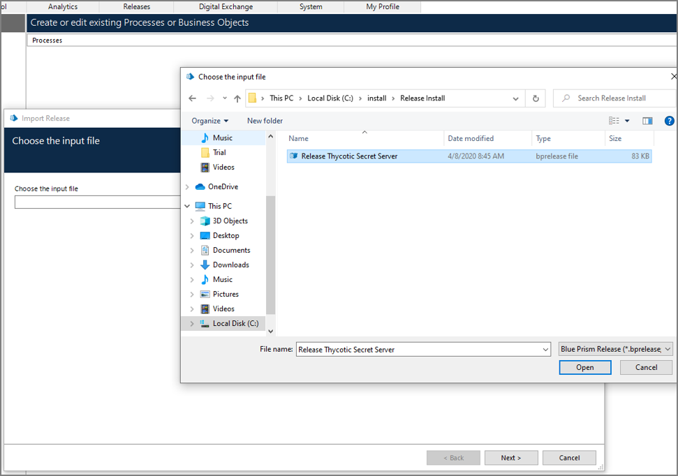
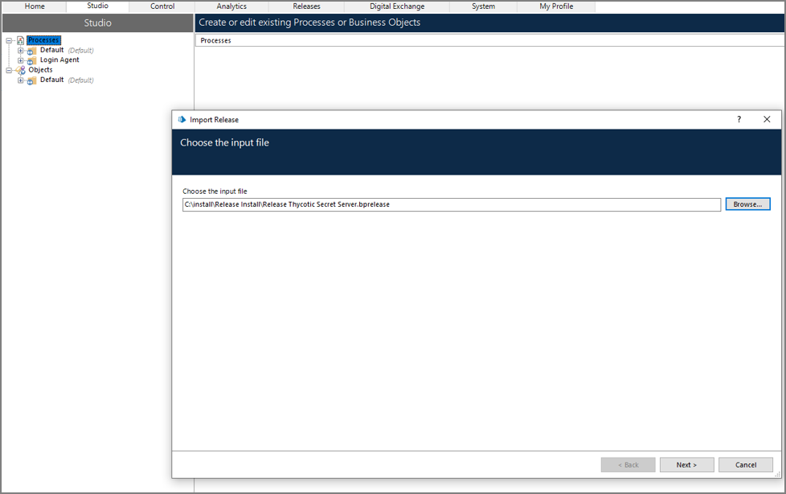
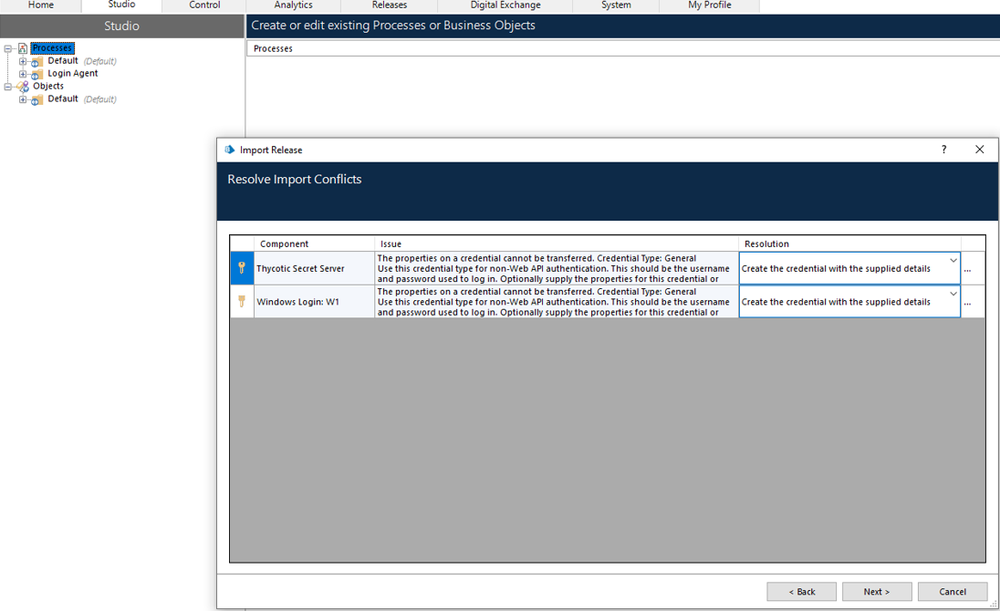
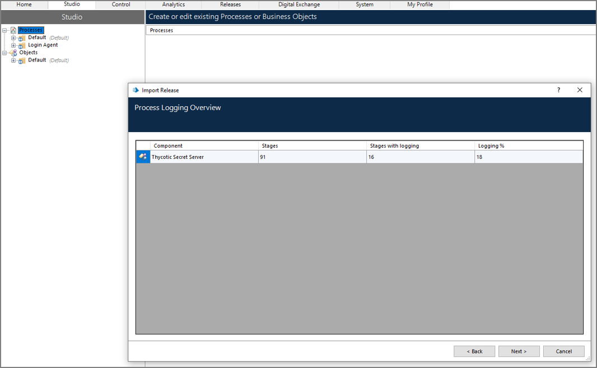
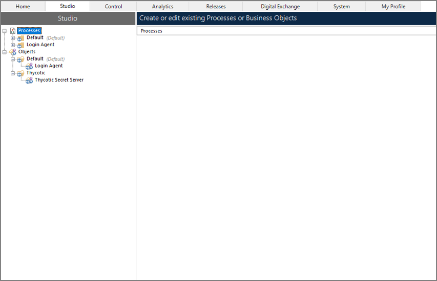

[title]: # (Import the Thycotic Secret Server Integration)
[tags]: # (install)
[priority]: # (101)
# Import the Thycotic Secret Server Integration

1. In order to connect Secret Server with BluePrism, the package “Release Thycotic Server.bprelease” must be present on the BluePrism host. Please click [here](https://thy.center/ssi/link/SSBluePrism) to download the package for Blue Prism.

1. In BluePrism, select __Import__ and choose the Thycotic integration as the input file.

   

1. Confirm the input file is __Release Thycotic Secret Server.bprelease__ and click __Next__.

   

1. On the Resolve Import Conflicts page, confirm that the Resolution is __Create the credential with the supplied details__ and click __Next__.

   

1. On the Process Logging Overview page, click __Next__.

   

1. The package import should now be complete.

   