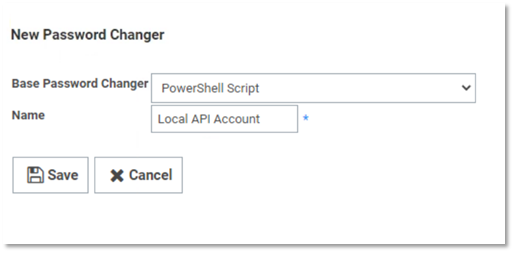
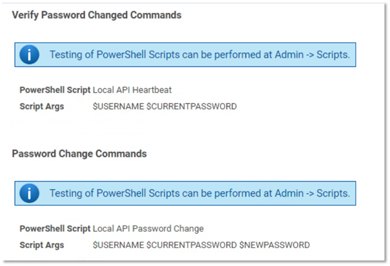
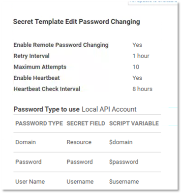
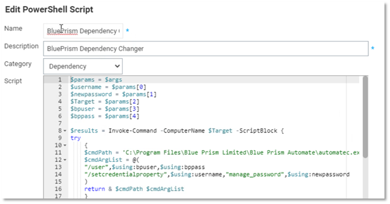
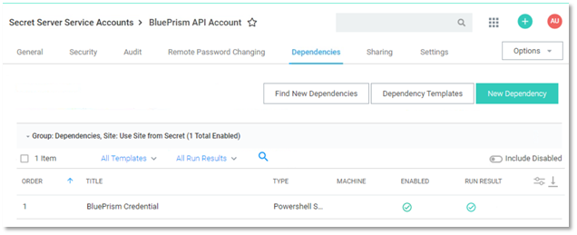
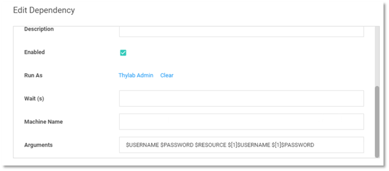

[title]: # (How to Rotate the BluePrism API Account)
[tags]: # (api aaccount)
[priority]: # (301)
# How to Rotate the BluePrism API Account

## Step 1

The first step is to enable local API account rotation for an application account that is stored within Secret Server.

1. Create a custom remote password changer.

   
   

__Heartbeat Script__

   ``` 
$params = $args
$username = $params[0]
$password = $params[1]
$resturl = "https://<Secret Server Address>/api/v1"
$tokenurl = "https://<Secret Server Address>/oauth2/token"

try
{
    $creds = @{
        username = $username
        password = $password
        grant_type = "password"
    }

    $token = ""
    $token = $response.access_token;
    if($response = Invoke-RestMethod $tokenurl -Method Post -Body $creds)
    {
    Write-Host $response
    try
    {
    $token = $response.access_token;
    $headers = New-Object "System.Collections.Generic.Dictionary[[String],[String]]"
    $headers.Add("Authorization", "Bearer $token")
    $tokenreturn = Invoke-RestMethod $resturl/oauth-expiration -Method Post -Headers $headers
    }
    catch
    {
        throw $("Error Details: " + $_)
    }
        return $true
    }
    catch
    {
        throw $("Error Details: " + $_)
    }
    else 
    {
        throw $("Error Details: " + $_)
    }

}
catch [System.Net.WebException]
{
    Write-Host "----- Exception -----"
    Write-Host  $_.Exception
    Write-Host  $_.Exception.Response.StatusCode
    Write-Host  $_.Exception.Response.StatusDescription
    $result = $_.Exception.Response.GetResponseStream()
    $reader = New-Object System.IO.StreamReader($result)
    $reader.BaseStream.Position = 0
    $reader.DiscardBufferedData()
    $responseBody = $reader.ReadToEnd() | ConvertFrom-Json
    Write-Host  $responseBody.errorCode " - " $responseBody.message
    foreach($modelState in $responseBody.modelState)
    {
        $modelState
    }
}


   ```

__Password Changing Script__

   ```

$params = $args
$username = $params[0]
$password = $params[1]
$newpassword = $params[2]
$resturl = "https://<Secret Server Address>/api/v1"
$tokenurl = "https://<Secret Server Address>/oauth2/token"

try
{
    $creds = @{
        username = $username
        password = $password
        grant_type = "password"
    }

    $userpassargs = @{
        currentPassword = $password
        newPassword = $newpassword
    }

    $token = ""
    $token = $response.access_token;
    if($response = Invoke-RestMethod $tokenurl -Method Post -Body $creds)
    {
    try
    {
    $token = $response.access_token;
    Write-Host $token
    $headers = New-Object "System.Collections.Generic.Dictionary[[String],[String]]"
    $headers.Add("Authorization", "Bearer $token")
    $changepw = Invoke-RestMethod $resturl/users/change-password -Method Post -Headers $headers -Body $userpassargs
    $tokenexpire = Invoke-RestMethod $resturl/oauth-expiration -Method Post -Headers $headers
    }
    catch
    {
        throw $("Error Details: " + $_)
    }
        return $true
    }
    catch
    {
        throw $("Error Details: " + $_)
    }
    else 
    {
        throw $("Error Details: " + $_)
    }
}
catch [System.Net.WebException]
{
    Write-Host "----- Exception -----"
    Write-Host  $_.Exception
    Write-Host  $_.Exception.Response.StatusCode
    Write-Host  $_.Exception.Response.StatusDescription
    $result = $_.Exception.Response.GetResponseStream()
    $reader = New-Object System.IO.StreamReader($result)
    $reader.BaseStream.Position = 0
    $reader.DiscardBufferedData()
    $responseBody = $reader.ReadToEnd() | ConvertFrom-Json
    Write-Host  $responseBody.errorCode " - " $responseBody.message
    foreach($modelState in $responseBody.modelState)
    {
        $modelState
    }
}


   ```

## Step 2

1. Create a Secret Template for the Local API account.

   >**Note:** This template is the same as the “Password” default template, but with the Local API Password Changer identified in Step 1 added to it as its password changing mechanism.

   
1. The template will need a __resource__,__target__ or __Host__ field to identify the location of the BluePrism server.

## Step 3

1. Create a __dependency changer for BluePrism__. This remotely invokes AutomateC from BluePrism in order to set the credential property to the new password for the Secret.

   

__Dependency Script__

   ```

   $params = $args
   $username = $params[0]
   $newpassword = $params[1]
   $Target = $params[2]
   $bpuser = $params[3]
   $bppass = $params[4]

   $results = Invoke-Command -ComputerName $Target -ScriptBlock {
   try
    {
    $cmdPath = 'C:\Program Files\Blue Prism Limited\Blue Prism Automate\automatec.exe' 
    $cmdArgList = @( 
    "/user",$using:bpuser,$using:bppass
    "/setcredentialproperty",$using:username,"manage_password",$using:newpassword
    ) 
        return & $cmdPath $cmdArgList
    }
    catch
    {     
        Write-Debug $("Error Details: " + $_)
        return
    }   
    else 
    {
       Write-Debug $("Error Details: " + $_)
       return
    }
    }
    if($results -eq "Successfully set credential property")
    {
    Write-Debug "Succesful dependency update"
    return
    }
    else
    {
    throw $results
    }

   ```

   

BluePrism Credential dependency settings are shown below.

   

   >**Note:** A dependency will need to be created for each BluePrism server.
