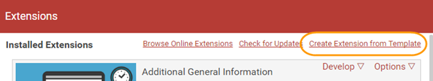

[title]: # (Create an Extension)
[tags]: # (extension)
[priority]: # (103)
# Create an Extension

1. Open the __Extensions page__.
1. Click __Create Extension from Template__.

   
1. Click the __Helper Template__.
1. Click __Clone | Install__.
1. Your cloned extension will be automatically installed and listed on your Extensions page.

   
