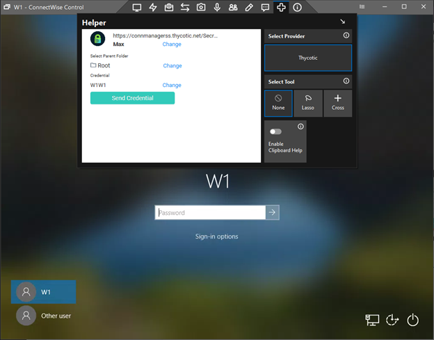

[title]: # (Configuration)
[tags]: # (introduction)
[priority]: # (100)
# Configuration

## Installing Thycotic Helper Extension (beta) for ConnectWise Control

Thycotic has developed an extension for ConnectWise Control. The extension is located inside the Helper Window of the the ScreenConnect client.

   

The extension provides the following features:

* Users can connect to a Secret Server instance
* Users can search and select folders
* Users can search and select secrets located within a folder
* Users can pass the userid/password (and domain) to the Connected Machine

Please see the following sections in order to configure Connectwise Control.

   * [Installing Thycotic’s Helper Extension](installing-thycotics-helper-extension)
   * [Install the Developer Extension](install-the-extension-developer-extension.md)
   * [Create an Extension](create-extension.md)
   * [Edit an Extension](edit-extension.md)
   * [Using Thycotic’s Helper Extension](using-thycotics-helper-extension.md)
