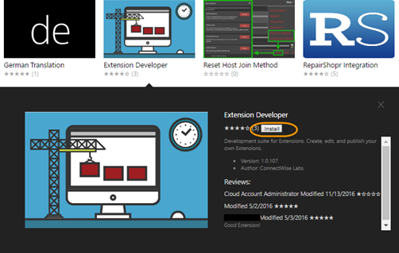

[title]: # (Install the Developer Extension)
[tags]: # (developer, extension)
[priority]: # (102)
# Install the Developer Extension

Before you can create an extension, you will need to download the Extension Developer extension. This extension contains the tools necessary to create, edit, and publish extensions.

1. Navigate to the __Administration | Extensions page__.
1. Click the __Browse Online Extensions links__.
1. Click __Browse Online Extensions to open the Extension Marketplace__.
1. Install the __Extension Developer__.
1. To find the Extension Developer extension, Click the __thumbnail__ and then click the __Install button__.

   

   >**Note:** The Extension Developer will add a new Develop tab to your existing extensions.