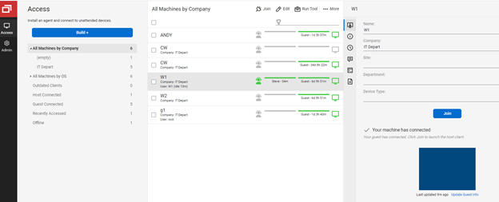
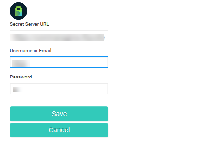
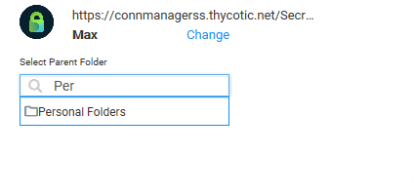
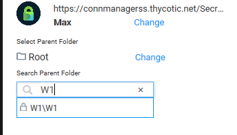
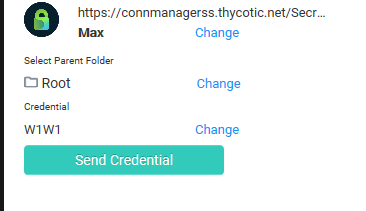

[title]: # (Using Thycotic’s Helper Extension)
[tags]: # (introduction)
[priority]: # (105)
# Using Thycotic’s Helper Extension

After installation, Thycotic’s extension will be available from the Helper window. The instruction below provide a typical use case for logging into a machine, but can be extended to any other resource available from the ScreenControl Client.

1. Connect to the machine from the __ControlWise Control window__.

   
1. Once connected, click on the __Helper icon__ and __Thycotic Provider__ (if not already selected).

   

1. Click on __Configure Secret Server__ (if not already connected) and enter the connection parameters.

   
1. In the __Select Parent Folder__ field, type in the full or partial folder name and click on __Enter__ to Search. You can select a folder by clicking on it.

   
1. In the __Search Parent Folder__ field enter a full or partial secret name and click __Enter__ to Search. You can select a secret by clicking on it.

   

   >**note:** The search for Secrets is limited to the selected folder unless the Root folder is selected.  In that case the search will look for a Secret in the entire system.

1. Click the __Send Credential__ button to push the __Domain/User ID__ and __Password__ to the selected connected Computer.

   