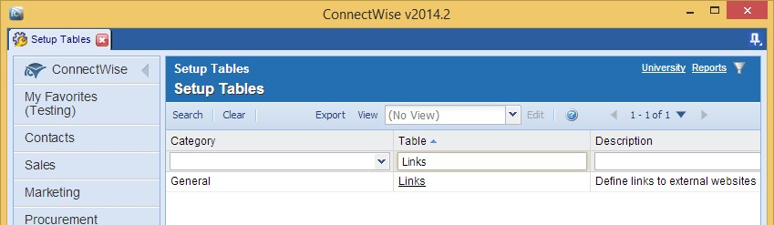
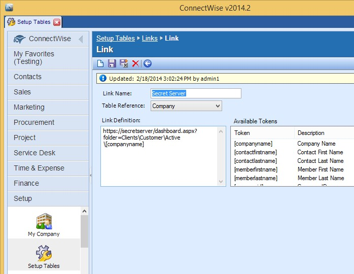
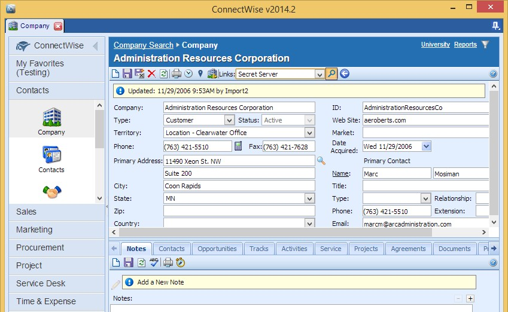
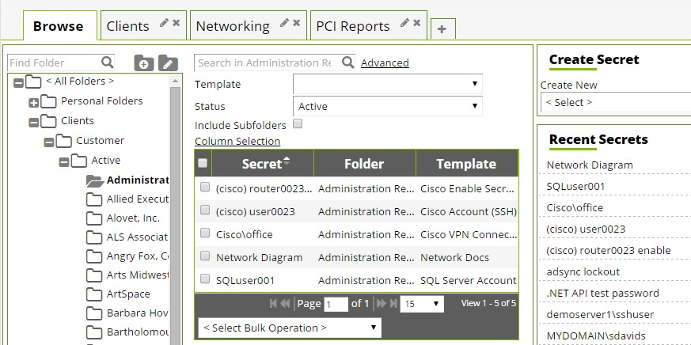

[title]: # (int product)
[tags]: # (introduction)
[priority]: # (1)
# Creating Company Links in ConnectWise 

ConnectWise supports creation of links to Secret Server folders using the company name as a dynamic parameter. This can be used to build a link from
within ConnectWise that will instantly open Secret Server to view the stored Secrets for the selected company.

To create a new link in ConnectWise, click the **Links** table from the **Setup Tables** menu.

Next, create a link to the Secret Server dashboard and specify the company name as the folder parameter in the query string. 

Your URL should look something like:

[https://yoursecretserverurl/dashboard.aspx?folder=Clients\\Customer\\Active\\[companyname]
](https://yoursecretserverurl/dashboard.aspx?folder=Clients/Customer/Active/%5bcompanyname)

>**Note**: Because ConnectWise does not use a token for the status or type of company, those parts of the folder path will need to be hardcoded, and multiple
links created.

The new link will now be available on the company information screen. 

Select it from the dropdown menu to automatically navigate to a search for
that company’s information on the Secret Server dashboard (*Figure 6*).

<!-- Change the file name, title, and main topic to reflect the name of the integration product. Add the initial configuration steps, usually the initial integration setup steps. -->
