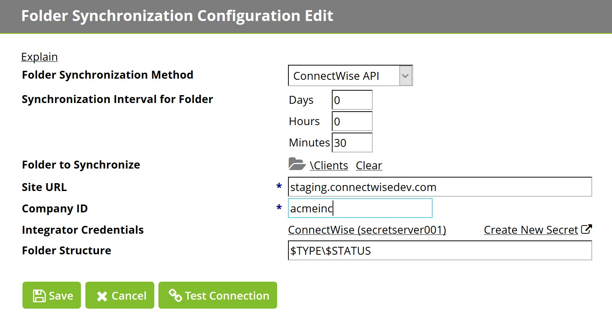
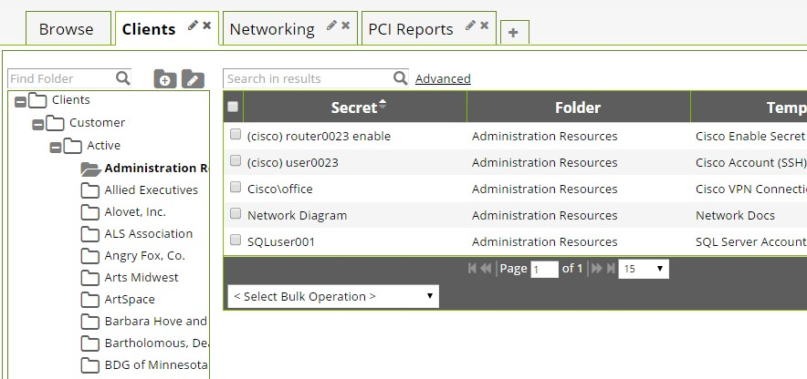

[title]: # (Secret Server)
[tags]: # (introduction)
[priority]: # (2)
# What to do in Secret Server

## Managing Synchronized Folders 

During synchronization, the folders are created in the Secret Server database.
Therefore, if at any point the ConnectWise synchronization is turned off, the
synchronized folders will remain in Secret Server. To delete a synchronized
folder, turn off folder synchronization and delete the folder in the same way as
a standard Secret Server folder.

