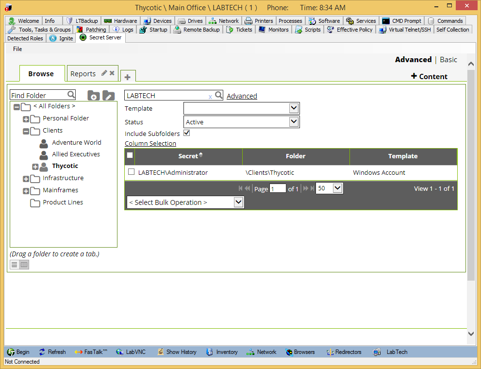

[title]: # (Connectwise Automate)
[tags]: # (introduction)
[priority]: # (400)

# Managing Customer Privileged Accounts

## Managing Folders

Secret Server has a folder structure that needs to correspond to the client names in Automate (LabTech). When a client is selected, the plugin automatically searches Secret Server’s folders for a folder name matching the client name and selects it, showing all Secrets stored in the folder for that client.

_Figures 1 & 2_ show a folder structure in Secret Server that corresponds to the Automate (LabTech) client structure.

 Clients")

**Figure 1** Automate (LabTech) Clients  


**Figure 2** Secret Server Folders

## Using the Plugin

When the plugin is installed, you will need to specify your Secret Server URL by navigating to any client and clicking **File \> Configure URL** as a super admin. Once it is set on one client all clients will read the same configuration
information.


**Figure 3** Setting the Secret Server URL

Your URL should look something like: *https://servername/secretserver* or *https://yoursecretserverurl*

>**Note**: The URL should not include any page names, such as index.html or login.aspx. The plugin will navigate to the correct page once saved. If the URL is incorrect, click **File \> Configure URL** again to reset it.

Once the URL is saved, the Secret Server login page should appear and you can enter in your Secret Server credentials. Your Secret Server login may be different than your Automate (LabTech) login.


**Figure 4** Logging into Secret Server

Once you’re logged in, the client’s folder will be automatically selected and you can view any passwords stored for that client.


**Figure 5** Company Link to Secret Server

If you open the Secret Server plugin from a computer, that computer name will be set as a search term inside the folder to automatically filter to any credentials stored specifically for that machine.



**Figure 6** Filtering to a Computer

## Synchronizing Folders

Secret Server can automatically create a Folder hierarchy from a custom database view. Note that this is optional and you can test the plugin by simply manually creating a Folder in Secret Server to correspond to a Automate (LabTech) client.

To automatically create Folders that correspond to Automate (LabTech) Clients you will need to do the following:

1. Create an ODBC system DSN on the Secret Server that points to the Automate (LabTech) database using the MySQL ODBC Driver.
1. Create a linked server in SQL Server.
1. Create a custom view in the SQL Server Database.
1. Turn on Folder Synchronization in Secret Server.

### Step 1 - Create an ODBC DSN

1. On the Secret Server machine go to **Administrative Tools | ODBC Data Source (64 bit)**.

   

   **Figure 7** Configuring an ODBC MySQL System DSN
1. Create a new MySQL System DSN and enter in the information for connecting to the Automate (LabTech) database. If the MySQL ODBC driver is not installed, you will need to download it from Oracle and install it.

### Step 2 - Create a Linked Server in SQL

1. Connect to the SQL Server instance where Secret Server is installed.
1. Under **Server Objects \> Linked Servers** right click and add a new linked server.
1. Configure the linked server to reference the System DSN that was set up. Your settings should look like:

   * **Provider:** Microsoft OLE DB Provider for ODBC Drivers
   * **Product name:** MYSQL
   * **Data source:** The ODBC System DSN Name, in this case **Automate (LabTech)db**
   * **Provider string:** ODBC provider with the DSN specified. E.g.
   * **ODBC;DSN=Automate (LabTech)db;;**
   * **Location:** Optional
   * **Catalog:** The Automate (LabTech) database name

   

   **Figure 8** Configuring a MS SQL Linked Server
1. Specify a username / password for the linked server to connect to the Automate (LabTech) MySQL database.

    database")

   **Figure 9** Setting a login for the Automate (LabTech) database
1. Save the linked server configuration.

### Step 3 - Create a Custom View

In the Secret Server MS SQL Database run the following query to create a custom view. Once the view is created, you can test it by running the query `SELECT * FROM vLabTechFolderView` in the Secret Server database.

```sql
CREATE VIEW [dbo].[vLabTechFolderView]

AS

SELECT FolderId, FolderName, FolderTree

FROM OPENQUERY(LabTech),

'SELECT CONCAT(CAST(c.ClientID AS CHAR), IFNULL(CAST((l.LocationId + 20000) AS

CHAR),'''')) AS FolderId,

c.Name AS FolderName,

''''AS FolderTree

FROM clients c

left join locations l

ON l.ClientID = c.ClientID

WHERE

l.LocationId IS NULL

UNION

SELECT l.LocationID + 20000 AS FolderId,

l.Name AS FolderName,

c.Name AS FolderTree

FROM locations l

JOIN clients c

ON c.ClientID = l.ClientID

')
```

### Step 4 - Enable Folder Synchronization in Secret Server

More explanation of how the Folder Synchronization feature works can be found under [Managing Synchronized Folders](../connectwise-manage/setup.md).

1. Log into the Secret Server web site.
1. Click on **Admin \> More** and click **Folder Synchronization.**
1. Edit to enable Folder Synchronization and fill out the connection information so that Secret Server can read from the newly created view. Note that all the Clients in Automate (LabTech) will be created as subfolders under the selected **Folder to Synchronize.**

   

   **Figure 10** Enabling Folder Synchronization in Secret Server
1. Save and Secret Server will synchronize the Automate (LabTech) Clients as Folders.

## Other Considerations

### Launchers

Secret Server has the ability to run Session Launchers, which open Remote Desktop, PuTTY, and other applications and make a connection from the user’s workstation to the target server.


**Figure 11** Secret with an RDP Launcher

These can be used within the Automate (LabTech) plugin, but require a configuration change in Secret Server. By default the launchers are run using Microsoft ClickOnce, which automatically downloads the launcher file to the user’s workstation. This is not supported using the plugin, so a supported protocol handler must be installed.

For information on configuring and using the protocol handler, see the instructions under the [Secret Launchers and Protocol Handlers](https://docs.thycotic.com/ss/10.9.0/secret-launchers/index.md) section.

### Secret Server Availability

Secret Server typically is a web application typically installed on premises. In order for the plugin to function properly, the location running the Control Center must be able to connect to the Secret Server instance. For example, if a user was offsite and Secret Server was not publicly available, the user would have to connect via VPN in order for the Secret Server plugin to properly show.
