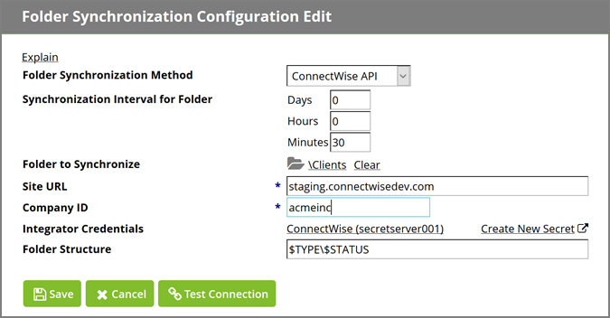

[title]: # (Installation)
[tags]: # (introduction)
[priority]: # (4)
# Setting up Folder Synchronization

The following image shows the ConnectWise synchronization view in Secret Server.

To set up this feature, click **Folder Synchronization** from the **Administration** menu.

>**Note**: For the ability to edit these settings, an administrator must be assigned a role within Secret Server containing the Administer ConnectWise
Integration permission.

Enabling Folder Synchronization will require specifying the synchronization interval in days, hours, and minutes. Folder to Synchronize references the parent folder where Secret Server will create the ConnectWise companies as child folders.

## Creating the ConnectWise Integrator Login

If an integrator login doesn’t exist in ConnectWise, create one by:

* Entering in the hostname of your ConnectWise instance
* Enter your company id
* Select the Secret of the ConnectWise integrator login

