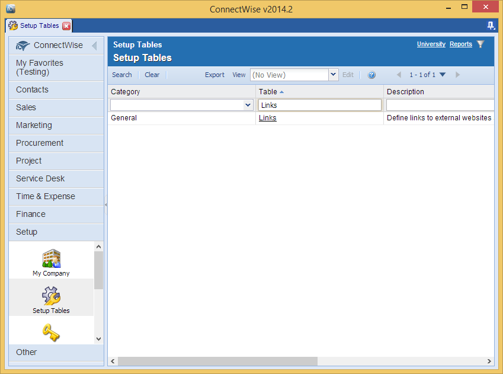

[title]: # (Manage Folders)
[tags]: # (setup)
[priority]: # (300)
# Setting up Folder Synchronization

>**Note**: Integration to be verified with new product versions.

*Figure 1* shows the ConnectWise synchronization view in Secret Server. To set up this feature, click **Folder Synchronization** from the **Administration** menu.

>**Note**: For the ability to edit these settings, an administrator must be assigned a role within Secret Server containing the Administer ConnectWise Integration permission.

Enabling Folder Synchronization will require specifying the synchronization interval in days, hours, and minutes. Folder to Synchronize references the parent folder where Secret Server will create the ConnectWise companies as child
folders.

If an integrator login doesn’t exist in ConnectWise, create one by following the steps in [Creating the ConnectWise Integrator Login](../connectwise-control/getting-started/install.md#creating_the_connectwise_integrator_login).

Enter the hostname of your ConnectWise instance, your company id, and select the Secret of the ConnectWise integrator login.

_Figure 2_ shows the result of synchronization with ConnectWise. A folder has been created in Secret Server for each company and placed in the folder tree based on the company type, status, and name in ConnectWise.

## Managing Synchronized Folders

During synchronization, the folders are created in the Secret Server database. Therefore, if at any point the ConnectWise synchronization is turned off, the synchronized folders will remain in Secret Server. To delete a synchronized folder, turn off folder synchronization and delete the folder in the same way as a standard Secret Server folder.

*Figure 1 ConnectWise Synchronization*

*Figure 2 Synchronized Folders*

## Creating Company Links in ConnectWise

ConnectWise supports creation of links to Secret Server folders using the company name as a dynamic parameter. This can be used to build a link from within ConnectWise that will instantly open Secret Server to view the stored
Secrets for the selected company.

To create a new link in ConnectWise, click the **Links** table from the **Setup Tables** menu (*Figure 3*).

Next, create a link to the Secret Server dashboard and specify the company name as the folder parameter in the query string. Your URL should look something like:

[https://yoursecretserverurl/dashboard.aspx?folder=Clients\\Customer\\Active\\[companyname]](https://yoursecretserverurl/dashboard.aspx?folder=Clients\Customer\Active\%5bcompanyname)

**Note** Because ConnectWise does not use a token for the status or type of company, those parts of the folder path will need to be hardcoded, and multiple links created.

The new link will now be available on the company information screen (*Figure 5*). Select it from the drop-down menu to automatically navigate to a search for that company’s information on the Secret Server dashboard (*Figure 6*).

*Figure 3 Links Table*

*Figure 4 Link Configuration*

*Figure 5 Company Link to Secret Server*

*Figure 6 Client Secrets from ConnectWise Link*
