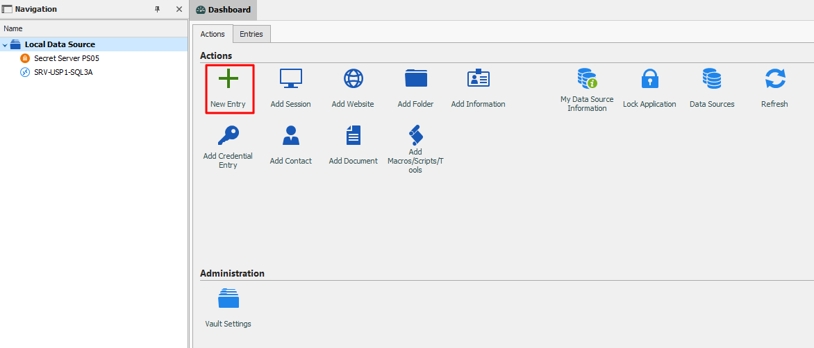
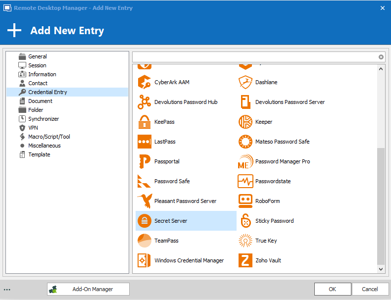
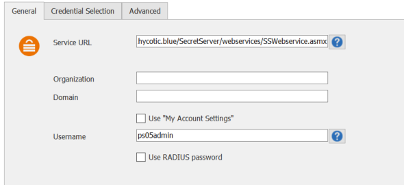
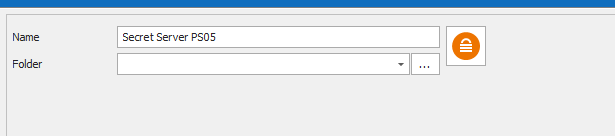
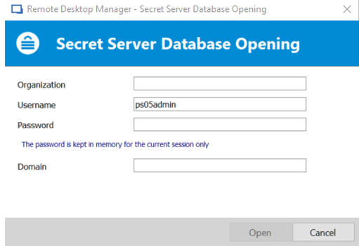

[title]: # (Configuration)
[tags]: # (configuration)
[priority]: # (101)
# Configuration Steps

1. Launch the **Remote Desktop Manager**.

1. Under Local Data Source, click **New Entry**.

   
1. Scroll to **Secret Server (Credentials)** and click **OK**.

   
1. For the Service URL, enter the **Secret Services API URL**.

   >**Note:** Format example: <https://yoursecretserverurl/SecretServer/webservices/SSWebService.asmx>.

1. In addition, the following screen shows a simple example with a local user. For a domain user, specify the domain. For Two-Factor Authentication (2FA), the only option available with Remote Desktop Manager is Remote Access Dial-In User (RADIUS).

   
1. Enter a **name** for the credential entry and click **OK**.

   
1. In the Secret Server Database Opening dialog box, enter **username** and
    **password**, and click **Open**.

   
1. The entry for Secret Server is now in your Data Source list.