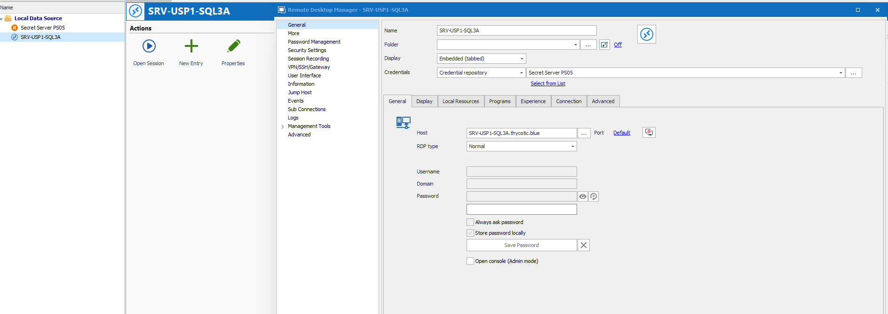
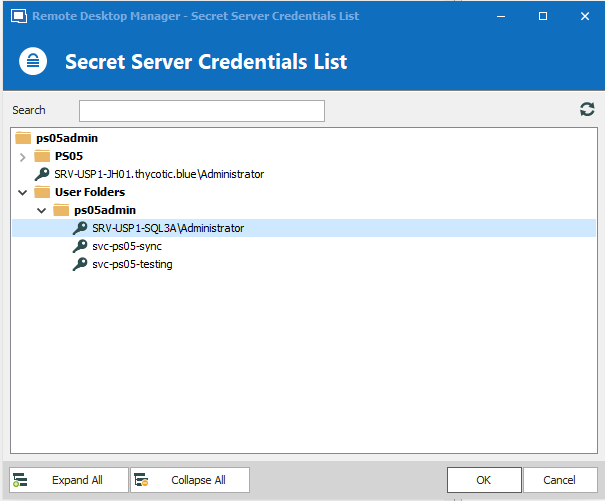
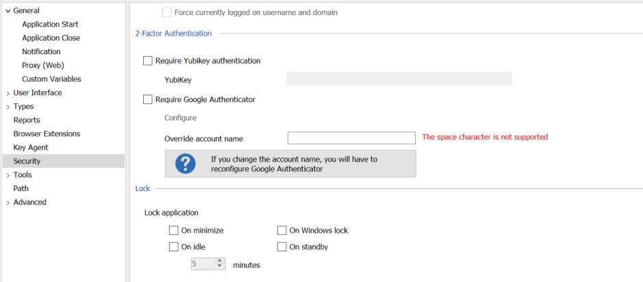

[title]: # (Link to a Specific Server)
[tags]: # (configuration)
[priority]: # (103)
# Steps to Link to a Specific Server

To link a specific Secret to a specific server, create a new entry.

The following example shows a basic Remote Desktop Connection session for a server
called SRV-USP1-SQL3A.

1. Right-click on the__entry__.
1. Click__Properties__.

   
1. On the Credentials section of the entry, change it to__Credential
    Repository__ and choose the Secret Server credential repository.
1. Click __OK__.

1. Right click on the server and click __Open Session__. You will be prompted
    to choose a Secret from Secret Server.

   
1. Click __OK__ and you will be able to log in to your server with the chosen
    credentials.

For accessibility/ease of use, it is recommended that secret names match the
session name within Remote Desktop Manager, but it is not required.

Any type of session can be configured to use this as a credential repository.

For additional security, we recommend locking the application. This can be
configured in Remote Desktop Manager security settings as shown below.
Additionally, you may provide 2FA to Remote Desktop Manager itself.

   
