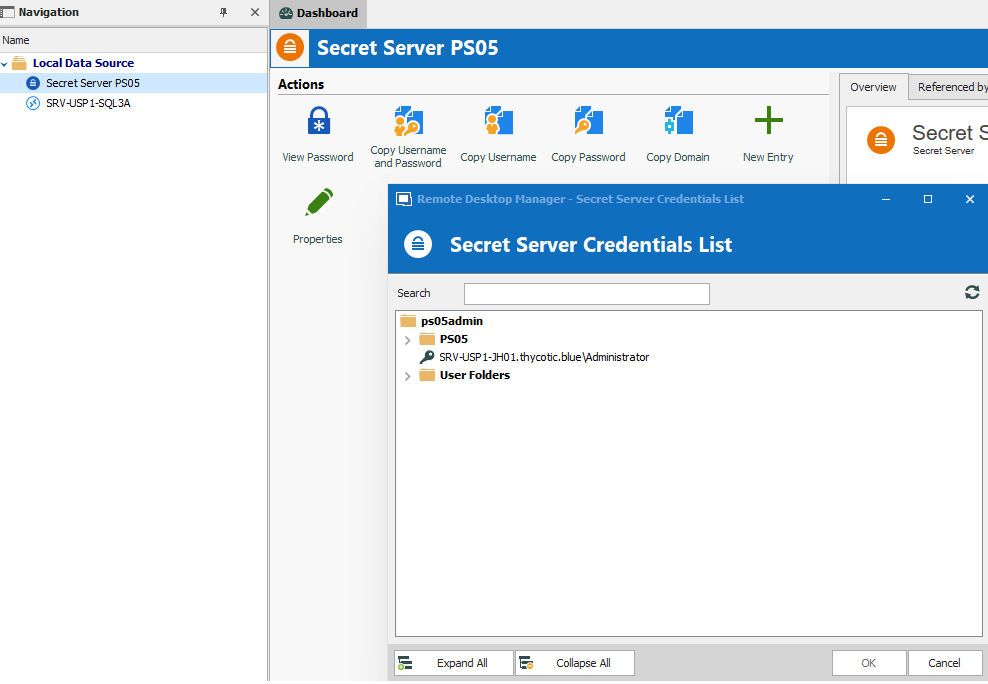
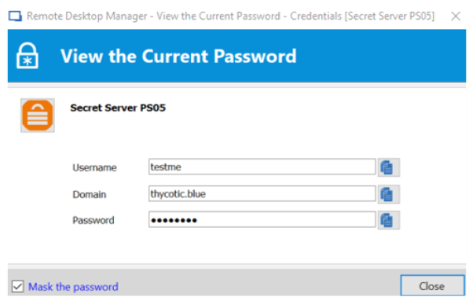

[title]: # (Retrieve Passwords)
[tags]: # (passwords)
[priority]: # (102)
# How to Retrieve Passwords

You can retrieve passwords from Secret Server directly within Remote Desktop
Manager.

1. Click the **View Password** button when the entry is highlighted as shown
    below.

   
1. To copy a password to your clipboard, click the **Copy** icon next to the
    password field directly from Remote Desktop Manager.

   