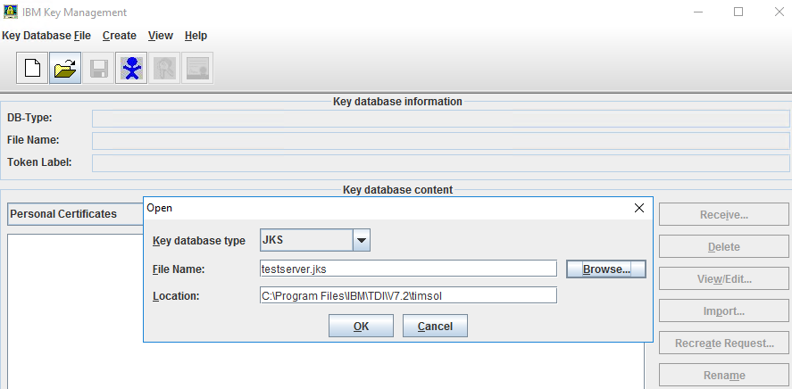
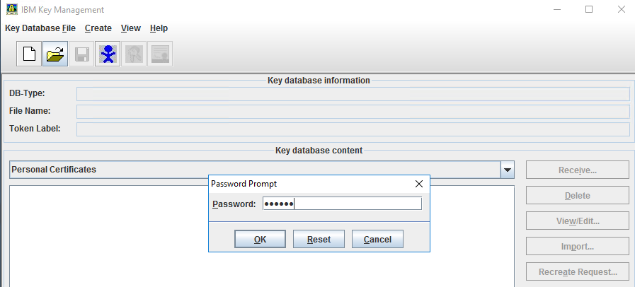
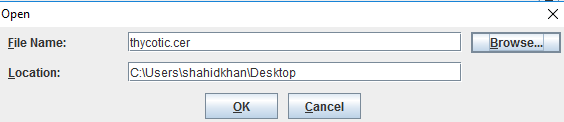
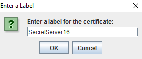
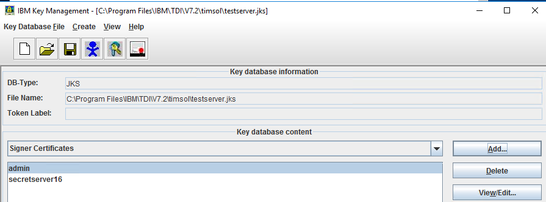
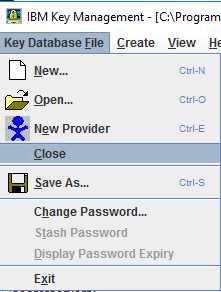
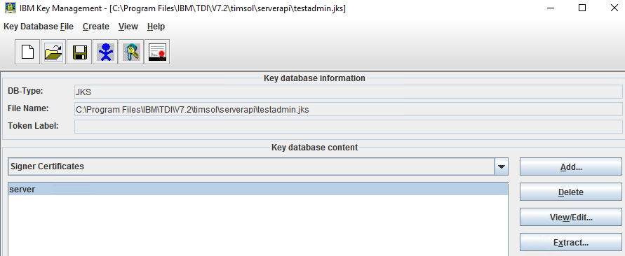
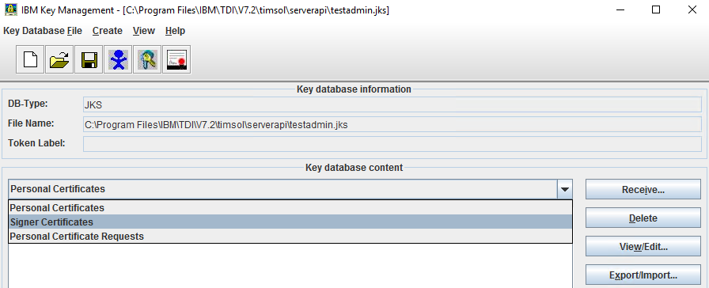
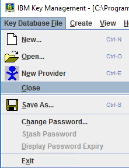

[title]: # (Add Thycotic certificate)
[tags]: # (introduction)
[priority]: # (104)
# Add the Thycotic Certificate

You will now need to add the imported certificate for Secret Server.

__To add cerficates:__

1. Go to `C:\Program Files\IBM\TDI\V7.2\jvm\jre\bin`.

   
1. Right-click `ikeyman` file and select __Run as administrator__.
1. In the __User Account Control__ dialog box, click __Yes__. The __IBM Key Management__ dialog box appears.

   
1. Click open  icon. The  __Open__ dialog box appears.
1. Click __Browse__ and navigate to `C:\Program Files\IBM\TDI\V7.2\timsol` and double-click the `timsol` folder.
1. Select `testserver.jks` and click __Open__. The __Open__ dialog box appears.
1. Click __OK__. The __Password Prompt__ dialog box appears.

   
1. In the __Password__ text box, type the password and click __OK__.

   > __Note__: The default password for `testserver.jks` is `server`.
1. In the __IBM Key Management__ dialog box, click __View/Edit__. The certificate details appear.

   
1. Verify the validity of the certfificate and close the dialog box.
1. From the type of certificate list, select __Signer Certificates__.

   
1. The type of __Signer Certificate__ as __admin__ is listed. Click __Add__. The __Open__ dialog box appears.

   
1. Click __Browse__ and navigate to the location of `thycotic.cer`.
1. Select `thycotic.cer` and click __Open__. The __Open__ dialog box appears.

   
1. Click __OK__. The __Enter a Label__ dialog box appears.

   
1. In the __Enter a Label for the certificate__ text box, type the label and then click __OK__. The certificate is listed in the __Key database content__ section.

   
1. Click Key __Key Database File__ tab | __Close__. The certificate is saved.

   
1. Click open  icon. The __Open__ dialog box appears.

   
1. Click __Browse__ and navigate to `C:\Program Files\IBM\TDI\V7.2\timsol`.
1. Double-click `timsol` folder and then double-click `serverapi` folder.
1. Click `testadmin.jks` and click __Open__.
1. Click __OK__. The __Password Prompt__ dialog box appears.

   
1. In the __Password__ text box, type the password and click __OK__.

   > __Note__: The default password for `testadmin.jk` is `administrator`.
1. Click __OK__. The certificate is listed in the __Key database content__ section.

   
1. From the type of certificate list, select __Singer Certificates__.

   
1. Click the certificate name __server__ and click __Add__.

1. The __Open__ dialog box appears.
  
   
1. Click __Browse__ and navigate to the location of `thycotic.cer`.
1. Click __Open__ and then in the __Open__ dialog box click __OK__. The __Enter a label__ dialog box appears.

   
1. In the __Enter a label for the certificate__ text box, type the label and then click __OK__. The certificate is listed in the __Key database content__ area.

   
1. Click __Key Database File__ tab | __Close__. The certificate is saved.

   

