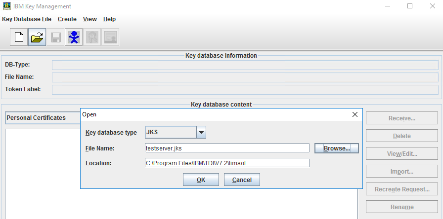
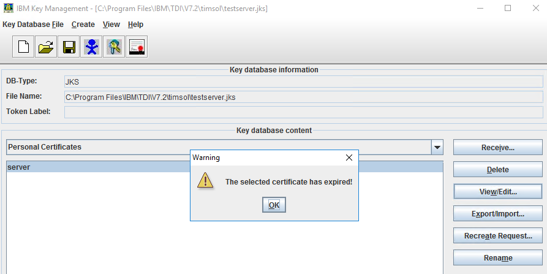

[title]: # (Check the validity of the Tivoli Directory Integrator certificate)
[tags]: # (introduction)
[priority]: # (102)
# Check the validity of the Tivoli Directory Integrator certificate

__To check and extend validity of the certificate:__

1. Go to `C:\Program Files\IBM\TDI\V7.2\jvm\jre\bin`.

   
1. Select `ikeyman` file, right-click the file and click __Run as administrator__.
1. In the __User Account Control__ dialog box, click __Yes__. The __IBM Key Management__ dialog box appears.
1. Click __Open__  icon. The __Open__ dialog box appears.

   
1. Click __Browse__ and navigate to the `timsol` folder which is located at `C:\Program Files\IBM\TDI\V7.2\timsol`.
1. In the `timsol` folder, select the `testserver.jks` and click __OK__. The __Password Prompt__ dialog box appears.

   
1. In the __Password__ text box, type the password, and click __OK__.

    >**Note:: The default password of testserver.jks is `server`.
1. On the right-hand side, click __View/Edit__. A Warning ‘__The selected certificate has expired!__’ might appear.

   
1. Click __OK__. The certificate details appear.
1. Click __Open__  icon. The __Open__ dialog box appears.
1. Navigate to the `serverapi` folder which is located at `C:\Program Files\IBM\TDI\V7.2\timsol\serverapi`.

   
1. Select `testadmin.jks` and click __Open__.
1. In the __Open dialog__ box, click __OK__. The __Password Prompt__ dialog box appears.

   
1. In the __Password__ text box, type the password, and click __OK__.

   > __Note__: The default password of testserver.jks is `administrator`.

1. On the right-hand side, click __View/Edit__. A Warning ‘__The selected certificate has expired!__’ might appear. If so, please see further steps for extending the certifcate in [Troubleshooting](troubleshooting.md)

   
