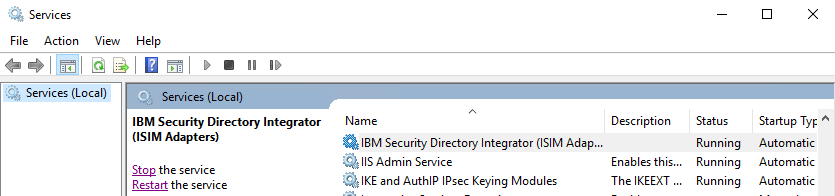
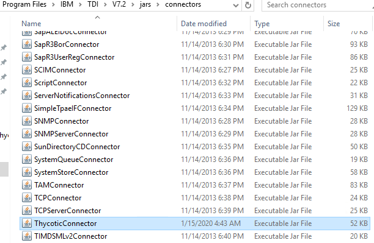
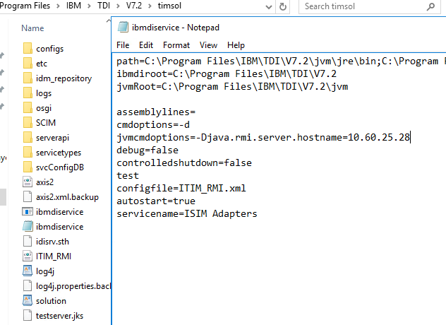
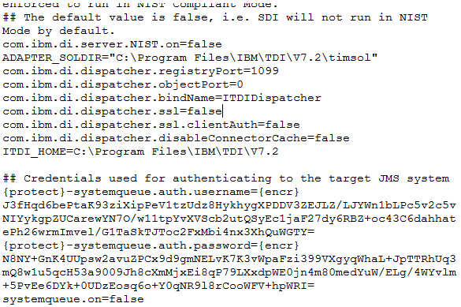
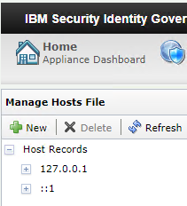
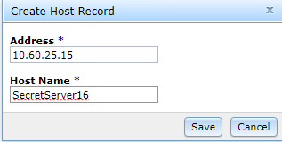
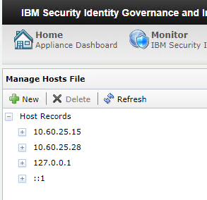

[title]: # (Configuring IBM IGI GUI and Dispatcher Folder)
[tags]: # (introduction)
[priority]: # (101)
# Configuring IBM IGI GUI and Dispatcher Folder to Access Admin Console

You need to configure IBM IGI GUI and Timsol to establish connection with Secret Server.

Following are the steps:
* [Update file in folders](#Update-file-in-folders)
* [Check and extend the validity of the certificate](#Check-and-extend-the-validity-of-the-certificate)
* [Import Thycotic certificate](#Import-Thycotic-certificate)
* [Add Thycotic certificate](#Add-Thycotic-certificate)
* [Manage host file](#Manage-host-file)

The detailed procedure for each step is explained below.

## Update files in folders

You have to update the files in folders such as Connectors, Axix2, Others, and Timsol.

**To update the files in folders:**
1.	Go to the virtual appliance.

     

2.	Login using the **login** and **Password**.
3.	Type the command `igi` and press **Enter**. 
4.	Type the command `utilities` and press **Enter**. 
5.	Type the command `ib_settings` and press **Enter**. 
6.	Type the command `ib_password_reset` and press **Enter**. 
7.	Type `YES` to confirm password reset and press **Enter**. The password reset is successful.
8.	Type the command `ib_api` and press **Enter**. 
9.	Type the command `enable` and press **Enter**
10. Type `YES` if you are sure you want to enable Identity Brokerage API. 
11.	Go to **IBM Security Identity Governance and Intelligence Appliance** dashboard.

     

12.	In the **Server Control** area, select the server and click **Restart**.
13. In the **Windows Search** box type `services`. The results are auto-populated. Click **Services**. The **Services** window appears.

     

14. Verify if the **IBM Security Directory Integrator (ISIM Adapters)** service is running.
15.	Go to **Thycotic Adapter** > **SIA_V7.1.5_SSS_Thycotic_Sec_Serv** and copy `ThycoticConnector` file.
16.	Go to `C:\Program Files\IBM\TDI\V7.2\jars\connectors` and paste `ThycoticConnector`.

    > **Note**: Stop the **IBM Security Directory Integrator** service before pasting the file.

    

17.	Go to `C:\Program Files\IBM\TDI\V7.2\jars\3rdparty\others` and paste the following files here :
     * `commons-codec-1.11`

     * `commons-logging-1.2`

     * `httpclient-4.5.8`

     * `httpcore-4.4.11`

     * `json-simple-1.1.1`

      > **Note**: Download these files from internet.

     

18.	Go to `C:\Program Files\IBM\TDI\V7.2\jars\3rdparty\IBM\axis2` and delete the existing version of the following files: 
     * `commons-codec` 

     * `commons-logging`

     * `httpclient`

     * `httpcore`
 
     and  paste the latest version of the following files:
     
     * `commons-codec-1.11`
     
     * `commons-logging-1.2`
     
     * `httpclient-4.5.8`
     
     * `httpcore-4.4.11`

     > **Note**: Download these files from internet.

   
    

19.	Go to `C:\Program Files\IBM\TDI\V7.2\timsol`.

    

20.	Select the `ibmdiservice` file and open it in Notepad in administrative mode.

     

21.	In the `jvmcmdoptions`, type `-Djava.rmi.server.hostname= <server hostname where Tivoli directory installer is installed and security directory integrator is installed>` and save the file.
22.	In the `Timsol` folder, select the `solution` file and open it Wordpad in administrative mode.

     

23.	In the `com.ibm.di.dispatcher.ssl`, delete `true` and type `false` and save the file.

     

The folders are updated successfully. Now, you need to verify the validity of the certificate.

## Check and extend the validity of the certificate

Make sure that your certificate is valid. If the validity expires, you need to extend the validity.
 
**To check and extend validity of the certificate:**
1. Go to `C:\Program Files\IBM\TDI\V7.2\jvm\jre\bin`.

     
2.	Select `ikeyman` file, right-click the file and click **Run as administrator**.
3.	In the User **Account Control** dialog box, click **Yes**. The **IBM Key Management** dialog box appears.
4.	Click **Open**  icon. The **Open** dialog box appears.

     
5.	Click **Browse** and navigate to the `timsol` folder which is located at `C:\Program Files\IBM\TDI\V7.2\timsol`.
6.	In the `timsol` folder, select the `testserver.jks` and click **OK**. The **Password Prompt** dialog box appears.

     
7.	In the **Password** text box, type the password, and click **OK**.

    > **Note**: The default password of testserver.jks is `server`.
	
8.	On the right-hand side, click **View/Edit**. A Warning ‘**The selected certificate has expired!**’ might appear.

    

9.	Click **OK**. The certificate details appear.
10.	Click **Open**  icon. The **Open** dialog box appears.
11.	Navigate to the `serverapi` folder which is located at `C:\Program Files\IBM\TDI\V7.2\timsol\serverapi`.

      

12.	Select `testadmin.jks` and click **Open**.
13.	In the **Open dialog** box, click **OK**. The **Password Prompt** dialog box appears.

     
14.	In the **Password** text box, type the password, and click **OK**.

    > **Note**: The default password of testserver.jks is `administrator`.
15.	On the right-hand side, click **View/Edit**. A Warning ‘**The selected certificate has expired!**’ might appear.

     

16.	Click **OK**. The certificate details appear.
17.	In **Windows Search**, type `cmd` and press **Enter**. The results are auto-populated.
18.	Right-click `Command Prompt` and click **Run as Administrator**. 
19.	In the **User Account Control** dialog box, click **Yes**. The **Administrator: Command Prompt** appears.
20.	To move to the `timsol` folder, type `C:\Program Files\IBM\TDI\V7.2\timsol and press Enter`.
21.	Run the following eight commands:
 
    a.	`"c:\Program Files\IBM\TDI\V7.2\jvm\jre\bin\keytool" -selfcert -v -alias server -validity 730 -keystore testserver.jks -storepass server`

     

    b.	`"c:\Program Files\IBM\TDI\V7.2\jvm\jre\bin\keytool" -selfcert -v -alias admin -validity 730 -keystore serverapi\testadmin.jks -storepass administrator`

       

    c.	`"c:\Program Files\IBM\TDI\V7.2\jvm\jre\bin\keytool" -export -alias server -keystore testserver.jks -storepass server  -file myserver.crt`

        
   
     d.	`"c:\Program Files\IBM\TDI\V7.2\jvm\jre\bin\keytool" -export -alias admin -keystore serverapi\testadmin.jks -storepass administrator  -file myadmin.crt`

      

    e.	`"c:\Program Files\IBM\TDI\V7.2\jvm\jre\bin\keytool" -delete -alias admin -keystore testserver.jks -storepass server`

      

    f.	`"c:\Program Files\IBM\TDI\V7.2\jvm\jre\bin\keytool" -import -alias admin -keystore testserver.jks -storepass server -file myadmin.crt`

      
  
       > **Note**: To trust this certificate, type yes.

     

     g.	`"c:\Program Files\IBM\TDI\V7.2\jvm\jre\bin\keytool" -delete -alias server -keystore serverapi\testadmin.jks -storepass administrator`

       
    
    h.	`"c:\Program Files\IBM\TDI\V7.2\jvm\jre\bin\keytool" -import -alias server -keystore serverapi\testadmin.jks -storepass administrator -file myserver.crt`

     

    > **Note**: To trust this certificate, type yes.

      

     >**Note**: Go to `C:\Program Files\IBM\TDI\V7.2\timsol` and verify that certificates `myadmin` and `myserver` are added to the `timsol` folder.
22.	Go to `C:\Program Files\IBM\TDI\V7.2\timsol` and copy the `testserver.jks` file.
23.	Go to `C:\Program Files\IBM\TDI\V7.2` and paste the `testserver.jks` file.
24.	Go to `C:\Program Files\IBM\TDI\V7.2\timsol\serverapi` and copy `testadmin.jks` file.
25.	Go to `C:\Program Files\IBM\TDI\V7.2\serverapi` and paste `testadmin.jks` file.

The validity of the certificate is verififed and now you need to import the Thycotic certificate.

## Import Thycotic certificate
For secure connection between Thycotic Secret Server and IBM IGI, you need to import Thycotic certificate.

**To import Thycotic certificate:**
1.	Click **Not secure** part of the Thycotic Server URL . **Your connection to this site is not secure** dialog box appears.

     

2.	Click **Certificate (Invalid)**. The **Certificate** dialog box appears.

    

3.	Click **Details** > **Copy to File**. The **Welcome to the Certificate Export Wizard**
 appears.

4.	Click **Next**. The **Export File Format** panel appears.

     

5.	Click **Next**. The **File to Export** panel appears.
 
      

6.	In the **File name** text box, type the name for the certificate to be exported.
7.	Click **Browse** and select the location where you want to export the certificate.
8.	Click **Next**. The **Completing the Certificate Export Wizard** appears.
 
     

9.	Click **Finish**. The message, ‘**The export was successful.**’ appears. The certificate is exported to the location selected.

     

10.	Right-click the certificate where you have exported and click **Install Certificate**. 

     

     The **Welcome to the Certificate Import Wizard** appears.

       

11.	In the **Store Location** area, select **Current User** and then click **Next**. The **Certificate Store** panel  appears.

     

12.	Select **Place all certificates in the following store** and then click **Browse**.
13.	Select **Personal** folder and then click **Next**. The **Completing the Certificate Import Wizard** panel appears.

     
14.	Click **Finish**. The message ‘**The import was successful.**’ appears.

     

15.	Right-click the certificate where you have exported and click **Install Certificate**.
 
      

     The **Welcome to the Certificate Import Wizard** appears.

     

16.	In the **Store Location** area, select **Current User** and then click **Next**. The **Certificate Store** panel  appears. 

     

17.	Select **Place all certificates in the following store** and then click **Browse**.
18.	Select **Trusted Root Certification Authorities** folder and then click **Next**. The **Completing the Certificate Import Wizard** panel appears.

    

19.	Click **Finish**. The message ‘**The import was successful.**’ appears.

     
	
The Thycotic certficate is imported successfully. Now you need to add the certificate.
 ## Add Thycotic certificate

You need to add the imported certificate.

**To add cerficates:**

1.	Go to `C:\Program Files\IBM\TDI\V7.2\jvm\jre\bin`.

    

2.	Right-click `ikeyman` file and select **Run as administrator**.
3.	In the **User Account Control** dialog box, click **Yes**. The **IBM Key Management** dialog box appears.

    

4.	Click open  icon. The  **Open** dialog box appears.

5.	Click **Browse** and navigate to `C:\Program Files\IBM\TDI\V7.2\timsol` and double-click the `timsol` folder.
6.	Select `testserver.jks` and click **Open**. The **Open** dialog box appears.
7.	Click **OK**. The **Password Prompt** dialog box appears.

     

8.	In the **Password** text box, type the password and click **OK**.
      
     > **Note**: The default password for `testserver.jks` is `server`.
9.	In the **IBM Key Management** dialog box, click **View/Edit**. The certificate details appear.

     

10.	Verify the validity of the certfificate and close the dialog box.
11.	From the type of certificate list, select **Signer Certificates**.

 
    The type of **Signer Certificate** as **admin** is listed. Click **Add**. The **Open** dialog box appears.
 
      

12.	Click **Browse** and navigate to the location of `thycotic.cer`.
13.	Select `thycotic.cer` and click **Open**. The **Open** dialog box appears.

     

14.	Click **OK**. The **Enter a Label** dialog box appears.

     

15.	In the **Enter a Label for the certificate** text box, type the label and then click **OK**. The certificate is listed in the **Key database content** section.

     

16.	Click Key **Key Database File** tab > **Close**. The certificate is saved.

     

17.	Click open  icon. The **Open** dialog box appears.

     

18.	Click **Browse** and navigate to `C:\Program Files\IBM\TDI\V7.2\timsol`.
19.	Double-click `timsol` folder and then double-click `serverapi` folder.
20.	Click `testadmin.jks` and click **Open**.
21.	Click **OK**. The **Password Prompt** dialog box appears.

     

22.	In the **Password** text box, type the password and click **OK**.
    
    > **Note**: The default password for `testadmin.jk` is `administrator`.
23. Click **OK**. The certificate is listed in the **Key database content** section.

     

24.	From the type of certificate list, select **Singer Certificates**.

     

25.	Click the certificate name **server** and click **Add**. 

 
      The **Open** dialog box appears.
  
     

26.	Click **Browse** and navigate to the location of `thycotic.cer`.
27.	Click **Open** and then in the **Open** dialog box click **OK**. The **Enter a label** dialog box appears.

      

28.	In the **Enter a label for the certificate** text box, type the label and then click **OK**. The certificate is listed in the **Key database content** area.

     

29.	Click **Key Database File** tab > **Close**. The certificate is saved.

     

The Thycotic Secret Server certificate is added successfully. Now, you need to manage the host file.

## Manage Host file
You need to add the deatails of host file for communication between Secret Server and Dispatcher.

**To manage host file:**

1.	 Go to **IBM Security Identity Governance and Intelligence** user interface.
2.	 Click **Manage System Settings** > **Network Settings** > **Hosts File**. The **Manage Hosts File** page appears.

     

3.	 Click **New**  icon. The **Create Host Record** dialog box appears.

     

     > **Note**: Fields marked with asterisk (*) are mandatory.

4.	**Address**- Type the IP address where the Dispatcher is installed.
5.	**Host Name** - Type the host name.
6.	Click **Save**. The record is listed under **Hosts Records** in the **Manage Host File** page.
 
 
7.	Click **New**  icon. The **Create Host Record** dialog box appears.

     

    > **Note**: Fields marked with asterisk (*) are mandatory.

8.	**Address**- Type the IP address where the Secret Server is installed.
9.	**Host Name**- Type the host name .
10.	Click **Save**. The host record is listed under **Hosts Records**.

    

11.	 Go to **Windows Services** and click **IBM Security Directory Integrator** service.

     

12.	 Click **Restart**.

13. Go to the Windows Firewall and add 1099 port to the Inbound Rule and Outbound Rule.

    > **Note:** This step is mandatory for successful connection of Secret Server and IBM IGI.

The IBM IGI GUI and Dispatcher Folder are successfully configured to Access Admin Console. The next step is to [integrate Secret Server with IBM IGI Admin Console](steps\stepfiveintegratingsecretserver.md) 
