[title]: # (Configure the connector)
[tags]: # (introduction)
[priority]: # (107)
# Configure the connector

The next step is to configure the connector.

__To configure the Connector:__

1. Click __Manage__ | __Connectors__.

   
1. In the __Actions__ list, click __Add__.

   
1. In the __Connector Details__ section, fill in the required information.

   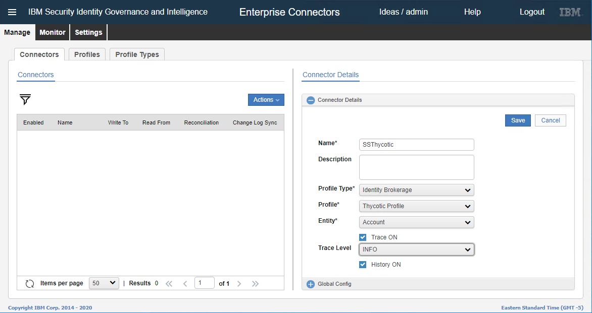

      a. __Name__ - Type the name of the connector.
  
      b. __Profile Type__ - Select `Identity Brokerage`.
  
      c. __Profile__ - Select `Thycotic Profile`.
  
      d. __Entity__ - Select `Account`.
  
      e. __Trace ON__ - Select the check box.
  
      f. __Trace Level__ - Select `INFO`.
  
      g. __History ON__ - Select the check box

1. Click __Save__. More options are available for selection.

   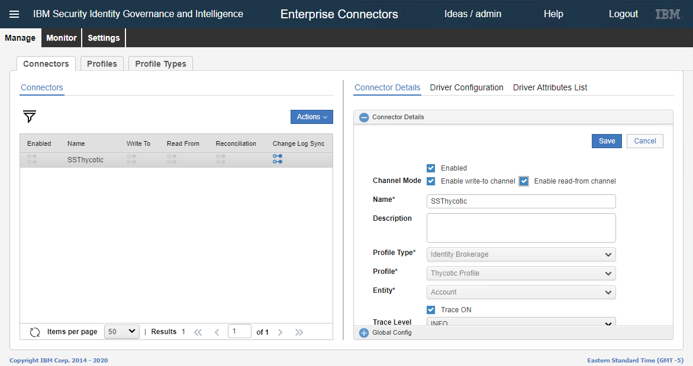
1. Select the check boxes: __Enabled__, __Enable write-to channel__, and __Enable read-from channel__.
1. click __Save__.
1. Click __Driver Configuration__ tab and fill in the required details.

   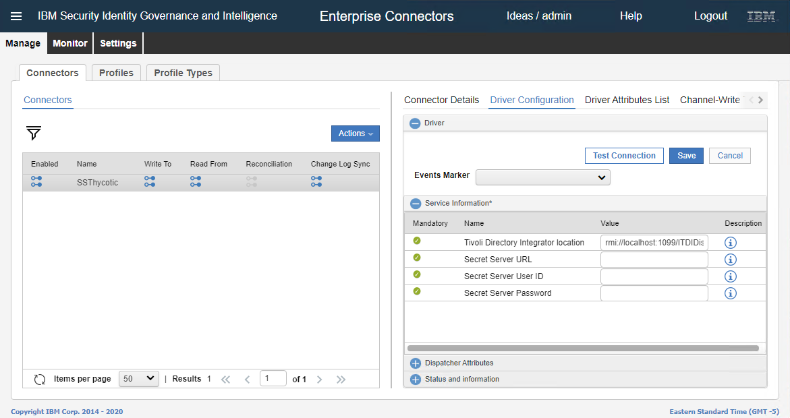

     a. __Tivoli Directory Integration location__ - Type the IP Address of the Dispatcher where the Dispatcher is installed.
  
     b. __Secret Server URL__ - Type the secret server URL
  
     c. __Secret Server User ID__ - Type the secret server user ID.
  
     d. __Secret Server Password__ - Type the password.

1. Click __Save__.

   
1. In the __Driver__ section, on the upper-right click __Save__.
1. Click __Test Connection__. If the connection is successful, a message, '__The connection is successful.__' appears. Click __Ok__.

   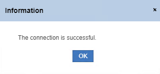
1. Click __Channel-Write To__ tab | __Mapping__.

   
1. Verify the presence of the mapping files.

   
1. Click __Channel-Read From__ tab | __Mapping__.

   
1. Verify the presence of the mapping files.

   
1. Click   __Monitor__ | __Connector Status__.

   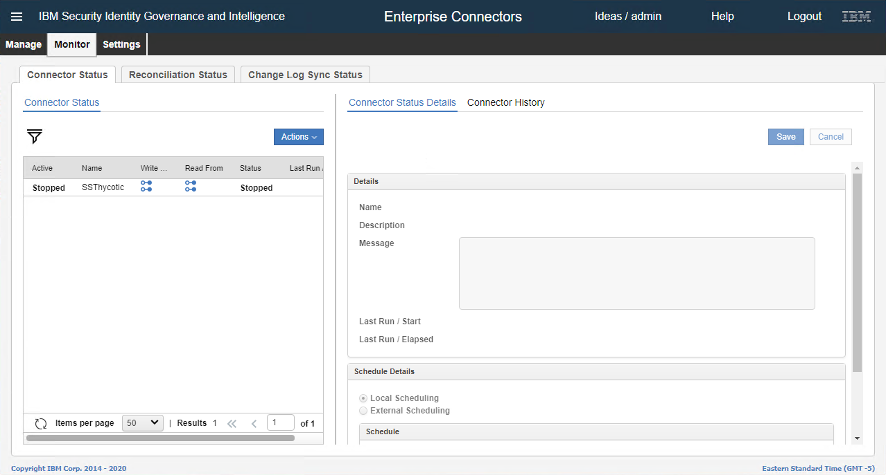
1. Select the connector.

   
1. In the __Schedule Details__ |  __Frequency__ list, select the value as `20 seconds` and then select __Effective Immedialtely__.

   
1. In the __Actions__ list, click Start.

   
1. The __Information__ dialog box appears. Click __Ok__.

   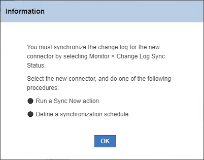
1. Click __Monitor__ | __Change Log Sync Status__.

     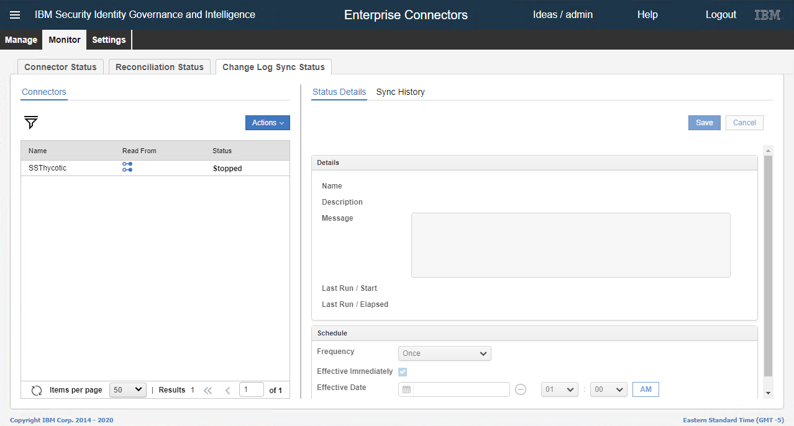
1. Select the connector.
1. In the __Actions list__, click __Sync Now__.

   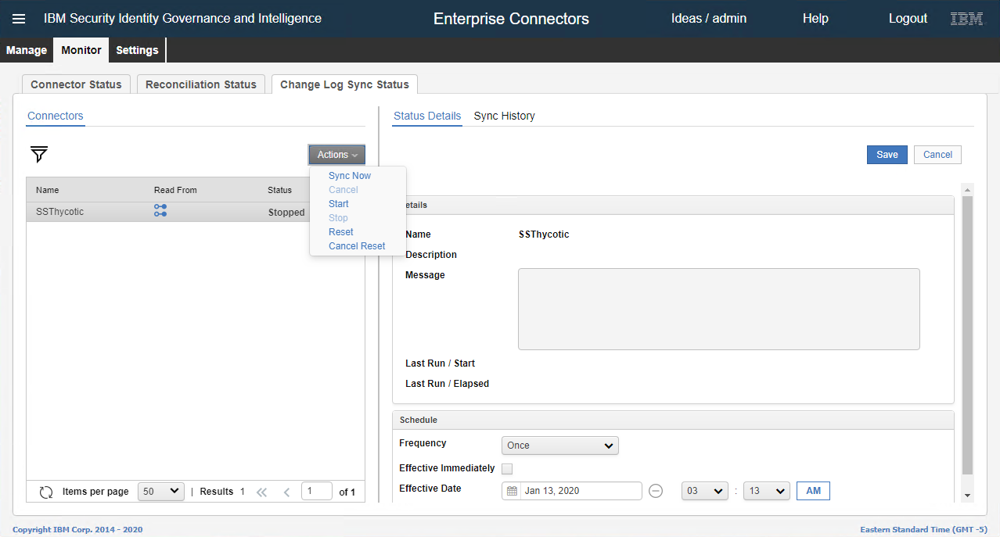
1. To verify the synch, on the right-hand side click __Sync History__. The sync must be completed.

   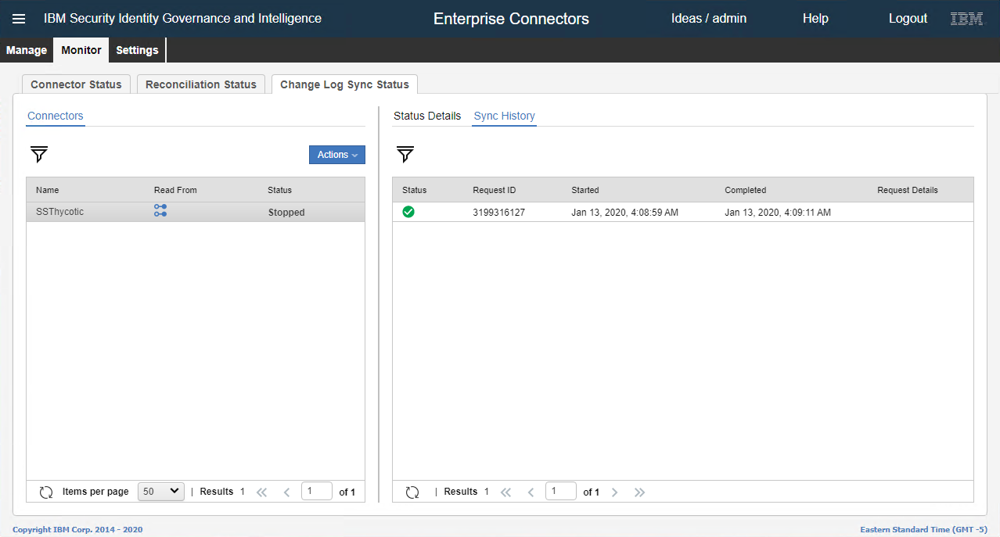
1. In the menu on the left-hand side, click __Access Governance Core__.

   
1. The __Access Governance Core__ UI appears.

   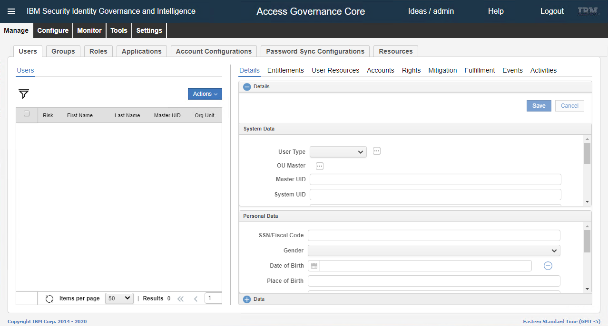
1. Click __Manage__ | __Applications__.

   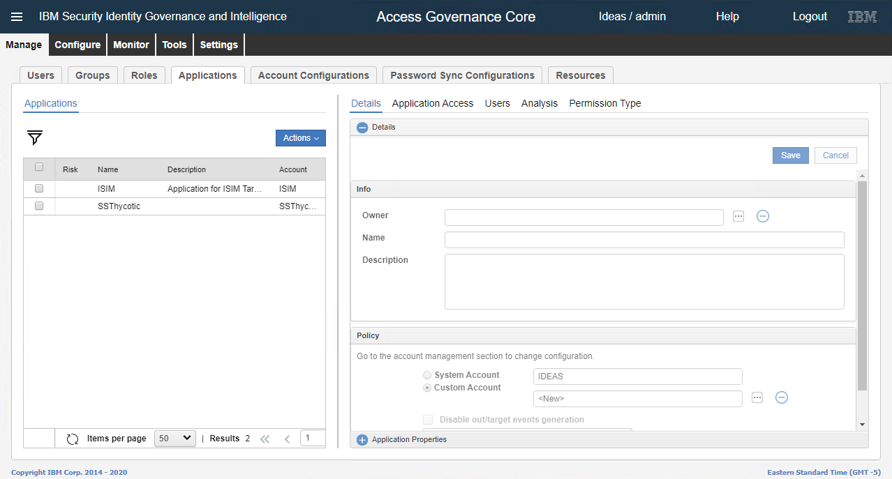
1. Select the account.

   
1. On the right-hand side, click __Application Access__. All the information from Secret Server appears.

   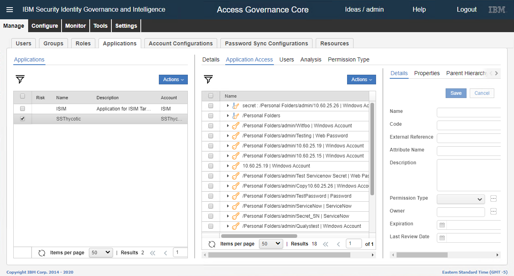
1. Click __Manage__ | __Account Configurations__.

   
1. Select the account.

   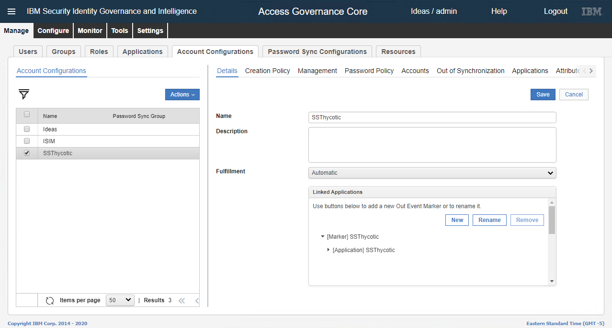
1. On the right-hand side, click __Accounts__. All the users of secret server appear.

   

Now, the connector is configured successfully and data from Secret Server is synchronized.
