[title]: # (Integrate Secret Server with IBM IGI Admin Console)
[tags]: # (introduction)
[priority]: # (106)
# Integrate Secret Server with IBM IGI Admin Console

The integration of Secret Server is done with IBM IGI Admin Console to fetch Secret Server data into IBM IGI Admin Console.

## Import attribute mapping file

You can import the attribute mapping files using the IBM IGI Administration Console.

__To import the attribute mapping file:__

1. Sign into __Secret Server__.

   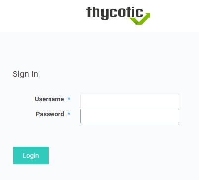
1. The __All Secrets__ page appears.

   
1. Click __Admin | Folders__.

   
1. The __Folders__ page appears.

   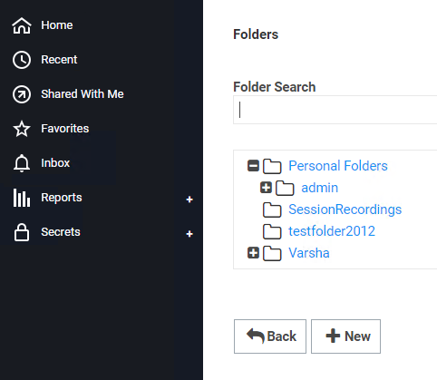
1. Double-click __Personal Folders__. Verify the presence of __admin__ folder.

1. Click __Admin | Groups__. The __Groups__ tab appears. Verify the presence of __Everyone__ group.

   
1. Go to __IBM Security Identity Governance and Intelligence__ administrative UI.

   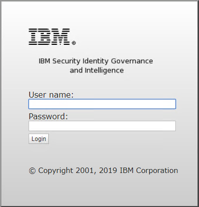
1. Fill in the required information, such as user name, password, and click __Login__. The __IBM IGI Administration Console__ dashboard appears.

   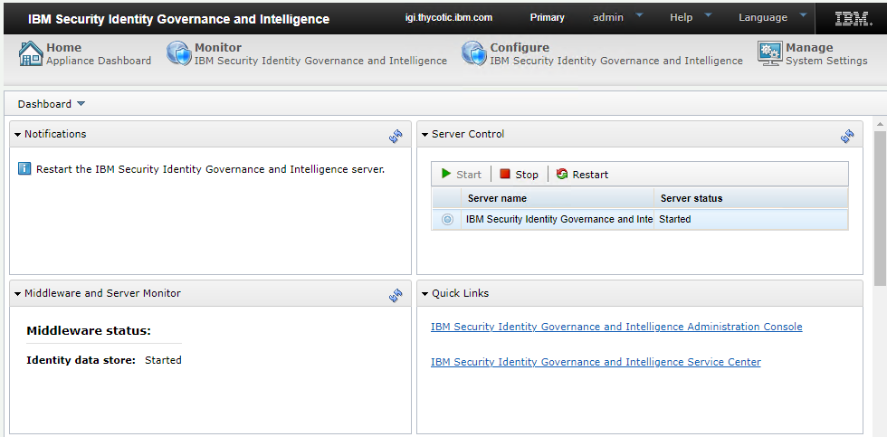
1. In the __Quick Links__ section, click __IBM Security Identity Governance and Intelligence Administration Console__.

   >**Note:** If you have a self-signed certificate, you may get a 'site can't be reached' message in that case you need to use the IP Address instead of domain name.

1. The __IBM IGI Administration Console__ login page appears.

   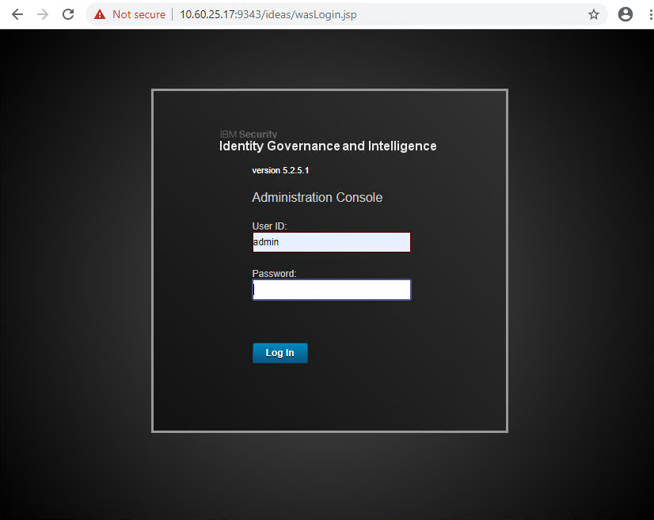
1. Fill in the required information, such as user ID, password, and click __Login__. The __IBM IGI Administration Console__ UI appears.

   
1. Click __Enterprise Connectors__. The __Enterprise Connectors__ page with the __Monitor__ tab selected appears.

   
1. Click __Manage | Profiles__.

   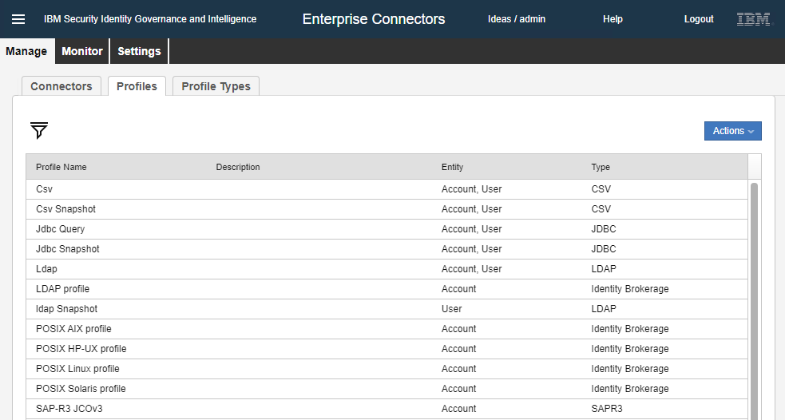
1. In the __Actions__ list, click __Import__.

   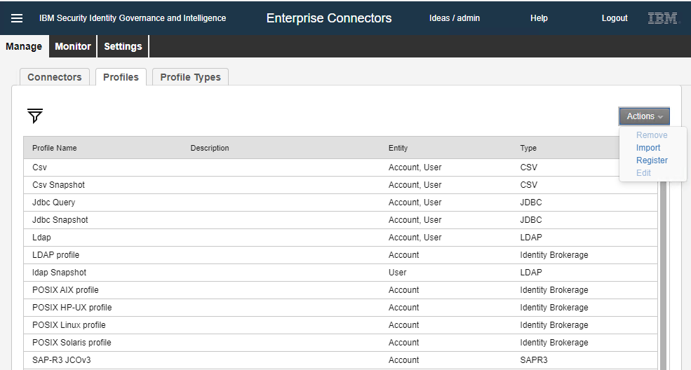
1. The __Import__ dialog box appears.

   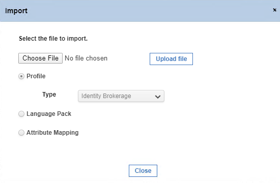
1. Click __Choose File__. The __Open__ dialog box appears.

   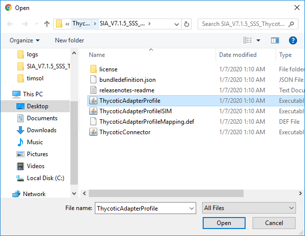
1. Navigate to the `ThycoticAdapterProfile` file and click __Open__.

   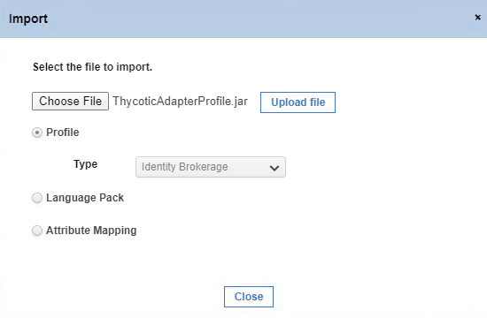
1. Click __Upload file__. A message, '__Profile imported successfully. Close this window to proceed.__' appears. Click __Close__.

   
1. In the __Enterprise Connectors__ page, Click __Manage | Profiles__.

   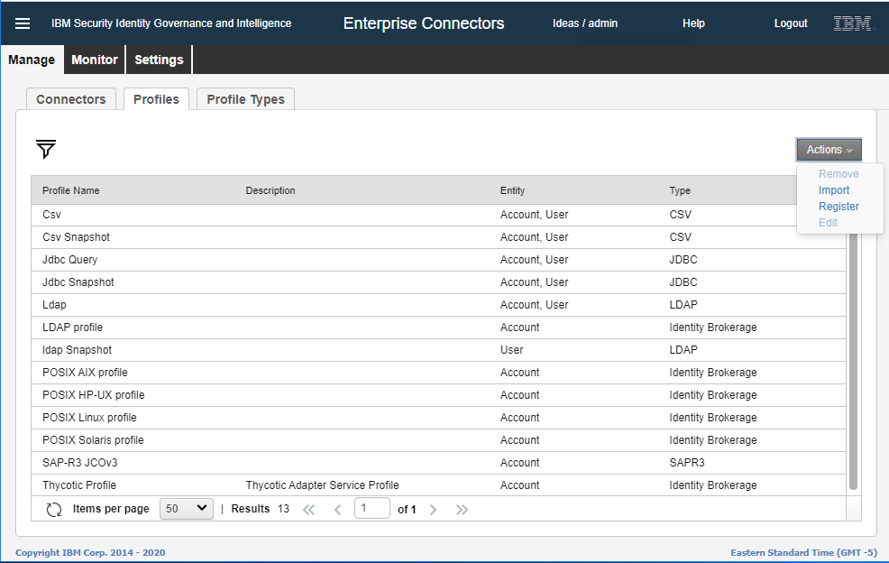
1. In the __Actions__ list, click __Import__. The __Import__ dialog box appears.

   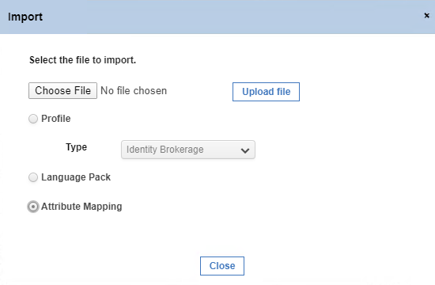
1. Select __Attribute Mapping__ option and click __Choose File__. The __Open__ dialog box appears.

   
1. Navigate to the `ThycoticAdapterProfileMapping.def` file, and click __Open__.

   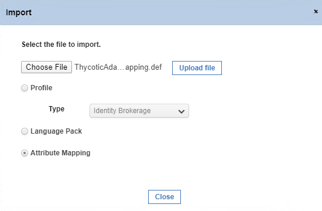
1. Click __Upload file__. A message, '__Attribute Mapping defining imported successfully. Close this window to proceed.__' appears.

   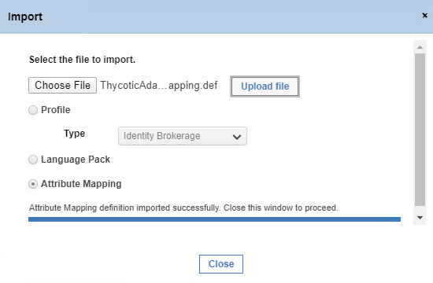
1. Click __Close__.

The attribute mapping definition is imported successfully.
