[title]: # (Troubleshooting)
[tags]: # (troubleshooting)
[priority]: # (110)
# Troubleshooting

## How to extend the validity of the Tivoli Directory Integrator certificate

1. Click __OK__. The certificate details appear.
1. In __Windows Search__, type `cmd` and press __Enter__. The results are auto-populated.
1. Right-click `Command Prompt` and click __Run as Administrator__. 
1. In the __User Account Control__ dialog box, click __Yes__. The __Administrator: Command Prompt__ appears.
1. To move to the `timsol` folder, type `C:\Program Files\IBM\TDI\V7.2\timsol and press Enter`.
1. Run the following eight commands:

    a. `"c:\Program Files\IBM\TDI\V7.2\jvm\jre\bin\keytool" -selfcert -v -alias server -validity 730 -keystore testserver.jks -storepass server`

     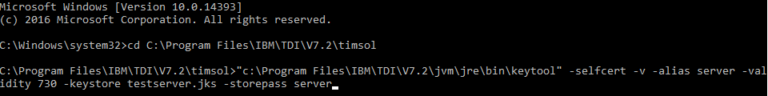

    b. `"c:\Program Files\IBM\TDI\V7.2\jvm\jre\bin\keytool" -selfcert -v -alias admin -validity 730 -keystore serverapi\testadmin.jks -storepass administrator`

     

    c. `"c:\Program Files\IBM\TDI\V7.2\jvm\jre\bin\keytool" -export -alias server -keystore testserver.jks -storepass server  -file myserver.crt`

     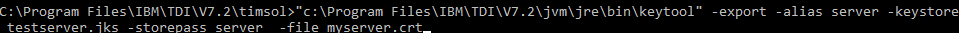 

     d. `"c:\Program Files\IBM\TDI\V7.2\jvm\jre\bin\keytool" -export -alias admin -keystore serverapi\testadmin.jks -storepass administrator  -file myadmin.crt`

     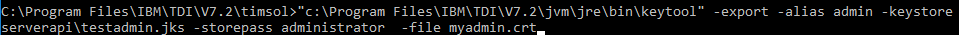

    e. `"c:\Program Files\IBM\TDI\V7.2\jvm\jre\bin\keytool" -delete -alias admin -keystore testserver.jks -storepass server`

     

    f. `"c:\Program Files\IBM\TDI\V7.2\jvm\jre\bin\keytool" -import -alias admin -keystore testserver.jks -storepass server -file myadmin.crt`

     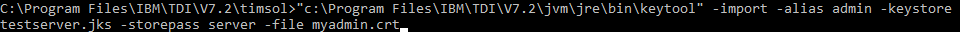
  
     >**Note:** To trust this certificate, type yes.

     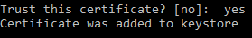

     g. `"c:\Program Files\IBM\TDI\V7.2\jvm\jre\bin\keytool" -delete -alias server -keystore serverapi\testadmin.jks -storepass administrator`

     

    h. `"c:\Program Files\IBM\TDI\V7.2\jvm\jre\bin\keytool" -import -alias server -keystore serverapi\testadmin.jks -storepass administrator -file myserver.crt`

     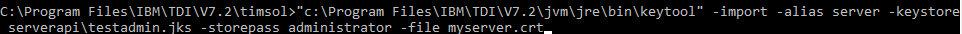

     >**Note__:** To trust this certificate, type yes.

      

     >**Note:** Go to `C:\Program Files\IBM\TDI\V7.2\timsol` and verify that certificates `myadmin` and `myserver` are added to the `timsol` folder.

1. Go to `C:\Program Files\IBM\TDI\V7.2\timsol` and copy the `testserver.jks` file.
1. Go to `C:\Program Files\IBM\TDI\V7.2` and paste the `testserver.jks` file.
1. Go to `C:\Program Files\IBM\TDI\V7.2\timsol\serverapi` and copy `testadmin.jks` file.
1. Go to `C:\Program Files\IBM\TDI\V7.2\serverapi` and paste `testadmin.jks` file.

## How to Import the Thycotic Certificate

For secure connection between Thycotic Secret Server and IBM IGI, you will need to import Thycotic certificate.

__To import Thycotic certificate:__

1. Click __Not secure__ part of the Thycotic Server URL . __Your connection to this site is not secure__ dialog box appears.

   
1. Click __Certificate (Invalid)__. The __Certificate__ dialog box appears.

   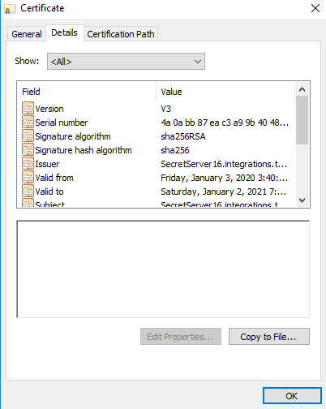
1. Click __Details | Copy to File__. The __Welcome to the Certificate Export Wizard__
 appears.

   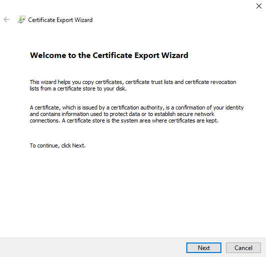
1. Click __Next__. The __Export File Format__ panel appears.

   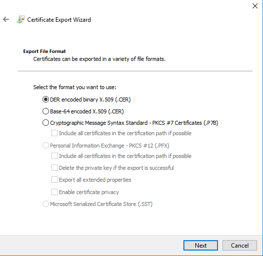
1. Click __Next__. The __File to Export__ panel appears.

   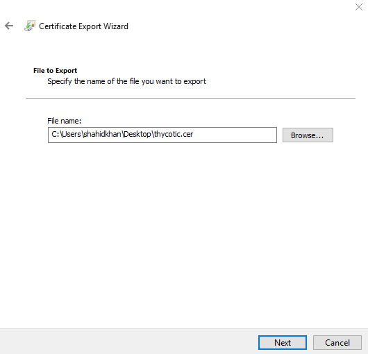
1. In the __File name__ text box, type the name for the certificate to be exported.
1. Click __Browse__ and select the location where you want to export the certificate.
1. Click __Next__. The __Completing the Certificate Export Wizard__ appears.

   
1. Click __Finish__. The message, ‘__The export was successful.__’ appears. The certificate is exported to the location selected.

   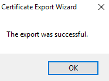
1. Right-click the certificate where you have exported and click __Install Certificate__.

   
1. The __Welcome to the Certificate Import Wizard__ appears.

   
1. In the __Store Location__ area, select __Current User__ and then click __Next__. The __Certificate Store__ panel  appears.

   
1. Select __Place all certificates in the following store__ and then click __Browse__.
1. Select __Personal__ folder and then click __Next__. The __Completing the Certificate Import Wizard__ panel appears.

   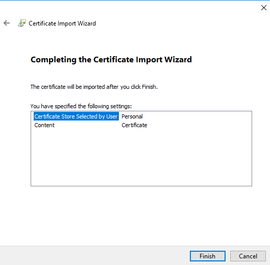
1. Click __Finish__. The message ‘__The import was successful.__’ appears.

   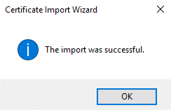
1. Right-click the certificate where you have exported and click __Install Certificate__.

   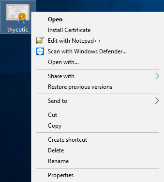
1. The __Welcome to the Certificate Import Wizard__ appears.

   
1. In the __Store Location__ area, select __Current User__ and then click __Next__. The __Certificate Store__ panel  appears.

   
1. Select __Place all certificates in the following store__ and then click __Browse__.
1. Select __Trusted Root Certification Authorities__ folder and then click __Next__. The __Completing the Certificate Import Wizard__ panel appears.

   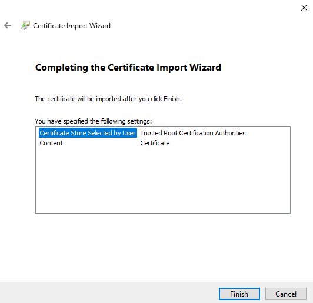
1. Click __Finish__. The message ‘__The import was successful.__’ appears.

   

## How to Add the Thycotic certificate

1. Go to `C:\Program Files\IBM\TDI\V7.2\jvm\jre\bin`.

   
1. Right-click `ikeyman` file and select __Run as administrator__.
1. In the __User Account Control__ dialog box, click __Yes__. The __IBM Key Management__ dialog box appears.

   
1. Click open  icon. The  __Open__ dialog box appears.
1. Click __Browse__ and navigate to `C:\Program Files\IBM\TDI\V7.2\timsol` and double-click the `timsol` folder.
1. Select `testserver.jks` and click __Open__. The __Open__ dialog box appears.
1. Click __OK__. The __Password Prompt__ dialog box appears.

   
1. In the __Password__ text box, type the password and click __OK__.

   > __Note__: The default password for `testserver.jks` is `server`.
1. In the __IBM Key Management__ dialog box, click __View/Edit__. The certificate details appear.

   
1. Verify the validity of the certfificate and close the dialog box.
1. From the type of certificate list, select __Signer Certificates__.

   
1. The type of __Signer Certificate__ as __admin__ is listed. Click __Add__. The __Open__ dialog box appears.

   
1. Click __Browse__ and navigate to the location of `thycotic.cer`.
1. Select `thycotic.cer` and click __Open__. The __Open__ dialog box appears.

   
1. Click __OK__. The __Enter a Label__ dialog box appears.

   
1. In the __Enter a Label for the certificate__ text box, type the label and then click __OK__. The certificate is listed in the __Key database content__ section.

   
1. Click Key __Key Database File__ tab | __Close__. The certificate is saved.

   
1. Click open  icon. The __Open__ dialog box appears.

   
1. Click __Browse__ and navigate to `C:\Program Files\IBM\TDI\V7.2\timsol`.
1. Double-click `timsol` folder and then double-click `serverapi` folder.
1. Click `testadmin.jks` and click __Open__.
1. Click __OK__. The __Password Prompt__ dialog box appears.

   
1. In the __Password__ text box, type the password and click __OK__.

   > __Note__: The default password for `testadmin.jk` is `administrator`.
1. Click __OK__. The certificate is listed in the __Key database content__ section.

   
1. From the type of certificate list, select __Singer Certificates__.

   
1. Click the certificate name __server__ and click __Add__.

1. The __Open__ dialog box appears.
  
   
1. Click __Browse__ and navigate to the location of `thycotic.cer`.
1. Click __Open__ and then in the __Open__ dialog box click __OK__. The __Enter a label__ dialog box appears.

   
1. In the __Enter a label for the certificate__ text box, type the label and then click __OK__. The certificate is listed in the __Key database content__ area.

   
1. Click __Key Database File__ tab | __Close__. The certificate is saved.

   
