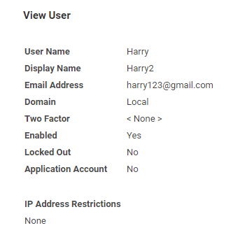

[title]: # (Verifying Integration)
[tags]: # (verify)
[priority]: # (109)
# Verifying the Integration

## Check user details and change password

If you would like to verify that the integration was successful, you can test this by checking the user details and changing the password.

1. Go to the __Secret Server | Admin | Users__.

1. Click on the user that was added. The details of the user should be updated.

   
1. Go to __IBM IGI Administrator Console__.
1. In the menu, click __Access Governance Core__.
1. Click __Manage__ tab | __Users | Accounts__ tab.
1. Select the account.
1. In the Actions list, click __Change Pwd__.

   
1. The __Change Password__ dialog box appears.

   
1. Fill in the required information, such as new password and confirm password.
1. Click __OK__.
1. A message, ‘__Operation successfully completed.__’ appears.
1. Click __Ok__.

   
1. Click the __Events__ tab.
1. At the bottom of the __Events__ tab, click on __OUT Event__. The event is listed. Wait till the Status and the __ERC Status__ is displayed as __Success__.

Secret Server is sucessfully integrated with IBM IGI Admin Console.
