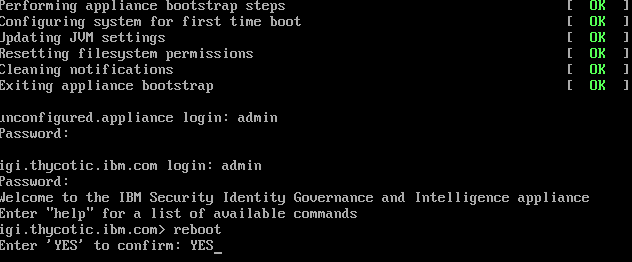

[title]: # (Configure the OpenID Connect Provider)
[tags]: # (introduction)
[priority]: # (3)
# Disable the OpenID Connector

The next step after installing IBM IGI is to configure the OpenID Connect Provider.

__To configure OpenID Connect Provider:__

1. Open a browser and navigate to the IBM IGI login page. This should be an IP address and port number (Example: 10.60.25.21:9443). The default port number is __9443__.

   >**Note:** If you receive an error screen due to not having a certificate configured, please proceed by clicking __Advanced | proceed (unsafe)__.

1. The __IBM IGI Login__ page appears.

   
1. Fill in the required information, such as the user name, password, and click __Log In__. The IBM IGI user interface appears.
   >**Note:** The default value for user name and password is `admin`.
1. Click __Configure__ | __Manage Server Setting__ | __OpenID Connect Provider Configuration__. The __Connect Provider Configuration__ page appears.

   
1. Click __Disable__.

   
1. A message, '__Are you sure you want to disable OpenID Connect Authentication configuration?__' appears.

   
1. Click __Yes__. The status of the configuration appears.

   

   >**Note:** In the IBM IGI UI, the notifications are listed in the __Notifications__ section.

   
1. In the __Server Control__ section, select the server and click __Restart__.

   
1. Go to the __IBM IGI Virtual Appliance__.

   
1. In the Virtual Appliance, type `reboot` and press __Enter__.
1. To confirm, type `YES` and press __Enter__.
1. The __IBM IGI login__ dialog box appears.

   
1. Fill in the required information, such as the user name, password, and click __Log In__. The IBM IGI user interface appears.

   
