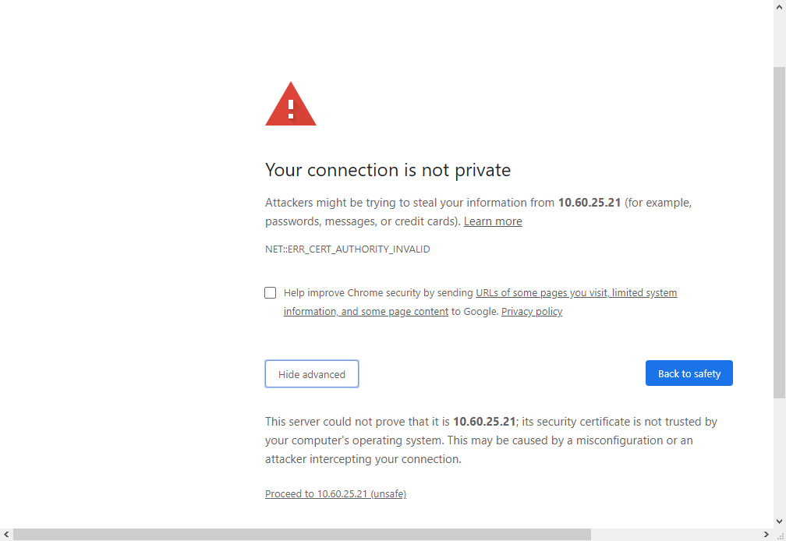
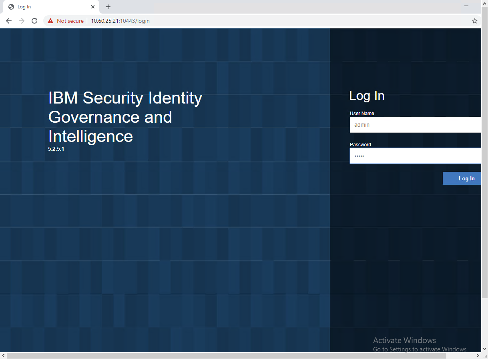
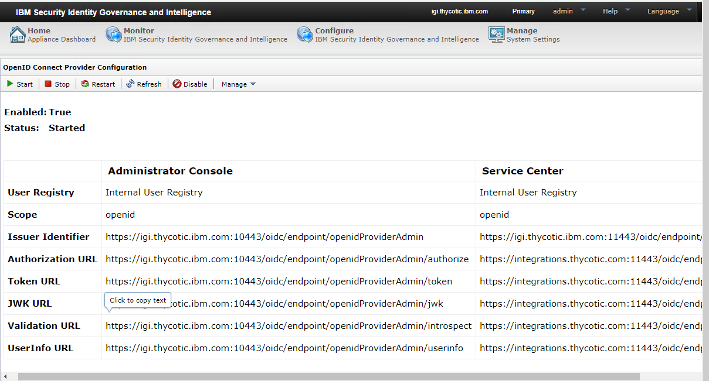
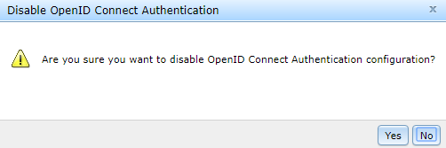
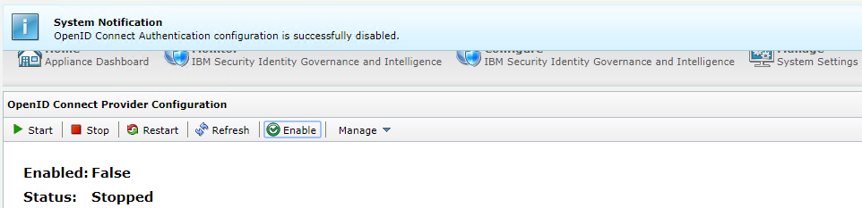
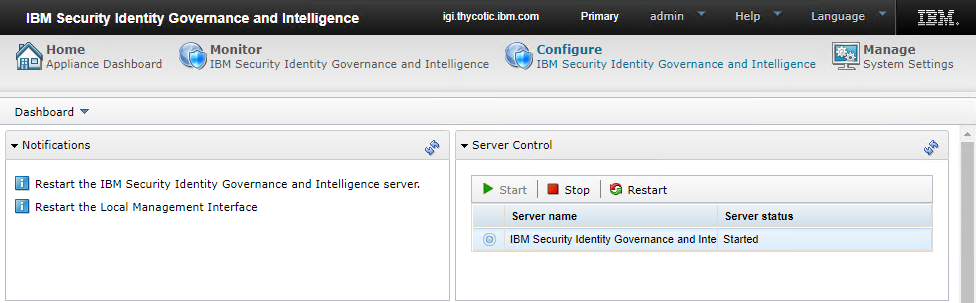
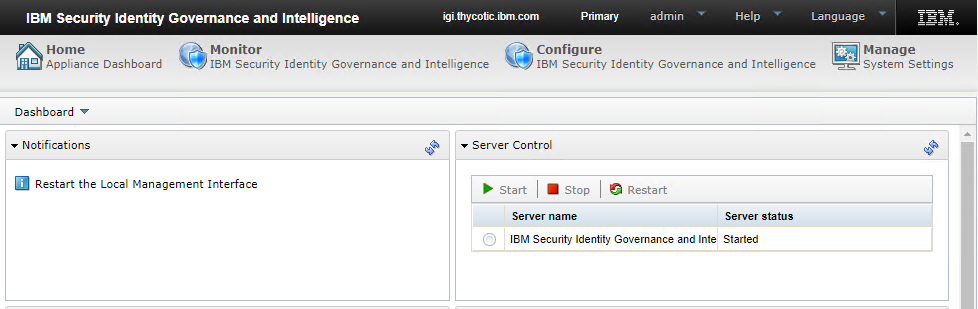
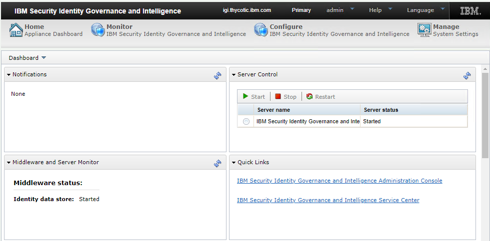

[title]: # (Configure the OpenID Connect Provider)
[tags]: # (introduction)
[priority]: # (104)
# Configure the OpenID Connect Provider

## Configure OpenID Connect Provider
The next step is to configure the OpenID Connect Provider. 

**To configure OpenID Connect Provider:**

1. Type the `IP address` along with the port number (For example: 10.60.25.21:9443) in the browser and press **Enter**.

    >**Note**: The default port number is 9443.

     

2.  Click **Advanced** and click **Proceed to `IP Address` (unsafe)**.

     

     The **IBM IGI Login** page appears.
      
 
3.	Fill in the required information, such as the user name, password, and click **Log In**. The IBM IGI user interface appears. 
     >**Note:** The default value for user name and password is `admin`.

4.	Click **Configure** > **Manage Server Setting** > **OpenID Connect Provider Configuration**. The **Connect Provider Configuration** page appears.

     

5.	Click **Disable**. 

     

     A message, '**Are you sure you want to disable OpenID Connect Authentication configuration?**' appears.

     

6.	Click **Yes**. The status of the configuration appears.

     

    > **Note**: In the IBM IGI UI, the notifications are listed in the **Notifications** section.

     

7. In the **Server Control** section, select the server and click **Restart**.

     

8. Go to the **IBM IGI Virtual Appliance**.

     
9. In the Virtual Appliance, type `reboot` and press **Enter**.

10.	To confirm, type `YES` and press **Enter**. The **IBM IGI login** dialog box appears.

         

11. Fill in the required information, such as the user name, password, and click **Log In**. The IBM IGI user interface appears. 

     

The Virtual Appliance for IBM IGI is configured and setup. Now, the next step is to install [Security Directory Integrator 7.2](\steps\steptwoinstallingsdi7.2.md).