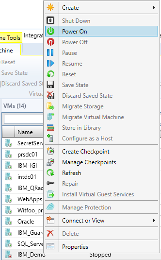
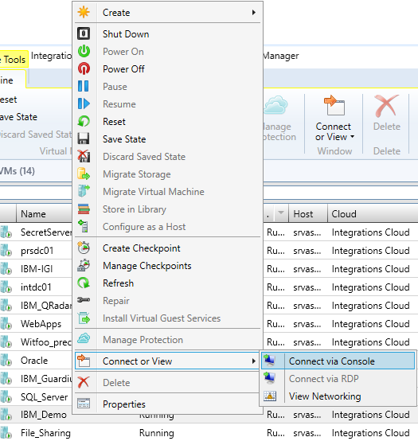
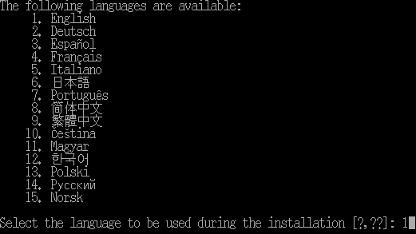
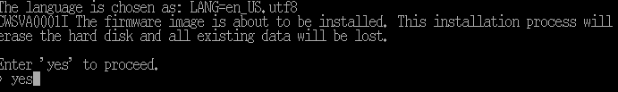
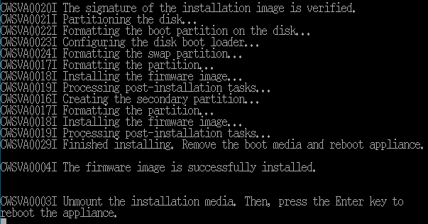

[title]: # (Configuring and Setting Up Virtual Appliance)
[tags]: # (introduction)
[priority]: # (101)
[display]: # (none)
# Configuring and Setting Up Virtual Appliance for IBM IGI

<!-- add troubleshooting topic and info -->

To integrate IBM IGI with Secret Server, IBM IGI must be installed and configured using a Virtual Appliance.

## Set up the Virtual Appliance

The following are the steps to set up a Virtual Appliance:

 * [Install firmware](#Install-firmware)
 * [Set up properties for VM](#Setup-properties-for-VM)

## Install firmware
After creating a VM, the firmware must be installed.

__To install the firmware on the VM:__
1. On the VM window, right-click the name of the Virtual Machine created and click __Power On__.

   
1. Right-click the name of the VM and click __Connect or View__ | __Connect via Console__.

   
1. The __Windows Security__ dialog box appears.

   
1. Type a password and click __OK__. The Console view appears.

   
1. Select the language to be used during the installation as `English` and press __Enter__.

   
1. To proceed, type `yes` and press __Enter__.

   

The firmware is successfully installed. After installation is completed, the process prompts to reboot the appliance. Before rebooting the appliance, some properties are to be set.

## Set up properties for VM

You need to set up the properties for hardware configuration.

__To set up properties for VM:__

1. On the VM window, right-click the name of the VM created and click __Properties__.

   
1. Click __Hardware Configuration__ | __Virtual DVD drive__.

   
1. In the __Media__ area, select __No media__ and click __OK__. The VM gets updated.
1. Go to Virtual Appliance and press __Enter__ to reboot.

   

The VM properties are set successfully.

