[title]: # (How to set up IBM IGI)
[tags]: # (introduction)
[priority]: # (103)
# How to set up IBM IGI

## Set up IBM IGI
This section provides the steps to set up IBM IGI.

__To set up IBM IGI:__

1. In the __igi.thycotic.ibm.com__ domain name, enter login and password details.

1. Type the `IP address` along with the port number (For example: 10.60.25.21:9443) in the browser and press __Enter__.

   >**Note:** The default port number is 9443.

   

1. Click __Advanced__.
1. Click __Proceed to `IP Address` (unsafe)__.

   

1. The IBM IGI Login page appears.

   
1. Fill in the required information, such as the user name, password, and click __Login__. The __IBM Security Identity Governance and Intelligence__ page appears.

   >__Note:__ The default value for user name is `admin`. The value of the password is what you have changed in the Console window.

   
1. Click __Setup__ for setting up a primary node for the IBM Security Identity Governance and Intelligence cluster. The __IBM IGI setup wizard__ appears.

   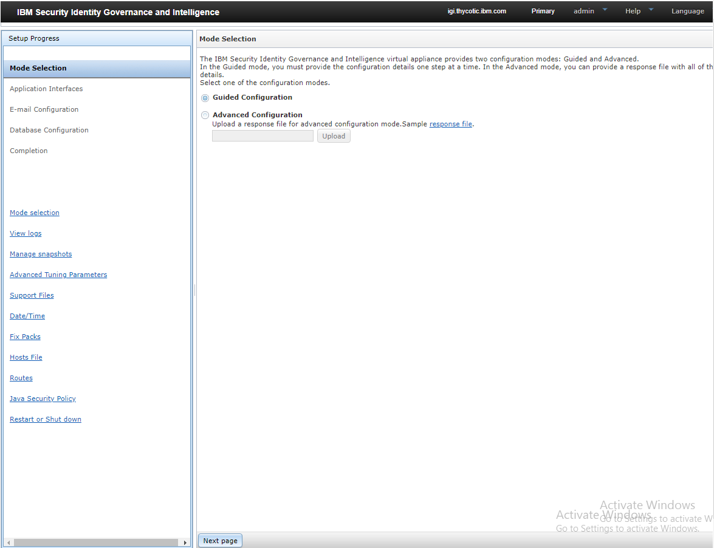
1. In the __Mode Selection__ page, click __Next page__. The __Application Interfaces__ page appears.

   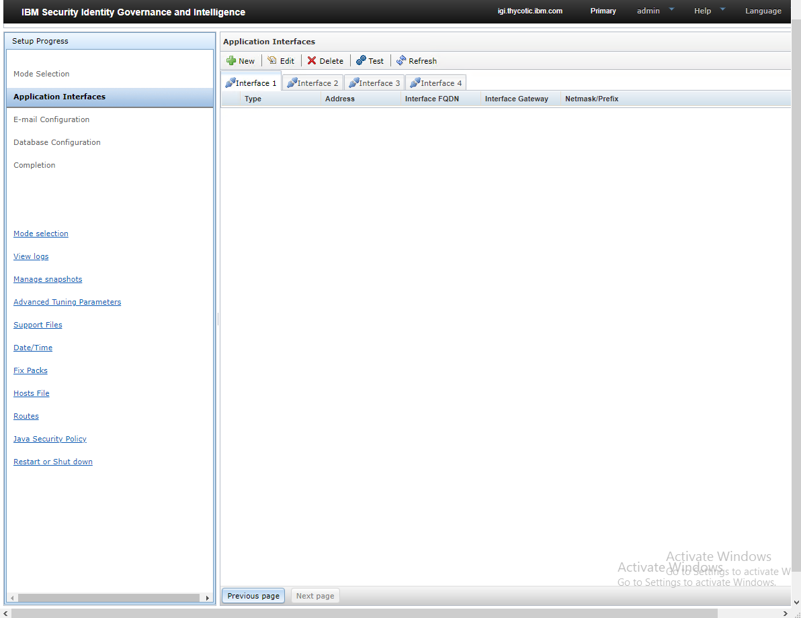
1. In the __Application Interfaces__ page, click the __New__  icon. The __Add Address__ dialog box appears.
1. In the __Add Address__ dialog box, fill in the required information.

   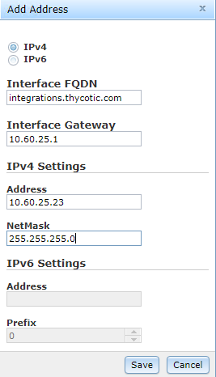

    * __IPv4__ - Select the required option.

    * __Interface FQDN__ - Type the fully qualified domain name.

    * __Interface Gateway__ - Type the interface gateway details.

    * __IPv4 Settings - Address__ - Type the IP Address.

   >**Note:** Ensure the IP Address is not assigned to any other computer.

    * __IPv4 Settings - NetMask__ - Type the netmask details.

1. Click __Save__. A message “__The new application address is added successfully.__” appears and the IP Address is listed.

   
1. Click __Next page__. The __Mail Server Configuration__ page appears.

   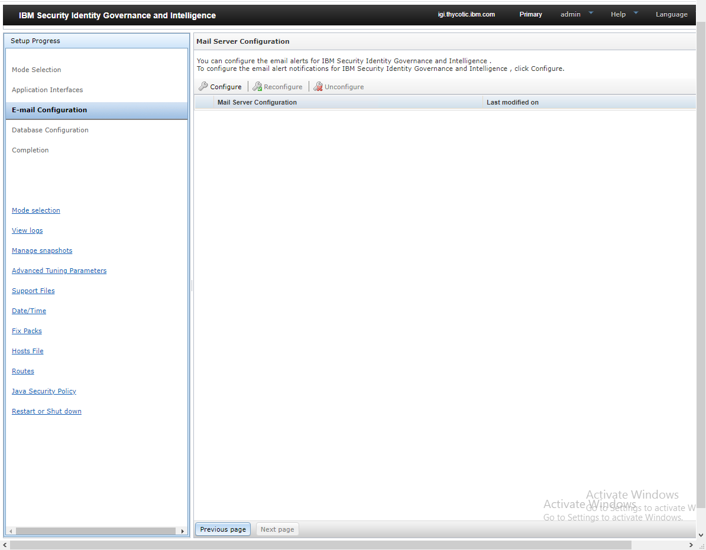
1. Click the __Configure__  icon. The __Mail Server Configuration Details__ dialog box appears.
1. In the __Mail Server Configuration Details__ dialog box, fill in all the information.

   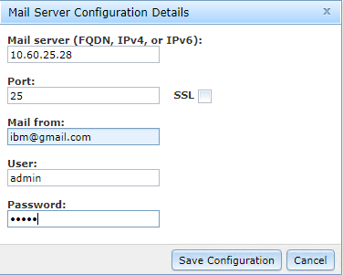
1. Click __Save Configuration__. A message, ‘__Mail server configuration added.__’ appears and the email configuration is listed.

   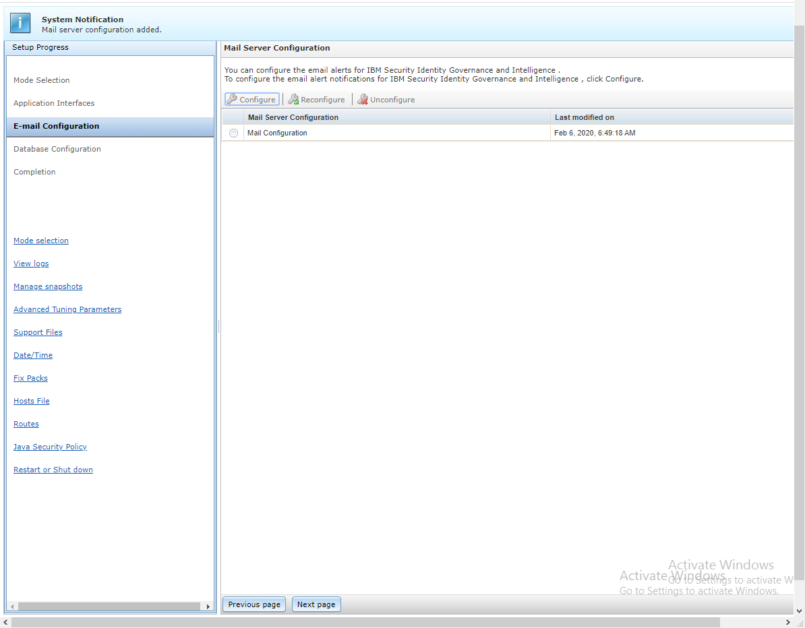
1. Click __Next page__. The __Database Server Configuration__ page appears.

   
1. Click the __Configure__  icon. The __Identity data store__ details dialog box appears.
1. In the __Connection__ tab, fill in all the information.

   
1. Click __Save Configuration__. A message,'__Identity data store configuration created.__ 'appears and the database configurations are displayed.

   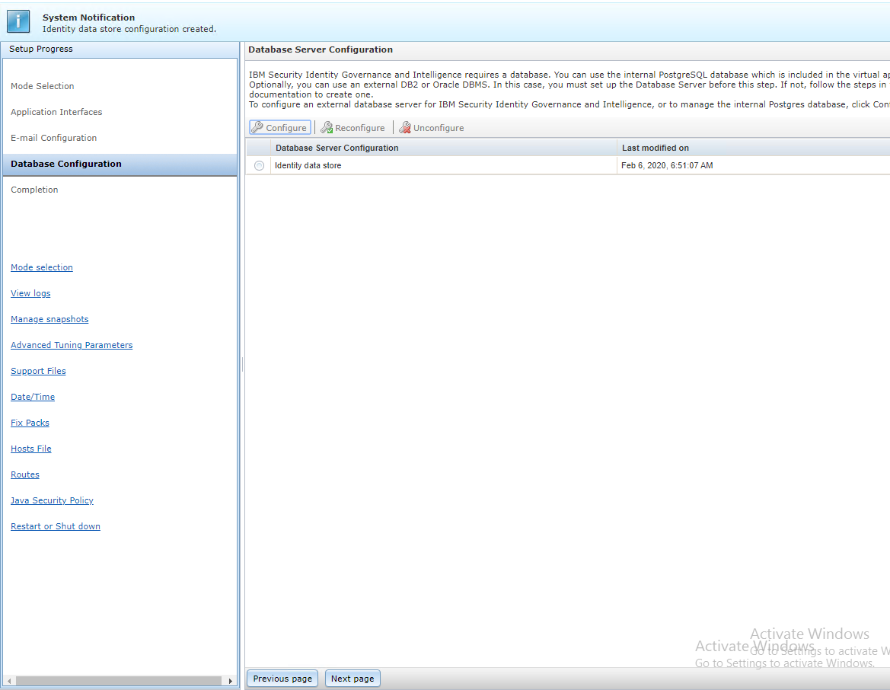
1. Click __Next page__.

   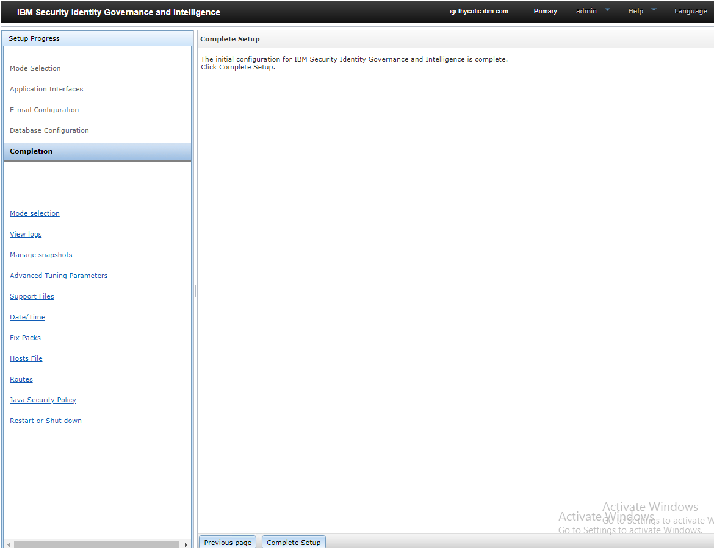
1. In the __Complete Setup__ page, click __Complete Setup__. The progress bar of the setup appears.

   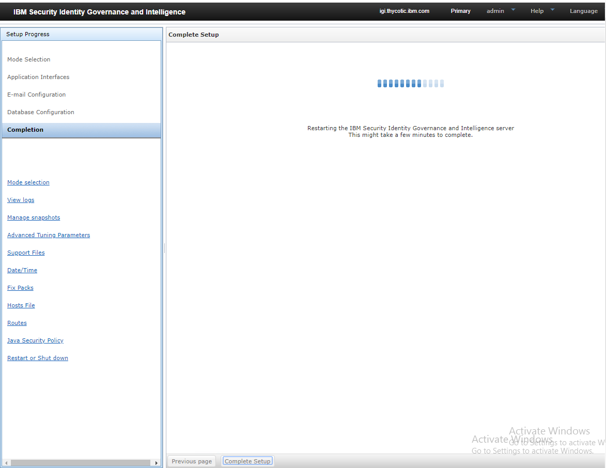
1. The __Complete Setup__ page appears.

   
1. After the completion of the setup, click `here` in the sentence `Click here to go to the dashboard`. The __Session Ended__ dialog box appears.

   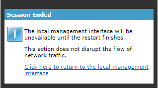
1. In the __Session Ended__ dialog box, click the sentence `Click here to return to the local management interface`. The IBM IGI dashboard appears.

   >**Note:** If the IBM IGI dashboard does not appear, type the IP address along with the port number (For example: 10.60.25.21:9443) in the browser and press Enter. If required, replace the domain name with the IP Address.

   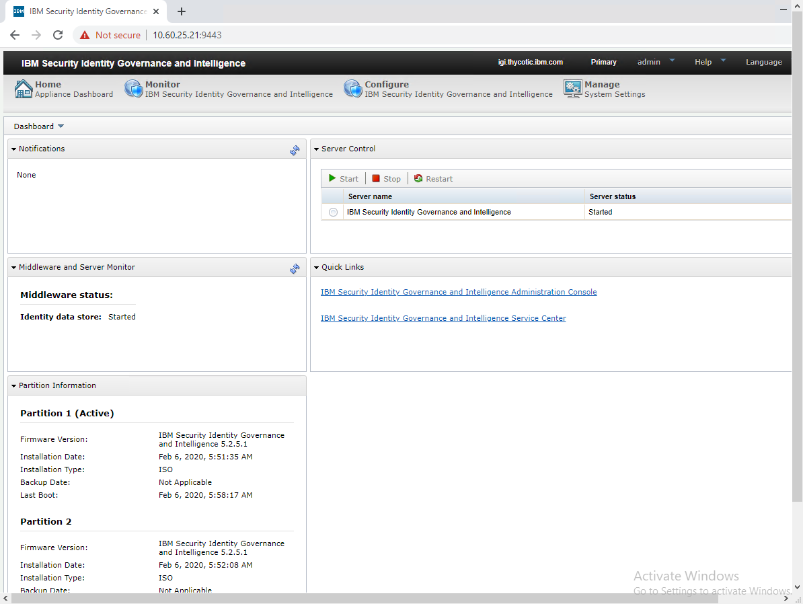
1. Close the session.

The IBM IGI setup is completed successfully. Now, the OpenID Connect Provider is to be configured.
