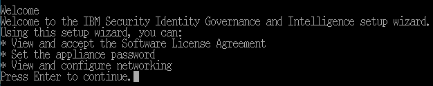
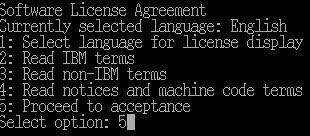
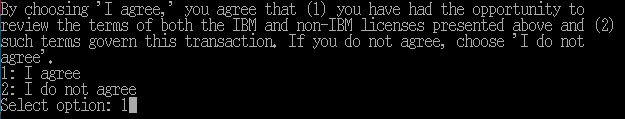
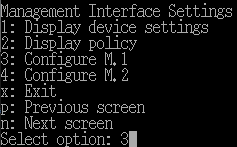
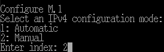
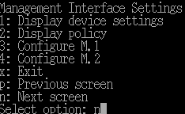
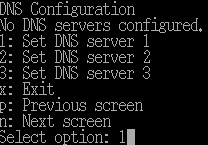
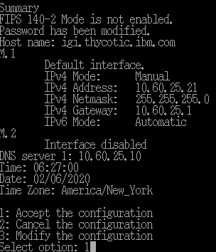

[title]: # (Install IBM IGI)
[tags]: # (introduction)
[priority]: # (101)
# Install IBM IGI

This section provides the steps to install IBM IGI.

__To install IBM IGI:__

1. Type the login credentials. The __IBM Security Identity Governance and Intelligence setup wizard__ appears.
     >**Note:** The default value for login and password is `admin`.

     

1. Press __Enter__ to continue. The __Software License Agreement__ appears.

     
1. In the __Software License Agreement__, select the option __Proceed to acceptance__.

     
1. Select the option __I agree__ to suggest that you agree that you have had the opportunity to review the terms of both the IBM and non-IBM licenses presented and such terms govern this transaction.

     
1. Under __FIPS 140-2 Mode Configuration__, select the option __Next screen__.

     
1. Under __Appliance Password__, select the option __Change password__ .

     
1. Under __Change Password__, fill in the required information, such as old password, new password, and confirm new password. The ‘__Password successfully changed.__’ message appears.

     

1. Under __Appliance Password__, select the option __Next screen__.

     
1. Under __Host Name Configuration__, select the option __Change the host name__.

     
1. Under __Change the Host Name__, enter the FQDN host name. (For example: igi.thycotic.ibm.com )

     
1. Under __Host Name Configuration__, select the option __Next screen__.

     
1. Under __Management Interface Settings__, select the option __Configure M.1__.

     
1. Under __Configure M.1__, select the option __Manual__.

     
1. Fill in the required information, such as type the IPV4 address, IPV4 subnet mask, IPV4 gateway, and then select __IPV6 configuration mode__ as __Automatic__.

      
1. In the __Management Interface Settings__, select the option as __Next screen__.

      
1. In __DNS Configuration__, select the option __Set DNS server 1__.

      
1. In __Set DNS server 1__, type the DNS server IP address. 

     
1. In __DNS Configuration__, select the option __Next screen__.

     
1. In __Time Configuration__, select the option __Next screen__.

     
1. In the __Summary__, select the option __Accept the configuration__.
1. After applying the policy changes, a message, ‘__Policy changes were successfully applied. Local Management Interface has been restarted.__’ appears.

     
1. The __IBM IGI__ appliance login page appears.

     

1. IBM IGI is successfully installed.
