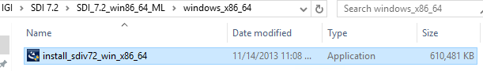
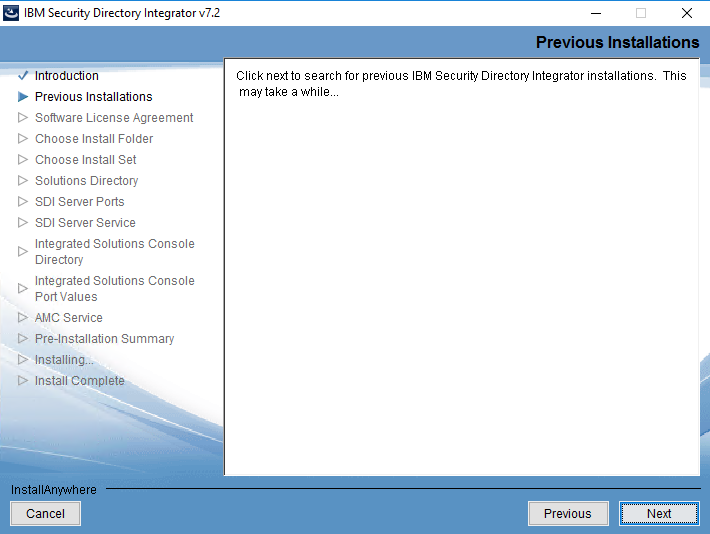
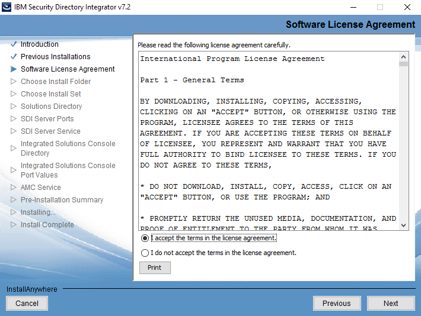
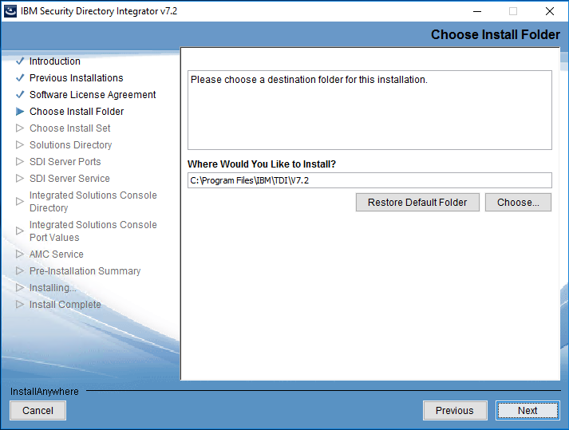
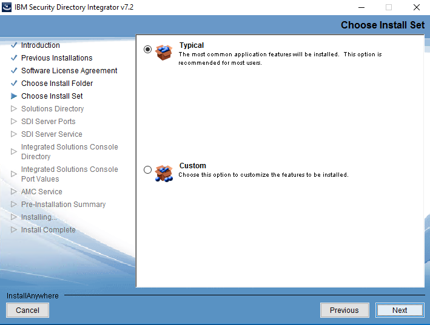
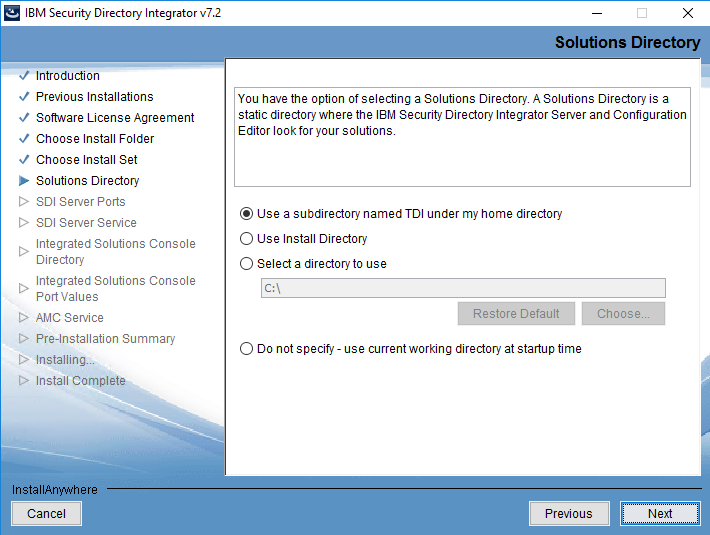
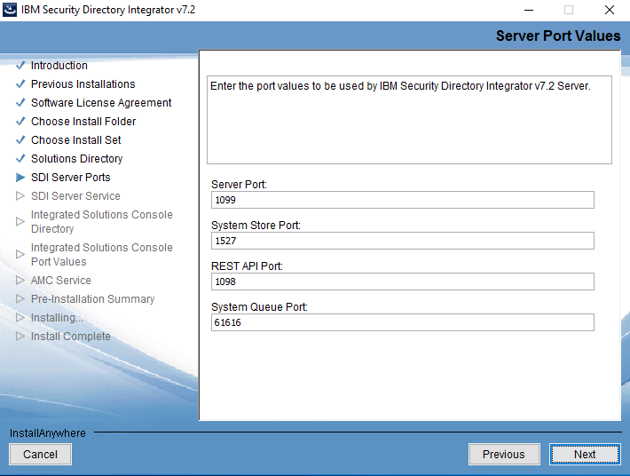
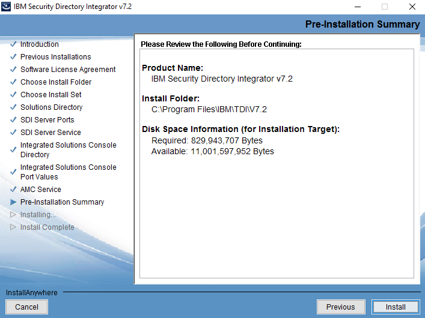
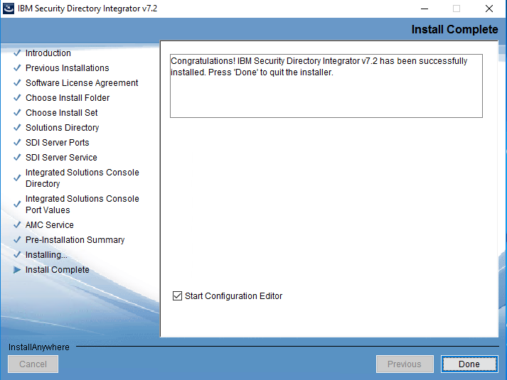

[title]: # (Installing Security Directory Integrator 7.2)
[tags]: # (introduction)
[priority]: # (102)
# Step Two: Installing Security Directory Integrator 7.2

You can install Security Directory Integrator 7.2. using the **Security Directory Integrator** wizard. IBM IGI uses Security Directory Integrator to communicate with various managed resources. 

**To install Security Directory Integrator 7.2:**
1.	Go to the Security Directory Integrator 7.2 folder that you have downloaded from the IBM website.
2.	Double-click the `windows_x86_64` folder.

     

3.	Right-click the `install_sdiv72_win_x86_64` file and click `Run as administrator`. The **User Account Control** dialog box appears.
4.	Click **Yes** to run the setup. The **Security Directory Integrator wizard** appears.
 
     

5.	Click **OK**. The **Introduction** panel appears.

     

6.	 Click **Next**. The **Previous Installations** panel appears.

     
 
7.	 Click **Next**. The **Software License Agreement** panel appears.

     

8.	 Select **I accept the terms in the license agreement** and click **Next**.

     

9.	In the **Choose Install Folder**, the folder where Security Directory Integrator 7.2 is installed appears. Click **Choose** to change the folder where you want to install Security Directory Integrator 7.2.
10.	After installing Security Directory Integrator 7.2, in the **Choose Install Folder**, click **Next**. The **Choose Install Set** panel appears.

     

11.	 Select **Typical** and click **Next**. The **Solutions Directory** panel appears.

     

12.	 Click **Next**. The **Server Ports Values** panel appears.

     

13.	 Click **Next**. The **Register Server as Service** panel appears.

     

14.	 Click **Next**. The **Integrated Solutions Console Port Values** panel appears.

     

15.	 Click **Next**. The **AMC Service** panel appears.

     

16.	 Click **Next**. The **Pre-Installation Summary** panel appears.

     

17.	 Click **Install**. The **Install Complete** panel appears.

     

18.	 Click **Done**. The Security Directory Integrator 7.2 is installed successfully. The **Workspace Launcher** dialog box appears.

     

19.	 Click **Cancel**.
20.	Go to `C:\Program Files\IBM\TDI\V7.2`. This is the **Security Directory Integrator 7.2** folder.

The Security Directory Integrator 7.2 is installed successfully in the respective folder.

The next step is to [install Tivoli dispatcher](steps\stepthreeinstalllingtivolidispatcher.md). 

