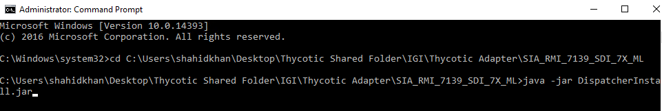
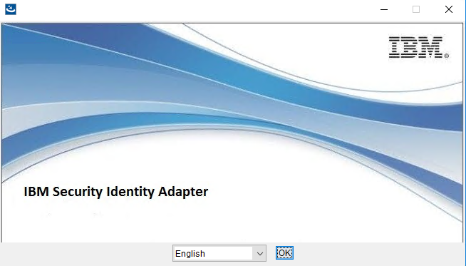
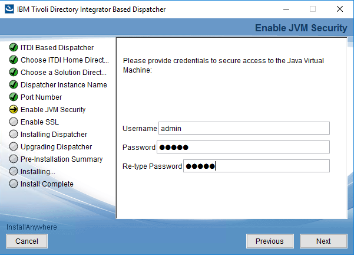
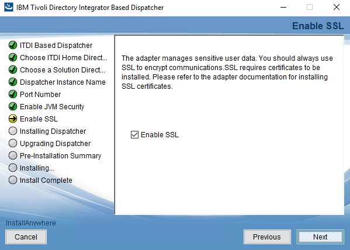
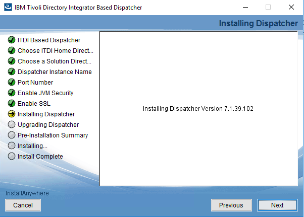

[title]: # (Installing Tivoli Dispatcher)
[tags]: # (introduction)
[priority]: # (106)
# Step Three: Installing Tivoli Dispatcher

You must install the Tivoli Dispatcher using the **IBM Security Identity Adapter**   wizard. The Tivoli Dispatcher is a Security Directory Integrator component that enables the IGI to communicate with IBM Security Directory Integrator.

**To install Tivoli Dispatcher:**
1.	Go to the **Thycotic Shared Folder** > **IGI** > **Thycotic Adapter** > **SIA_RMI_7139_SDI_7X_ML**.
2.	In the **Widnows Search** box type `cmd`. The results are auto-populated. Right-click **Command Prompt** and click **Run as administrator**.
3.	In the **User Account Control** dialog box, click **Yes**.

     

4.	In the **Command Prompt** type the following: 
`cd <path where the DispatcherInstall is located>`
and press **Enter**.
5.	In the **Command Prompt** then type the following:
`Java -jar DispatcherInstall.jar`  
and press **Enter**. The **IBM Security Identity Adapter** wizard appears.

     

6.	Click **OK**. The **ITDI Based Dispatcher** panel appears.

     

7.	 Click **Next**. The **Choose ITDI Home Directory** panel appears.

     

8.	 Click **Choose** to select Security Directory Integrator path and click **Next**. The **Choose a Solution Directory** panel appears.

     

9.	 Add `\timsol` to the `ITDI Home Directory` and click **Next**. The **Dispatcher Instance Name** panel appears.

     >**Note**: Timsol is the folder where all the Tivoli directory integrator based dispatcher file is placed.

     

10.	 Click **Next**. The **Port Number** panel appears.

     

11.	 Click **Next**. The **Enable JVM Security** panel appears.

     

12.	 Type username, password, re-type  password and click **Next**. The **Enable SSL** panel appears.

     

13.	 Click **Next**. The **Installing Dispatcher** panel appears.

     

14.	 Click **Next**. The **Pre-Installation Summary** panel appears.

     

15.	 Click **Install**.

     

16.	In the **Install Complete** panel, click **Done**. The Security Directory Integrator is installed.

17.	To verify the installation, go to `C:\Program Files\IBM\TDI\V7.2` and verify if the `timsol` folder is created.
18.	In the **Search** box type `services`. The results are auto-populated.
19.	Click `Services`. Verify if the **IBM Security Directory Integrator (ISIM Adapters)** service is running.

The Tivoli Dispatcher is successfully installed. 

The next step is to [configure IBM IGI and Dispatcher to access the Admin Console](steps\stepfouraccessadminconsole.md) 