[title]: # (Accessing Secret Server Events)
[tags]: # (events)
[priority]: # (302)
# Accessing Secret Server Events in the Secret Server Application within QRadar

1. Login to qradar to QRadar as the admin user: `https://<ipaddress>`

   

1. Click on Log activity, select the log from Secret server, then click on DSM
    editor under admin. (Required configuration for application integration)

   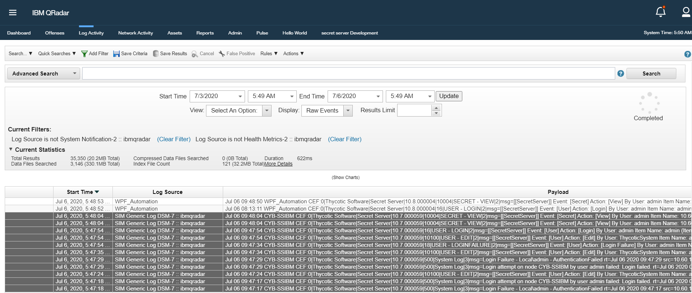

1. Select the log Source popup will be displayed, create new or select the
    existing one. (Required configuration for application integration).

   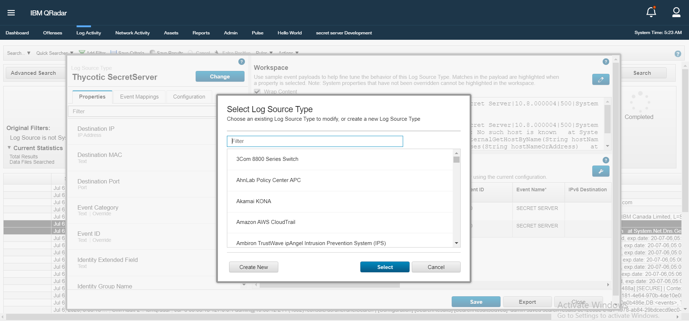

1. Click on Event Mapping category and click on Add option to map the event
    with event ID. In the DSM editor you need values showing up in the Log
    Preview for both __"Event ID"__ and __"Event Category".__  (NOT REQUIRED FOR APPLICATION INTEGRATION).

   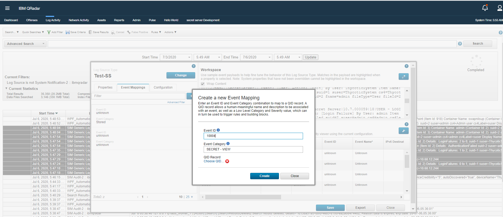

## How to create a new QID (OPTIONAL)

1. Click on the button Choose QID

   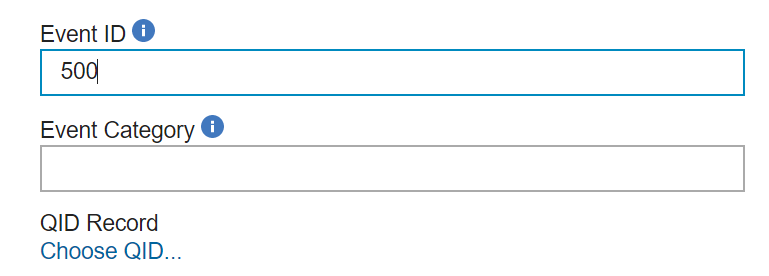

1. Click on Create New QID Record button or select the existing one.

   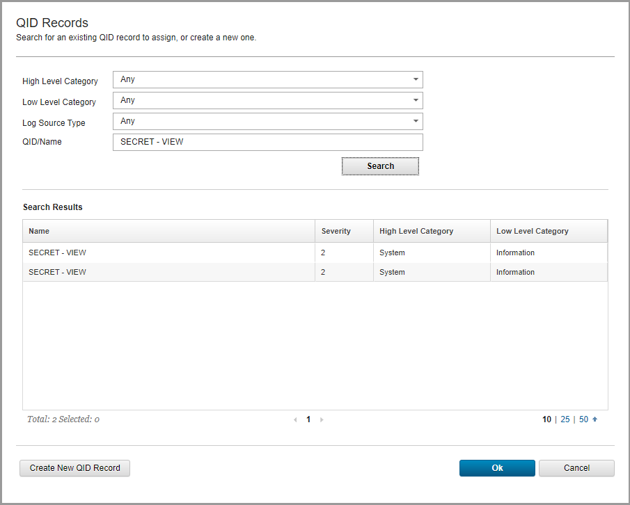

1. (OPTIONAL) Click on add a new Event Mapping using the same two values for Event ID and Category. The last step is to choose the event. Either selects an existing event name by searching using the search field, or create a new record ("Create New QID Record"). The Event ID, Event Category that is used to match the Event depend on using the same value.  

For more info click on : <https://developer.ibm.com/qradar/develop-dsm/>

## Add Custom Properties in __Log Source__

1. Click on __Properties__ tab and click on __+ icon__ to add new properties.

   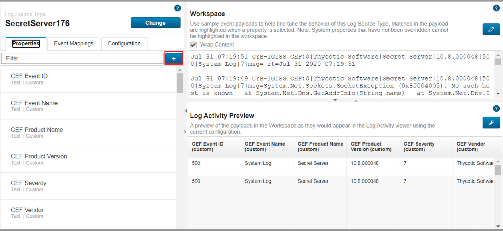

1. Click on __Create New__ button to add New Properties __ItemId__ and __Item Name__.

   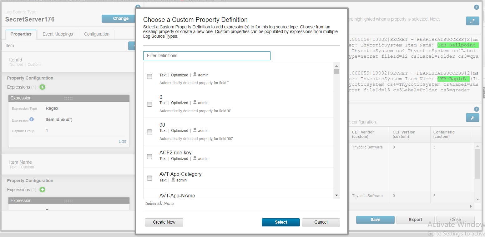

## Create Custom Property

1. Create two properties __ItemId__ and __Item Name__.
1. Check the check box to __enable the properties in Rules and Search indexing__ before clicking on the __Save__ button.

   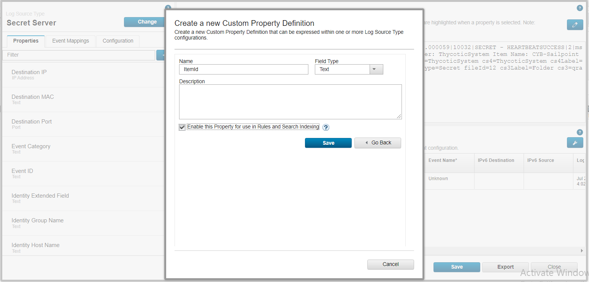

After properties have been added they will be displayed under __Properties tab__ in the selected __log source type__.

   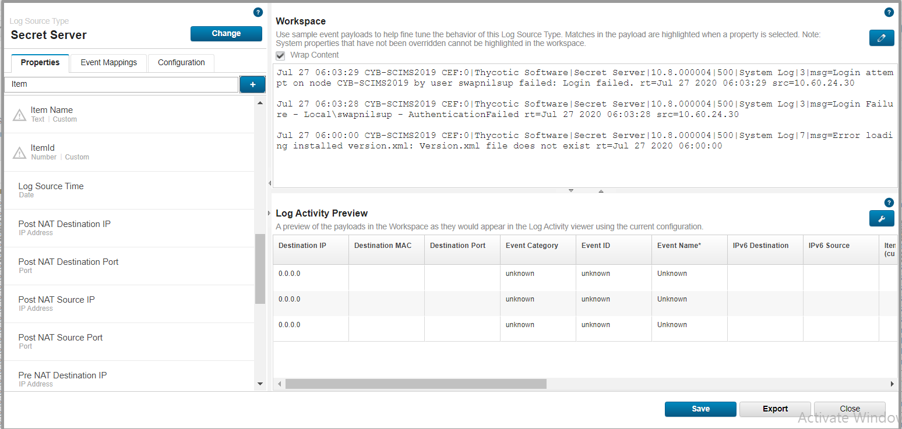

## Enable access to property values

1. Click on created properties

1. Enter the following expression

   * Field Name: __Item Id__       expression: __Item Id__:\s(\d*)

   * Field Name: __Item Name__     expression: __(?<=Item Name: ).+?(?=\(Item Id)__  

   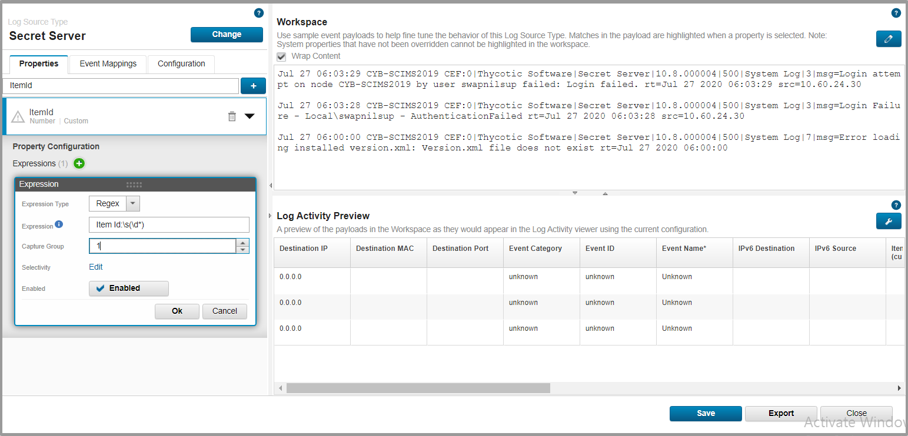

1. click on __Ok__.

## Enable Configuration

1. Click on __Configuration__ option.

1. __Enable__ the __Log property Auto Detection__ option.

1. __Enable Properties for use in Rules and Search indexing__.

   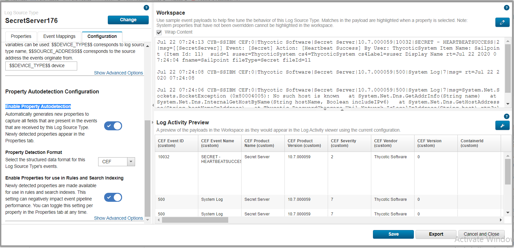

1. Select __CEF__ from the dropdown in __Property Detection Format__.

   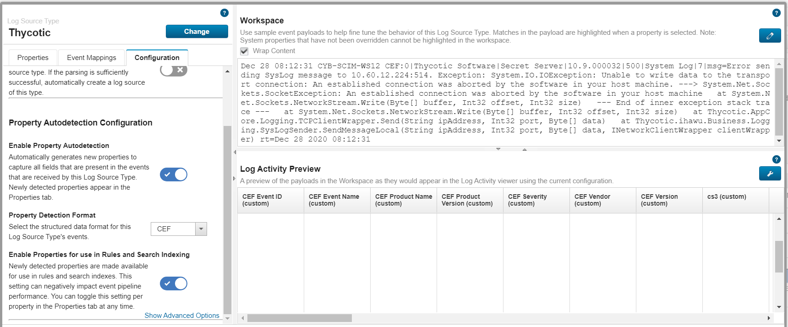

1. __Click Save__.

## Create log source

1. Click __on Admin | Log source__.

   

1. Click on the __Add__ button.

1. Add log source popup will be displayed.

   * Enter the Name

   * Description

   * Select the log source type created in above steps.

   * Enter the __Log source Identifier__ as Host Name of machine where Secret Server is installed.

1. Click __Save__.

   

## Deploy Log Source

1. On the Admin Page of QRadar, click on __deploy changes__ button.

   

## (OPTIONAL) Validate Log Source

1. Click on __Log Activity__ | __add filter__.

1. Select the log source.

   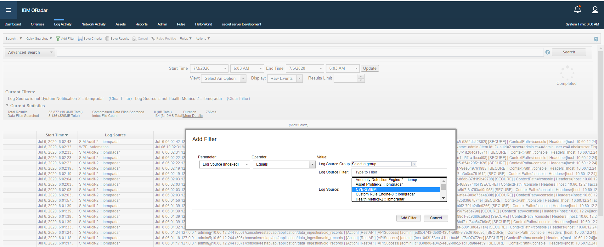

1. We would be able to see the log under log source which we have created using DSM editor

   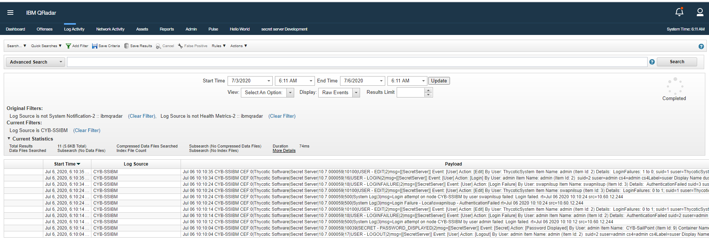
