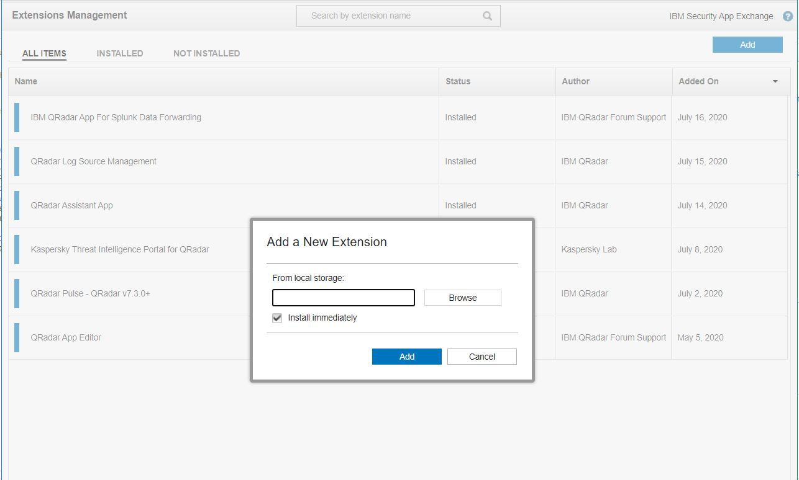
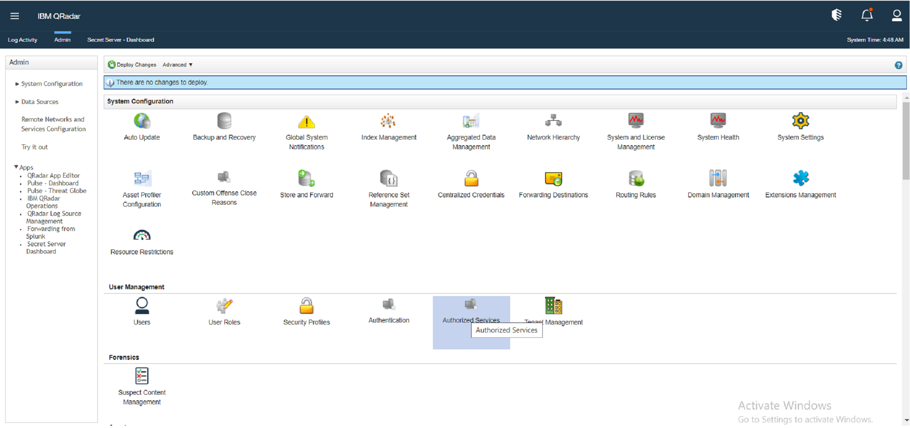
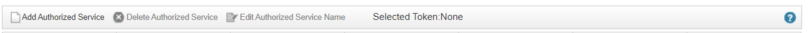
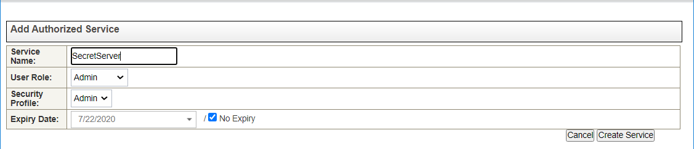
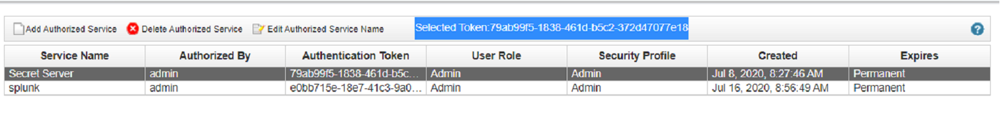
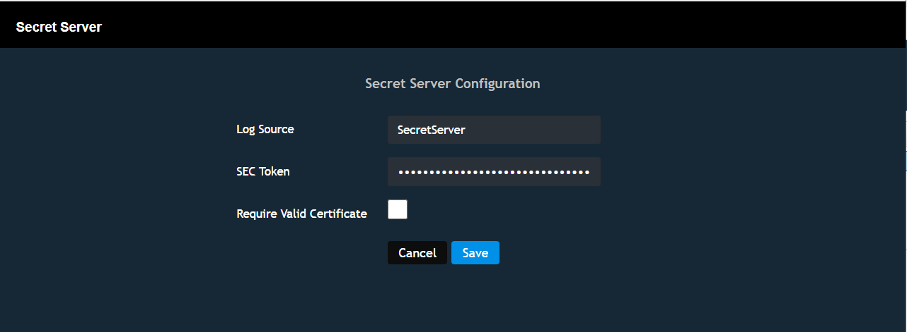
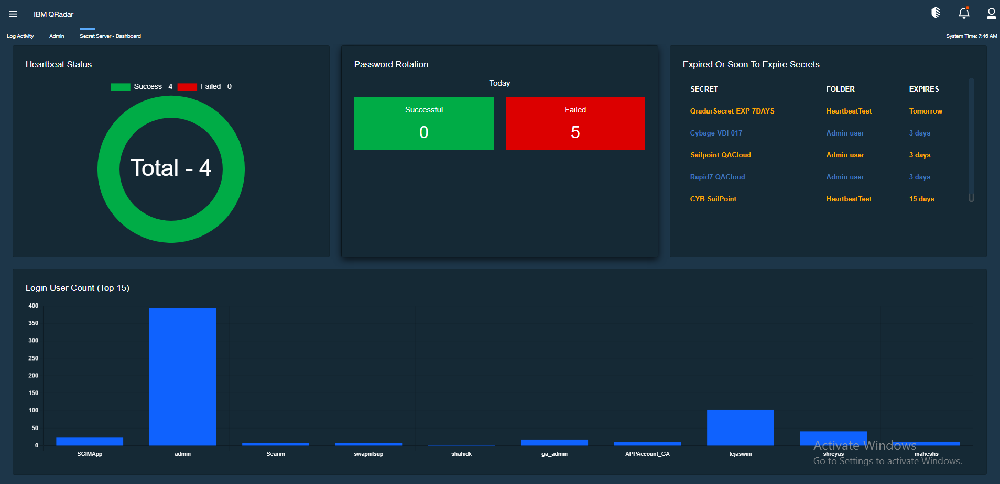
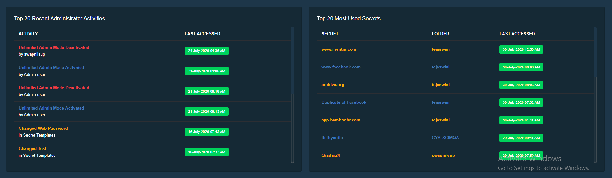

[title]: # (Secret Server Dashboard)
[tags]: # (dashboard)
[priority]: # (304)
# Extension Configuration

1. In the System Configuration section, click __Extensions Management__.

   

## In the Extensions Management window

1. Click __Add__.
1. Select the app archive downloaded from IBM App Exchange.
1. Select the __Install immediately__ check box.

   

   >**Note:** When the installation is complete, refresh the browser window before you use the extension

## Create Authentication Token

Before you can use the extension, you must create an __authentication token__. IBM QRadar requires that you use an authentication token to authenticate the QRadar API calls that the extension leverages. You use the __Manage Authorized Services__ window on the __Admin__ tab to create authentication token.

1. On the __Admin__ tab, go to the __User Management__ section.
1. Click __Authorized Services__.
   
   

## Create token

1. In the Manage Authorized Services window, click __Add Authorized Service__.

   

## Add the following information to the Add Authorized Service fields

* In the __Service Name__ field, type a name for this authorized service

* From the __User Role__ list, select __Admin__ the user role

* From the __Security Profile__ list, select the security profile that you want to assign to this authorized service

* In the __Expiry Date__ list, type or select a date that you want this service to expire. If an expiry date is not necessary, select __No Expiry__

* Click __Create Service__

   

## Copy Token

1. Click the row that contains the created service.

1. Copy the token string from the __Selected Token__ field in the “*menu bar”*.

1. Close the Manage Authorized Services window.

   

## Add token to enable extension

1. Navigate to __admin__ | __Secret Server Dashboard__ under App section

   
1. The Configuration page will be displayed.
1. Enter the __Log source identifier__ previously configured.
1. Paste the token string into the __SEC Token__ field.

   

   >**Note:** This SEC token will be used in the Secret Server app to display dashboard, reports etc.

1. Click __Save__.

## Viewing the extension

1. Click the *“Secret Server dashboard”*

   

   
