[title]: # (Pulse Dashboard Setup)
[tags]: # (dashboard)
[priority]: # (303)
# Pulse Dashboard Setup

To Configure Pulse Dashboard Setup (The QRadar integration is also available at Thycotic.com):

1. Click on __Add | Browse the pulse Zip file | Check “install immediately”__.
1. Click on the __Add__ button.  

   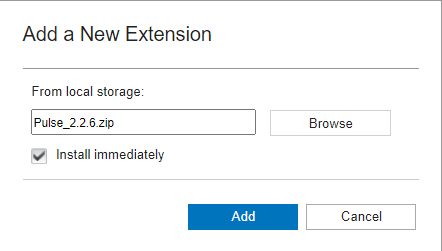
1. You should see the pulse QRadar pulse app in the extension management.  

   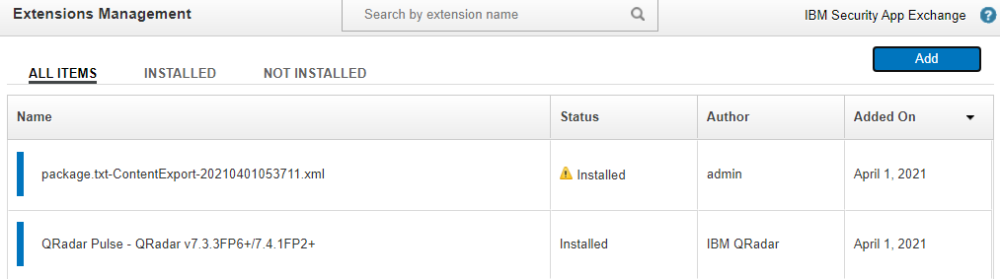
1. Click on the __Pulse__ Extension from the menu.

   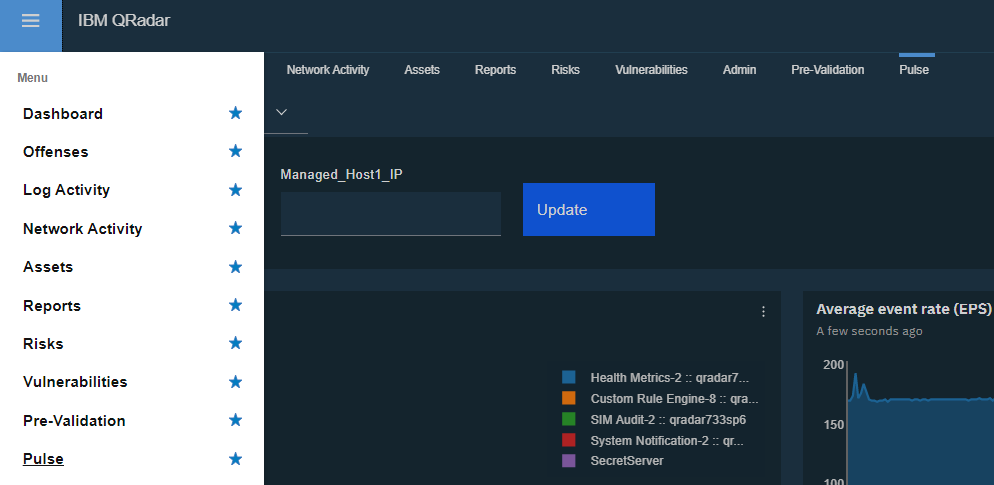
1. Click on the dashboard dropdown and select __New Dashboard__.

   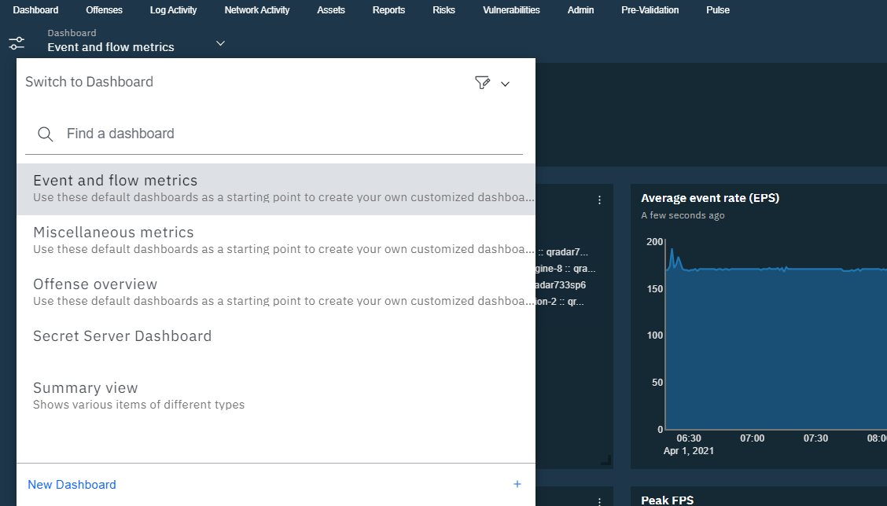
1. Click on __Import Dashboard__.  

   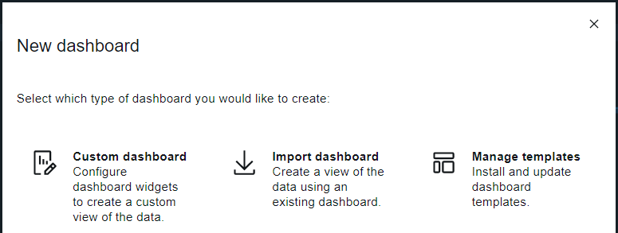
1. Extract the __Thycotic Secret Server dashboard zip__.

   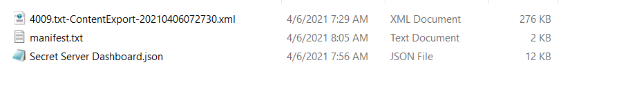
1. Click on __Add File__.
1. Navigate to __Secret Server Dashboard.json__.
1. Click on the __Import__ button.

   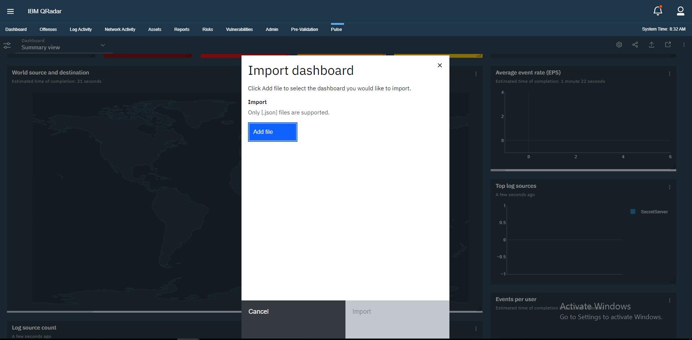
1. The __Secret Server Dashboard__ will be displayed in Pulse.

   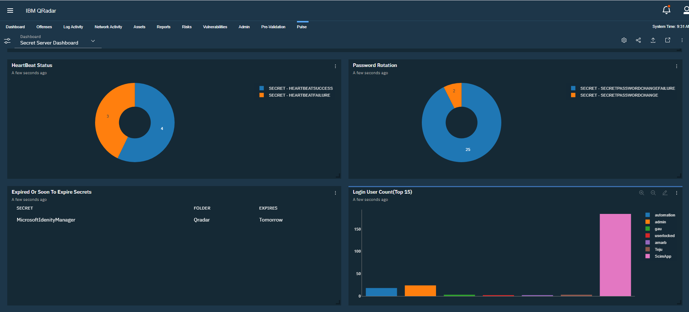

   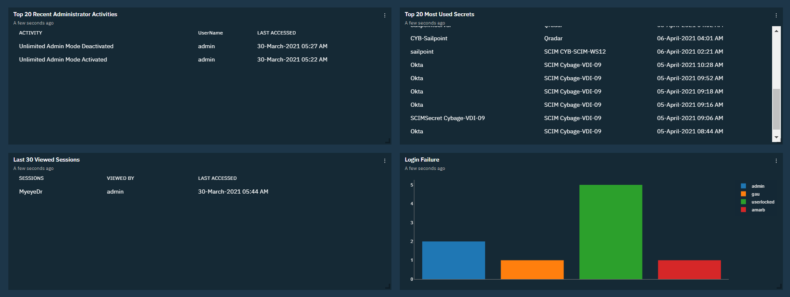

## Secret Server Dashboard Widget

* Add __Log Source Name__ to the __LogSource_Thycotic__ Parameters.  

   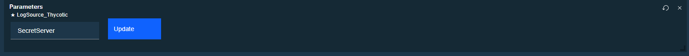
* __Heartbeat Status__  

   * __Success:__ The credentials in the Secret authenticated successfully with the target system.  
   * __Failed:__ The credentials in the Secret failed authentication with the target system.  

   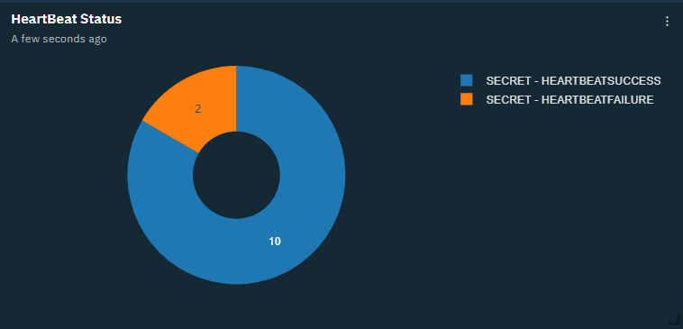
* __Password Rotation__  

    * __Success:__ A Secret Password has changed.  
    * __Failed:__ A Secret Password has failed to change.  

   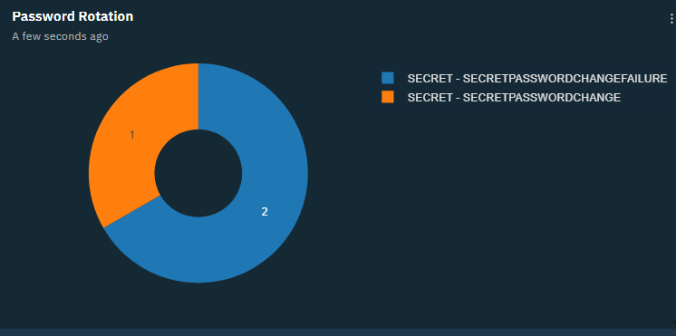
* __Secret expired or Soon to be expired__  

   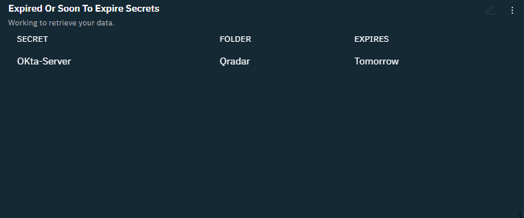
* __Top 15 login user count__  

   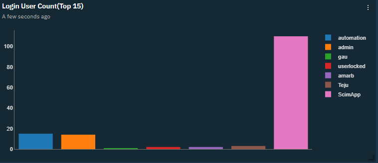
* __Top 20 Recent Administrator Activities__

   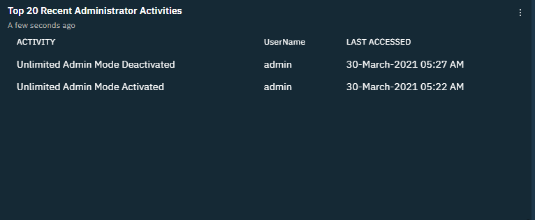
* __Top 20 Most Used Secrets__  

   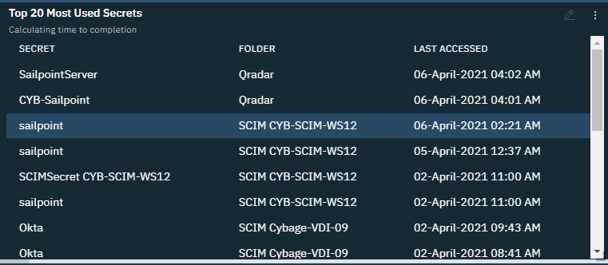
* __Last 30 Viewed Sessions__  

   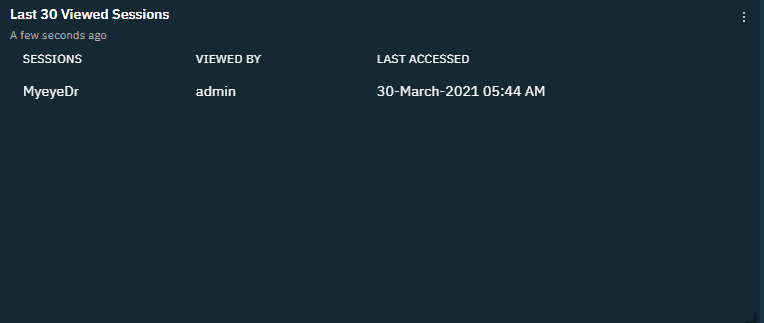
* __Last 30 Login Failure Users__

   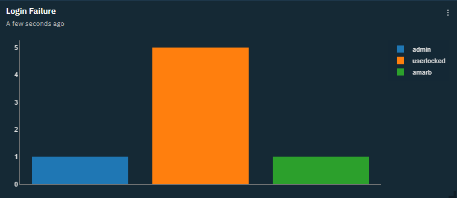
