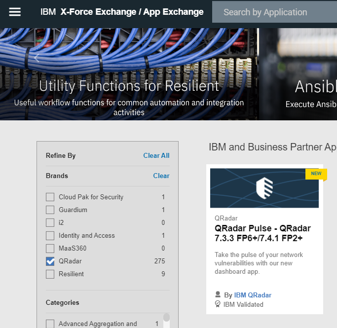
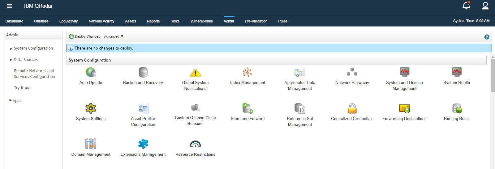
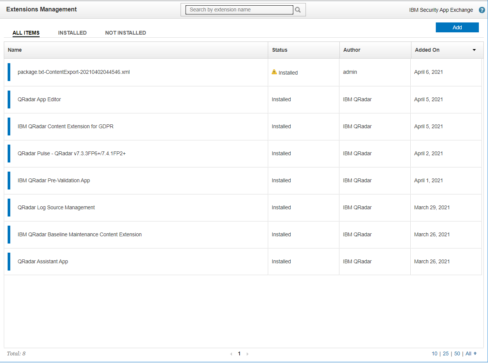
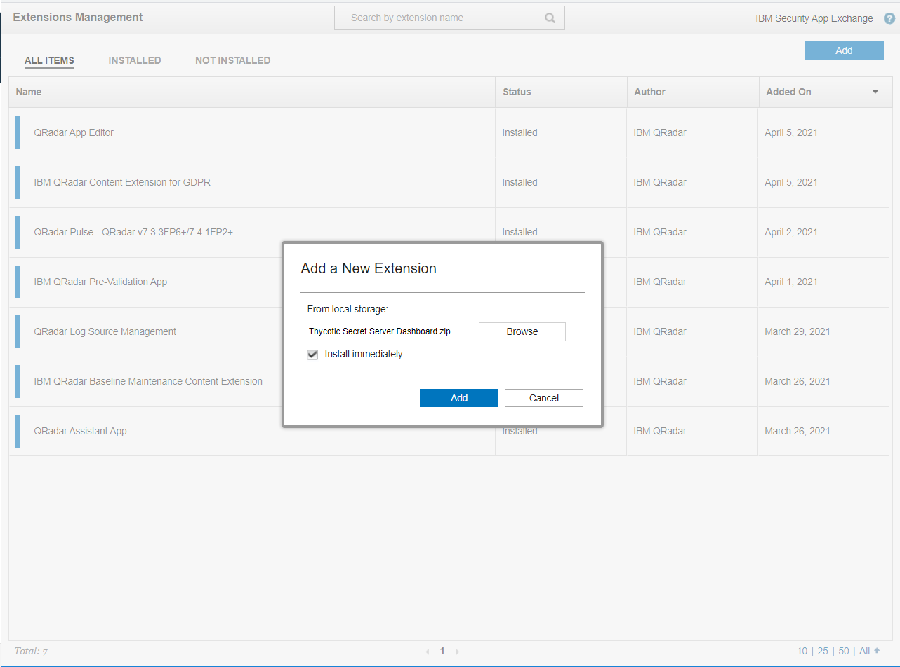

[title]: # (Accessing Secret Server Events)
[tags]: # (events)
[priority]: # (302)
# Accessing Secret Server Events in the Secret Server Application within QRadar

1. Login to QRadar as the admin user: `https://<ipaddress>`

   
1. Download __Thycotic Secret Server Dashboard__ extension from <https://exchange.xforce.ibmcloud.com/>.  

   
1. Login to QRadar with Admin role and navigate to the __Extension management__ by clicking on __Admin | Extension Management__.  

    
1. __Extension Management__ will be displayed and click on __Add__.

   
1. Browse to __Thycotic Secret Server Dashboard__ extension downloaded from IBM Exchange, click on the __Add button__.

   
1. Download Pulse App from <https://exchange.xforce.ibmcloud.com/> and install the Pulse extension by navigating to extension Management.

   

## Create log source

1. Click __on Admin | Log source__.

   
1. Click on the __Add__ button.
1. Add log source popup will be displayed.

    1.  Enter the Name down the Log Source Name which will be required in Step 9 in Pulse Dashboard Setup.

    1.  Description.

    1.  Select the log source type created in above steps.

    1.  Enter the __Log source Identifier__ as Host Name of machine where Secret Server is installed.

    1.  Click __Save__.

   

# Deploy Log Source

1. On the __Admin Page of QRadar__, click on __deploy changes__ button.

   