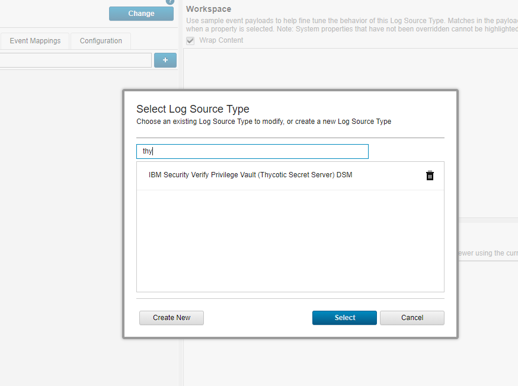
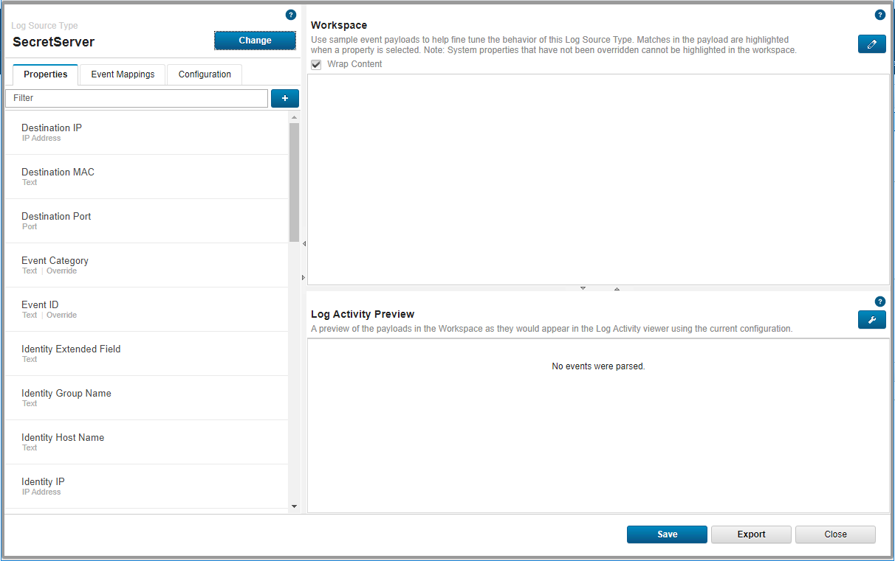
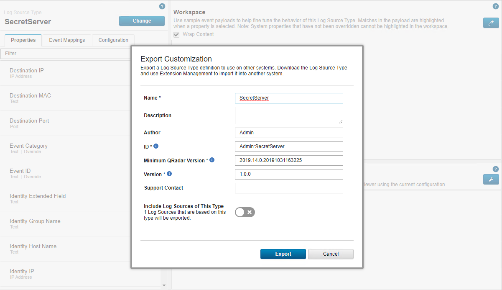

[title]: # (How to Export Event Mappings)
[tags]: # (introduction)
[priority]: # (105)
# How to export the event mappings along with the Custom DSM

**After Creating your QIDmap entries, you can map them to your events using the
DSM editor and export them via the export option.**

1. Navigate and login to __Qradar__.
1. Click on __Admin__.  

    
1. Click on the __DSM editor__ option.
1. Select the created log source, search for __"Thy"__.

    
1. Click on __Select__.

1. Click on __Export.__  

    
1. Enter in the required details.
1. Click on __Export__.

    
1. The zip will be downloaded.

    

## To search for your DSM using the ContentManagement Tool

__Enter in the following command:__

   `[root\@qradar \~]\# /opt/qradar/bin/contentManagement.pl --action
search --content-type 24 --id all --regex "\\w" \|grep Secret`

   

## To export the custom mappings

__Enter in the following command:__

   `[root\@qradar \~]\# /opt/qradar/bin/contentManagement.pl -a export -c all`

   `/opt/qradar/bin/contentManagement.pl -a export -c sensordevicetype -i 4001`

## Result

   
   

1. Rename the zip file to `MyExport.zip`.

1. On the new Qradar install, copy the .zip file and reimport it.

   __Enter in the following command:__

   `[root\@qradar \~]\# /opt/qradar/bin/contentManagement.pl --action import --file MyExport.zip`
