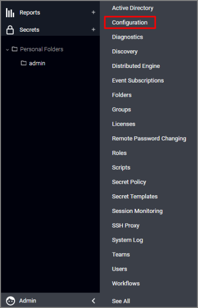

[title]: # (Exporting Logs from Secret Server)
[tags]: # (introduction)
[priority]: # (101)
# Exporting Logs from Secret Server

To export event logs from Secret Server to QRadar, begin by logging in to Secret Server as an
Administrator.

1. From the __ADMIN__ menu, select __Configuration__.

   
1. Scroll to the bottom of the page and click __Edit__.
1. Select the __Enable Syslog/CEF Logging__ check box and fill in the QRadar Server IP, Port, Protocol (“TCP” for this example) before clicking Save.
1. Data will immediately begin flowing to your QRadar instance. See the figure below from the Secret Server __Configuration__ menu:

   