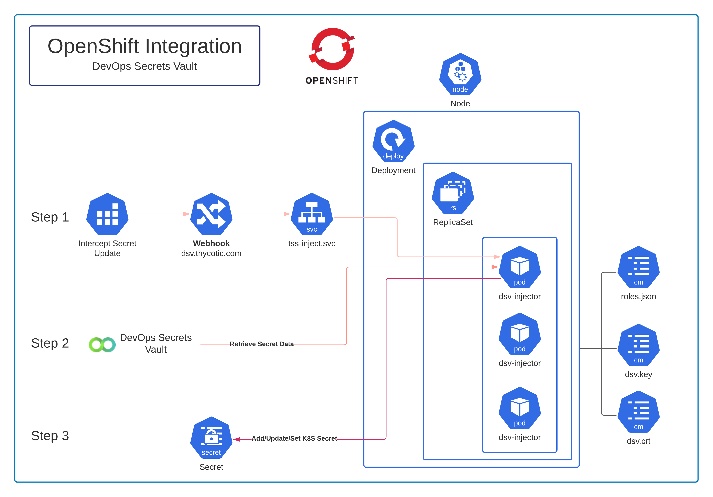

[title]: # (OpenShift)
[tags]: # (Openshift, Kubernetes, K8S, OKD, DSV, DevOps Secrets Vault)
[priority]: # (1)

# Architecture



The diagram above represents the visual version of the architecture and its components.

# General Description

The integration is a [Mutating Admissions Webhook](https://kubernetes.io/docs/reference/access-authn-authz/extensible-admission-controllers/#admission-webhooks) that intercepts requests for OpenShift Secrets using a specialized annotation. The request is then updated with data from DevOps Secrets Vault and passed in to the OpenShift Secrets vault. This ensures that credentials in the OpenShift Secrets Vault are aligned with the values as managed by DevOps Secrets Vault, hence password changes can occur on the DevOps Secrets Vault side and be able to be reflected in the OpenShift Secrets Vault.

The deployment is designed to be easily integratable in to existing deployment environments, as Secret requests only need to have the various [Annotations](#Annotations) added to them in order for the DevOps Secrets Vault based workflow to be enacted.

>**Note**: There are numerous different ways of configuring OpenShift for different operating environments. Hence this guide, although intending to give a solid baseline idea for deployment of the integration, will not be the sole, authoritative way in which the integration can function or be deployed. All examples below use the `default` namespace which, alongside some other components, will likely need to be modified to ensure suitability with your organization's OpenShift environment.

## The Webhook 

The webhook is at the front end of the integration and intercepts the requests for Secrets that are inbound to the OpenShift Secrets store, when the requests are given the appropriate annotation. Below is a basic configuration YAML for deploying the webhook in your OpenShift instance.

### Example Webhook YAML
```yaml
---
apiVersion: admissionregistration.k8s.io/v1
kind: MutatingWebhookConfiguration
metadata:
  name: dsv-injector
  labels:
    app: dsv
webhooks:
  - name: dsv.thycotic.com
    rules:
      - apiGroups: ["*"]
        apiVersions: ["*"]
        operations: ["CREATE", "UPDATE"]
        resources: ["secrets"]
    clientConfig:
      service:
        namespace: default
        name: dsv-injector
        path: "/inject"
        port: 8543
      caBundle: ""
    admissionReviewVersions: ["v1","v1beta1"]
    sideEffects: None
    timeoutSeconds: 5
```
### The Webhook Certificate

Each of the pods in the deployment are in posesssion (via [ConfigMaps](#Certificate)) of a certificate that they present in order to identify themselves to the OpenShift instance. The `caBundle` value in the webhook must be the base64 encoded version of the public certificate (crt) that the pods are presenting.

## The Service

As per standard OpenShift configuration, a loadbalanced service allows orchestrated applications to be handled effectively from an internal OpenShift networking standpoint. Hence, we want this service to direct all requests to the appropriate deployment/pods when an annotated Secret request comes in. 

Below is an example of the service and how it could look against the `default` namespace:

### Example Service YAML
``` yaml
---
apiVersion: v1
kind: Service
metadata:
  name: dsv-injector
  namespace: default
  labels:
    app: dsv-injector
spec:
  ports:
    - port: 8543
      targetPort: 18543
  selector:
    app: dsv-injector
  type: LoadBalancer
```


## ConfigMaps

### Roles Configuration
The `roles.json` file is accessed by the pods in the deployment through a ConfigMap. The file gives the pods information about where DevOps Secrets Vault is located, and how they should authenticate with it (via a set of credentials).

__DevOps Secrets Vault Example__
```json
{
    "default": {
        "credentials": {
            "clientid": "<ClientID>",
            "clientsecret": "<ClientSecret>"
        },
         //  "TLD":"eu", Optional for non-US instances
        "tenant": "tenantname"
    }
}
```

Multiple roles and vaults can also be used. 

>**Note**: In the absence of a role being explicitly specified, the `default` role will be used.

__Multiple Vaults Example__
```json
{
    "alternaterole": {
       "credentials": {
            "clientid": "<ClientID>",
            "clientsecret": "<ClientSecret>"
        },
           "tenant": "tenantname"
    },
    "default": {
        "credentials": {
            "clientid": "<ClientID>",
            "clientsecret": "<ClientSecret>"
        },
          "tenant": "anothertenantname"
    }
}
```

### Certificate

Two ConfigMaps are required for the certificate. One to hold the public certificate (.crt), and one for the private key associated therewith (.key).

__*IMPORTANT*__ The public certificate must have a CN (Command Name) of `deploymentname.namespace.svc`. To fit directly in to the examples given here, a CN of `dsv-injector.default.svc` must be present on the certificate.

Examples of these config maps (`dsv-crt` and `dsv-key`) are in the [Sample Deployment YAML](#example-deployment-yaml) under `volumes`.

__Container Mapping:__
These items are mapped in to the injector container through the `ENTRYPOINT` in the Dockerfile, which is, in its most basic form:

```
FROM dsv-injector:latest
ARG cert_file
ARG key_file
ARG roles_file
COPY ${cert_file} ./dsv.pem
COPY --chown=dsv ${key_file} ./dsv.key
COPY ${roles_file} ./roles.json
ENTRYPOINT ["dsv-injector-svc", "-cert", "dsv.pem", "-key", "dsv.key", "-roles", "roles.json" ]
```

>**Note**: The `dsv-injector` image on Docker Hub does not include these references, however the Docker Hub image reference (`thycotictc/openshiftdsv:latest`) in the Deployment below already includes the above configuration.


## The Deployment

The final component of the integration is the deployment and the pods associated with it. Each pod includes a single running container that is the injector application, which is designed to go out to the target vaulting platform and retrieve the intended Secret values.

Note that the deployment example below includes all of the configuration input as detailed in the sections above.

### Example Deployment YAML
``` yaml
---
apiVersion: apps/v1
kind: Deployment
metadata:
  name: dsv-injector
  namespace: default
  labels:
    app: dsv-injector
spec:
  replicas: 5
  selector:
    matchLabels:
      app: dsv-injector
  template:
    metadata:
      labels:
        app: dsv-injector
      namespace: default
    spec:
      containers:
        - image: thycotictc/openshiftdsv:latest
          name: dsv-injector
          command: ["dsv-injector-svc", "-cert", "dsv.crt", "-key", "dsv.key", "-roles", "roles.json" ]
          workingDir: "/config"
          resources:
            requests:
              memory: "512Mi"
              cpu: "250m"
            limits:
              memory: "2048Mi"
              cpu: "1000m"
          ports:
            - containerPort: 18543
              name: dsv
          volumeMounts:
          - name: config-volume
            mountPath: /config
      volumes:
        - name: config-volume
          projected:
            sources:
              - configMap:
                  name: dsv-config
                  items:
                  - key: roles.json
                    path: roles.json
              - configMap:
                  name: dsv-key
                  items:
                  - key: dsv.key
                    path: dsv.key
              - configMap:
                  name: dsv-cert
                  items:
                  - key: dsv.crt
                    path: dsv.crt 
```

## The Requests

### Annotations

The four annotations that affect the behavior of the webhook are:

```golang
const(
    roleAnnotation   = "dsv.thycotic.com/role"
    setAnnotation    = "dsv.thycotic.com/set-secret"
    addNotation      = "dsv.thycotic.com/add-to-secret"
    updateAnnotation = "dsv.thycotic.com/update-secret"
)
```
* `roleAnnotation` identifies the role that should be used, as per the [roles.json](#roles-configuration) entry
* `addAnnotation` adds missing fields without overwriting or removing existing fields.
* `updateAnnotation` adds and overwrites existing fields but does not remove fields.
* `setAnnotation` overwrites fields and removes fields that do not exist in the DSV Secret.

>**Note**: Only one of these should be specified on any given k8s Secret, however, if more
than one are defined then the order of precedence is `setAnnotation` then
`addAnnotation` then `updateAnnotation`.

### Secret Examples

In addition to the annotation, the `path` value that leads to the Secret will also need to be provided. This corresponds to the value of the target Secret within DevOps Secrets Vault from which data needs to be retrieved.

>**Note**: The data fields on the request itself are generally ignored, depending on the annotation used.

#### SET
``` yaml
---
apiVersion: v1
kind: Secret
metadata:
  name: example-secret
  annotations:
    dsv.thycotic.com/set-secret: /folderpath/secretname
type: Opaque
data:
  username: dW5tb2RpZmllZC11c2VybmFtZQ==
  domain: dW5tb2RpZmllZC1kb21haW4=
```

#### ADD
``` yaml
---
apiVersion: v1
kind: Secret
metadata:
  name: example-secret
  annotations:
    dsv.thycotic.com/update-secret: /folderpath/secretname
type: Opaque
data:
  data: dW5tb2RpZmllZC11c2VybmFtZQ==
```