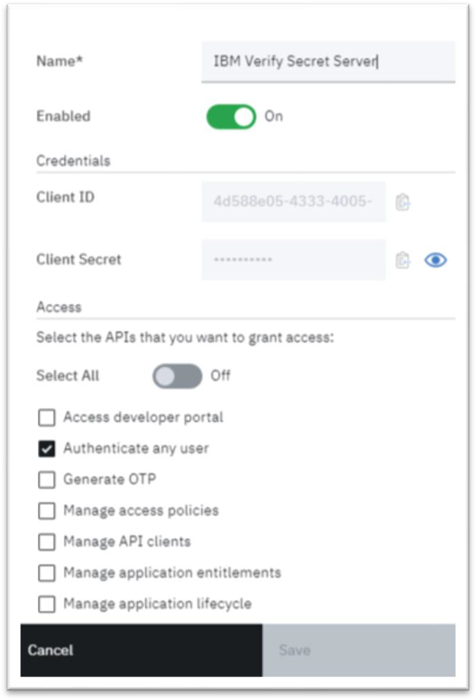

[title]: # (Configure IBM Verify Gateway for RADIUS Server)
[tags]: # (configuration)
[priority]: # (701)
[display]: # (none)
# Configure IBM Verify Gateway for RADIUS Server

1. Create __API client credentials__ by signing into the IBM IBM Security Verify administration console.

IBM IBM Security Verify helps secure user productivity with cloud-delivered Single Sign-On (SSO), multifactor authentication, and identity governance. It comes with thousands of pre-built connectors to help you quickly provide access to popular SaaS apps; and pre-built templates to help integrate in-house apps.

[IBM IBM Security Verify Link](https://www.ibm.com/us-en/marketplace/cloud-identity?cm_mmc=Search_Google-_-Security_Govern%2Busers%2Band%2Btheir%2Baccess-_-WW_NA-_-ibm%20cloud%20identity_e&cm_mmca1=000000NP&cm_mmca2=10005589&cm_mmca7=9008135&cm_mmca8=aud-384354108630%3Akwd-397836672603&cm_mmca9=_k_EAIaIQobChMIvLSOxvCn5AIVEp6fCh2ROAiNEAAYASAAEgJ5TPD_BwE_k_&cm_mmca10=354223824868&cm_mmca11=e&gclsrc=aw.ds&&gclid=EAIaIQobChMIvLSOxvCn5AIVEp6fCh2ROAiNEAAYASAAEgJ5TPD_BwE)

1. Sign into the __IBM IBM Security Verify administration console__ to access its functions. Before you begin, you must have a registered IBM Security Verify Administrator account.

1. For first-time sign in, use the login URL and credentials sent to your registered email address.

   >**Note:** A message is displayed if you enter an invalid username or password.

1. Access the __administration console__ at https://\<hostname\>.ice.ibmcloud.com/ui/.

1. Sign into IBM ID with your password. If there is more than one identity source configured, click the

## Appropriate or Preferred source for authentication.

1. Complete the form.

   The following steps are applicable for first-time sign in:

1. Agree to Terms and Conditions and click __Continue__.

1. You are prompted to change the password assigned to you. Change it to make it personal, easy to remember, and secure.

1. Enter your __new password__.

1. Follow the password policy.

1. Re-enter your __password__ for confirmation.

1. Click __Change Password__.

You are now signed into IBM Security Verify.

1. Click __MyIBM__.

   
1. A screenshot of a cell phone Description automatically generated

   

1. Click __Launch__.

1. Click __Configuration__ \> __API Access__ \> __Add API Client__.

1. Name the client. For example, IBM Verify Gateway.

1. Select the __check boxes__ to grant the following access rights:

   * Authenticate any user

      * Manage second-factor authentication enrollment for all users

      * Manage users and standard groups

      * Read second-factor authentication enrollment for all users

      * Read second-factor authentication method configuration

      * Read users and groups

1. Click __Save__.

1. Locate your API client in the list, hover over the end of the row to display the edit icon and click __Edit__. The API client information is displayed.

1. Copy the __Client ID__ and __Secret__ to the clipboard or click the __eye__ icon to view the secret and save the information. (You will need this information when you edit the IbmRadius configuration file.)

1. Click __Cancel__. No changes are necessary.

   

For more information, see Managing API clients.