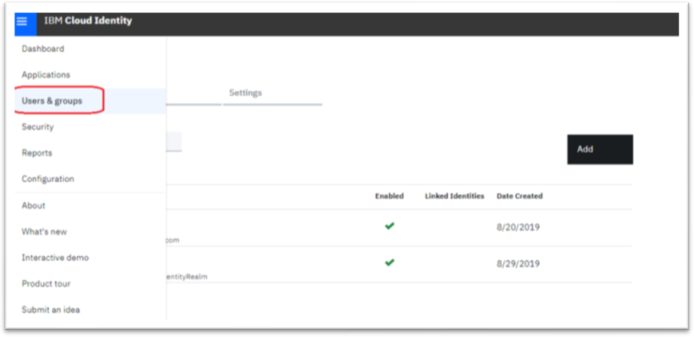
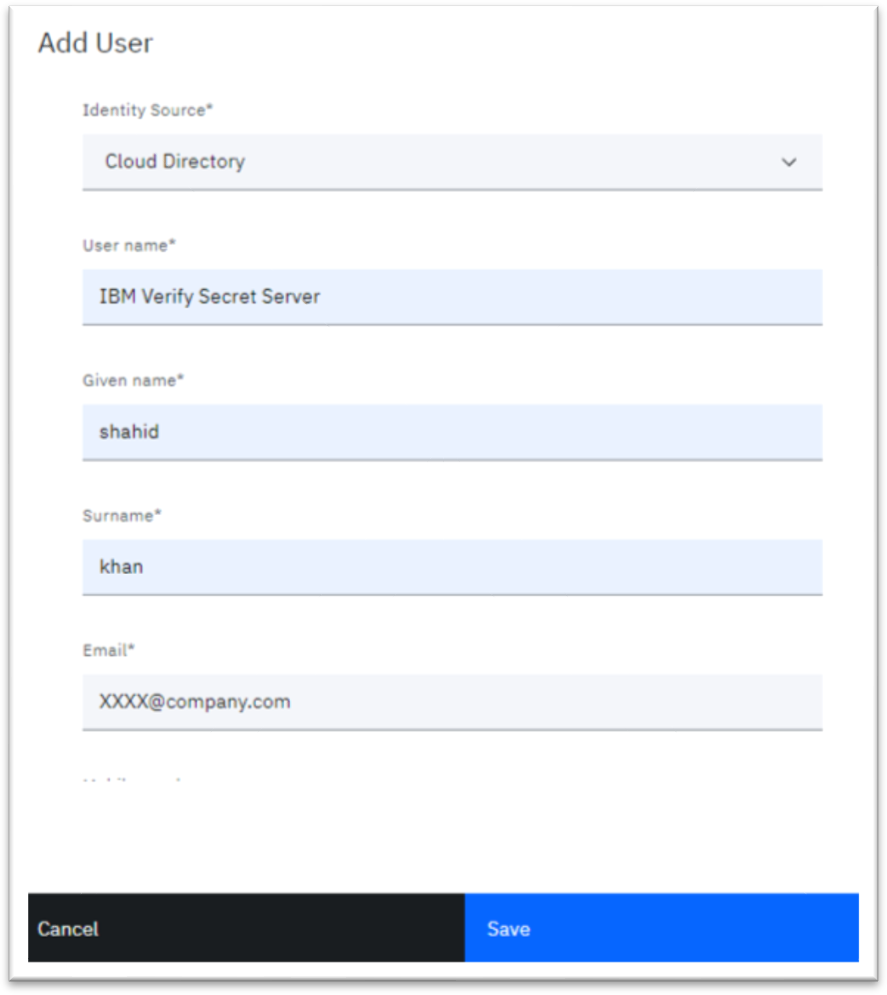

[title]: # (Create Users)
[tags]: # (users)
[priority]: # (702)
[display]: # (none)
# Create Users

Use the IBM IBM Security Verify Administration console to create users for the Verify Gateway for RADIUS Server.

For each user who requires second-factor authentication, you must enroll them for OTP such as TOTP, EmailOTP, or SMSOTP through the relevant enrollment APIs in IBM Security Verify Verify.

1. Click __Users & Group__.
1. Click __Add__.

   

   A screenshot of a cell phone Description automatically generated

1. Enter __required details__ and click __Save__. Ensure the user is enabled.

   

1. Reset the password of the new user.

When we create a new user in IBM IBM Security Verify and reset the user password, a temporary password is emailed. A permanent password is sent to the user to be used for RADIUS login in Verify Privilege Vault.

   >**Note**: The IBM RADIUS server product does not provide a function for enrolling users for OTP.
