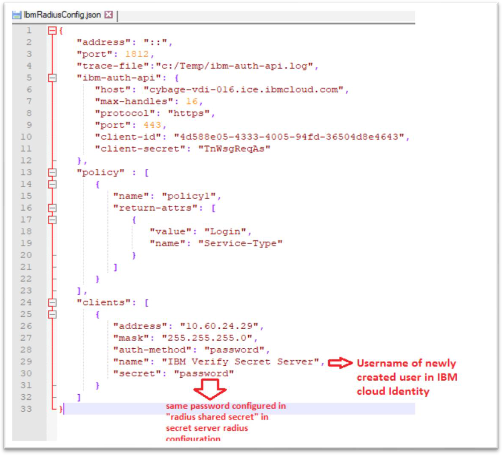

[title]: # (Start the Service)
[tags]: # (service)
[priority]: # (704)
# Start the Service

You can start the IbmRadius.exe program either as a Windows service or from the command line.

During the installation, IbmRadius.exe is configured as a Windows service and is not initially started because the administrator must first set up the `IbmRadiusConfig.json` file.

The service is set to manual start but can be set to automatically start. Errors, warnings, and informational messages are sent to the Windows Event log. If the service fails to start, or continues to run, examine the Event Log for possible causes such as an error in IbmRadiusConfig.json file.

The command line invocation of IbmRadius.exe does not use the Event Log, rather it outputs to standard error. It requires the argument "-run" and is generally only used for test or debugging purposes. Another useful argument “-attributes” lists all the RADIUS-known RADIUS attributes, their names, value type, and enum
values. This argument is useful when you add attributes into the
IbmRadiusConfig.json file.

   

Sample JSON file: `IbmRadiusConfig.json`