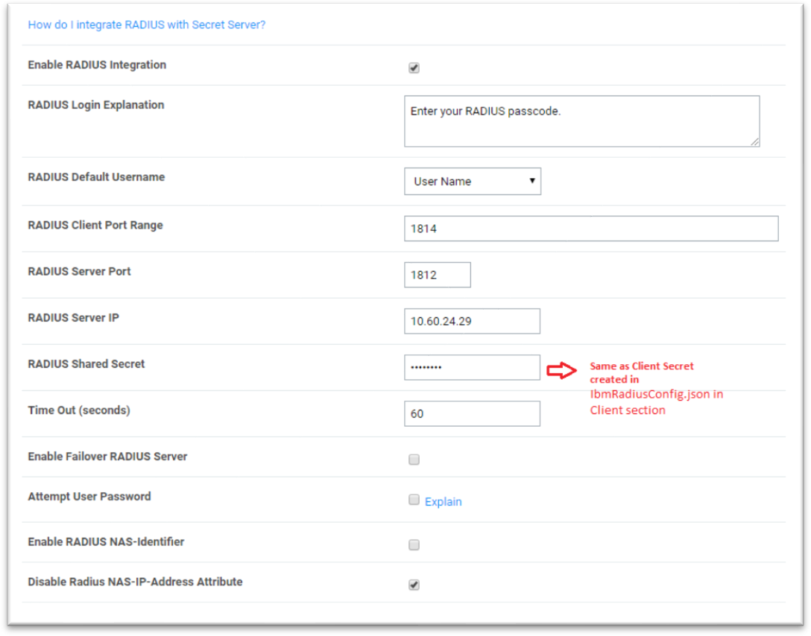
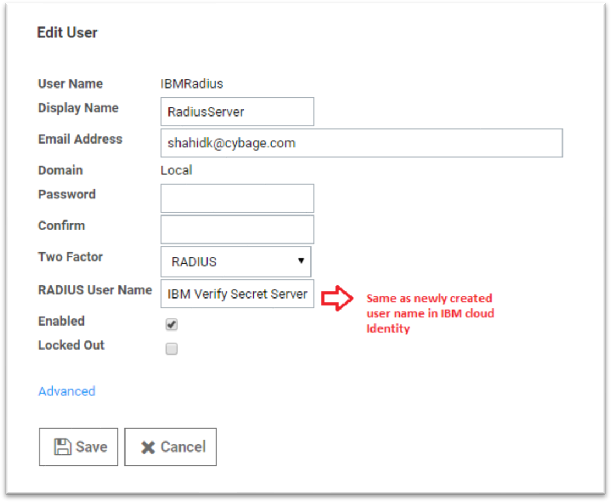
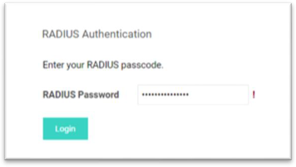

[title]: # (Test RADIUS Settings)
[tags]: # (test)
[priority]: # (705)
[display]: # (none)
# Test and Validate Authentication with RADIUS Server Settings

## Test RADIUS settings

1. Click the __Test RADIUS Login__ button.

   

After enabling RADIUS on your Verify Privilege Vault, you must enable RADIUS two-factor authentication for each user. You can enable it on a per-user basis.

1. Sign into an account with Administer Configuration and Administer RADIUS permissions.

1. Navigate to __Administration__ | __Users__ | __Username__ of user to enable.

1. Click the __Edit__ button and check the __RADIUS Two Factor Authentication__ check box.

1. Enter the __RADIUS username__ in the text field.

   >**Note:** Verify Privilege Vault defaults this value to its username. If you wish to use this default name, it must match the username on the RADIUS server.

1. Review the settings and click __Save__.

   

   Repeat 3-5 for each user that needs to use RADIUS.

## Validate Authentication through RADIUS Server

1. Sign into __Verify Privilege Vault__. The RADIUS Authentication screen appears.

   

1. A screenshot of a social media post Description automatically generated.

1. Enter your __RADIUS user password__ created in IBM IBM Security Verify.

1. You should be successfully logged into Verify Privilege Vault using two-factor authentication through RADIUS.
