[title]: # (Configuration)
[tags]: # (configuration)
[priority]: # (700)
# Configuration

## Setup Secret Server SDK

1. Configuration Instructions can be found [here](https://docs.thycotic.com/ss/10.9.0/api-scripting/sdk-cli#task_1__configuring_secret_server).

1. Record the rule name and key for later use:

   * rule name
   * key

## Setup a Secret Server Credential Provider in WebSphere

__Deploy JAR File__

SSCP is deployed using a single JAR file (websphere-0.0.1-SNAPSHOT-jar-with-dependencies.jar)

1. Install SSCP to the WebSphere by copying JAR to `/opt/IBM/WebSphere/AppServer/lib`.

1. Initializing the SSCP by running the following command line:

   `java -jar websphere-0.0.1-SNAPSHOT-jar-with-dependencies.jar –init [secret server url] [rule name] [key]`

1. Where [rule name] and [key] are values configured on the Secret Server SDK
Client Management/Client Onboarding screen.

   Example:

   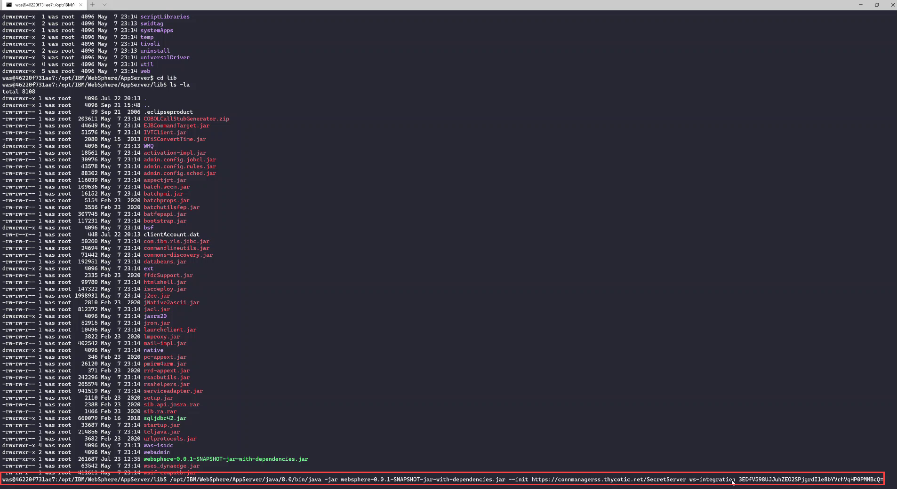

   `/opt/IBM/WebSphere/AppServer/java/8.0/bin/java -jar websphere-0.0.1-SNAPSHOT-jar-with-dependencies.jar --init https://connmanagerss.thycotic.net/SecretServer ws-integration 3EDfV598UJJuhZEO2SPjgrdI1e8bYVrhVqHP0PMMBcQ=`

   `clientAccount.dat` file is created in the same folder as websphere-0.0.1-SNAPSHOT-jar-with-dependencies.jar. During runtime the SSCP will look for the clientAccount.dat file in the same folder as this jar file

   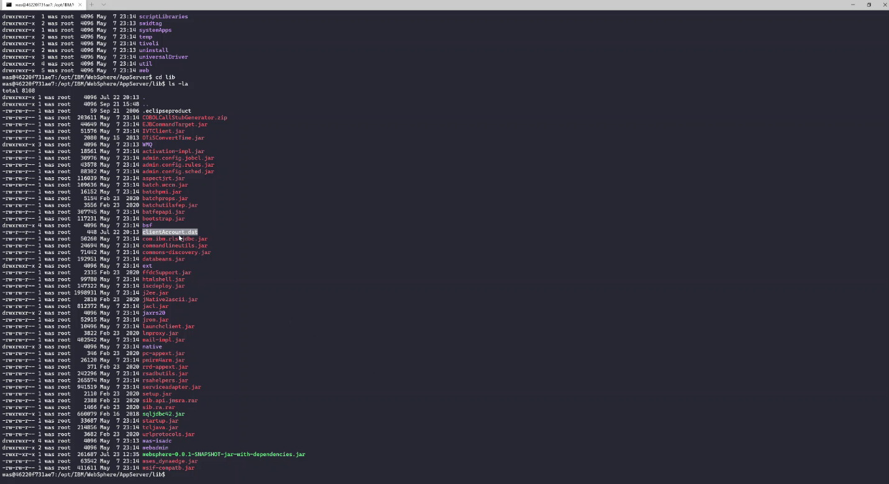

## Add Secret Server Credential Provider

1. In WebSphere menu navigate to __Security__ | __Global Security__ | __Java
    Authentication__ and __Authorization Service | Application logins__.

    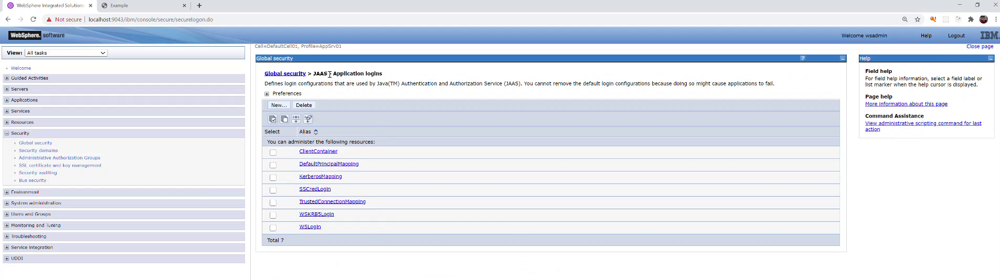

1. Click __New__.

   * Alias: __SSCredLogin__

   * Module Class Name: __com.thycotic.integrations.ws.jaas.SSCredentialsMapper__

   * Use login module proxy: __checked__

   * Authentication strategy: __REQUIRED__

   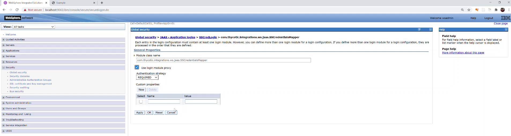

   The SSCP is now added to WebSphere.

## Configure Integration Parameters

The following parameters are supported:

| Parameter Name     | Default Value | Description                                     |
|--------------------|---------------|-------------------------------------------------|
| SSSecretId         | None          | Secret Id to fetch credentials from             |
| SSFieldUsername    | “username”    | Username slug                                   |
| SSFieldPassword    | “password”    | Password slug                                   |
| LogFilePath        | None          | Path to a local log file                        |
| LocalCacheLifespan | None          | Lifespan in seconds for local credentials cache |
|   |   |   |

You can define any of these parameters for a specific data source. These
parameters will be applied for all applications that reference this data source.

The configuration begins by configuring the authentication alias:

1. Navigate to __Security__ | __Global Security__ | __Java Authentication__ | __Authorization Service__ | __J2C authentication data__.

1. Click __New__.

   * Name: any name (e.g. __ss-integration-alias__)

   * User ID, Password - provide dummy values, they are not used

## Configure Parameters

1. To create parameters, navigate to __Environment__ | __Naming__ | __Name space
    bindings__.

   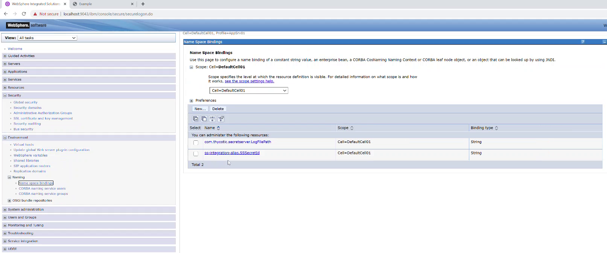

1. Scope: __Cell__.

1. Click __New__.

1. Binding type: __String__.

1. Binding identifier: __enter an appropriate name__.

1. Name: must be in this format: `“com.thycotic.secretserver/[name of alias]/[parameter name]”` (e.g.“com.thycotic.secretserver/ss-integration-alias/SSSecretID”).

1. Value: __enter value__.

   >**Note:** The SSSecretID *must be* defined in order to retrieve the credentials for the data source. You may also define any other parameters using this format:

   * Binding identifier: any name

   * Name: com.thycotic.secretserver/[name of alias]/[parameter name]

   * Value: appropriate value

1. Navigate to __Resources__ | __JDBC__ | __Data sources__.

   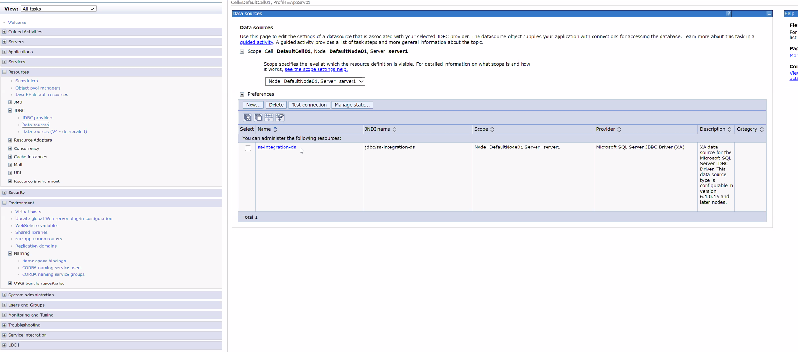

1. Select the data source that will receive credential from Secret Server.

1. Go to __Security Setting__.

   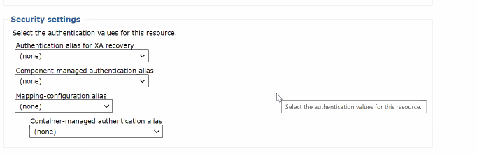

1. Add the SSCP to the data source by selecting it from the provided list in Mapping-configuration alias field.

   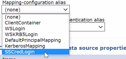

1. Add the authentication alias to the data source by selecting it from the provided list in Container-managed authentication alias field.

   >**Note:** You can define additional parameters in this way.

1. Save and Restart WebSphere.

## Disable WebSphere Local Cache

This section describes how to disable the WebSphere local cache. This must be
done if Secret Server is configured for password rotation.

1. If the CPM is configured to change passwords automatically, disable the CM Subject Cache to configure the ASCP for use on the following WebSphere versions:

For more information, see the [IBM documentation](http://www-01.ibm.com/support/docview.wss?uid=swg1PK75609).

1. In the Administration Console, expand __Servers__.

1. Click __Server Types__.

1. In the list of Server Types, select one of the server types:

-   WebSphere application servers, and then the name of the server (see images
    below).

-   WebSphere proxy servers, and then the name of the server.

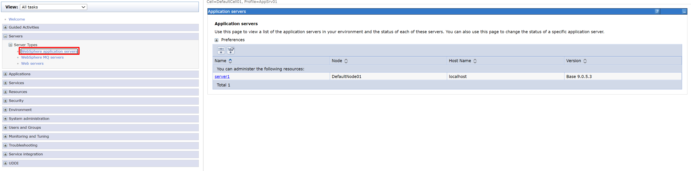

1.  In the Application servers page, select the server to configure.

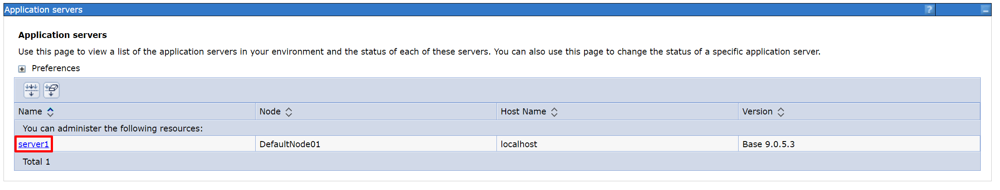

1.  On the Server Configuration page, under Server Infrastructure,, select Java
    and Process Management \> Process definition.

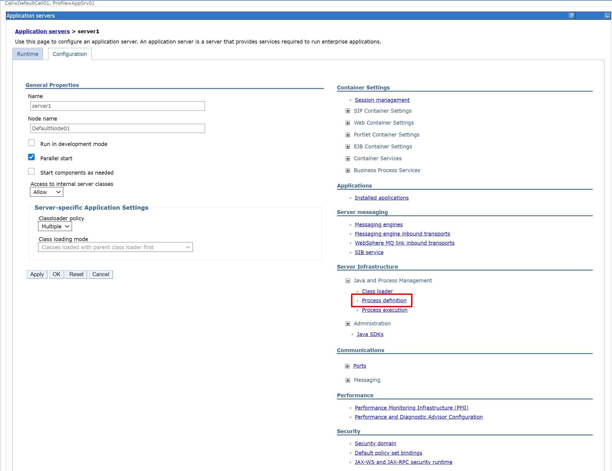

1.  On the Process definition page, under Additional Properties, select Java
    Virtual Machine.

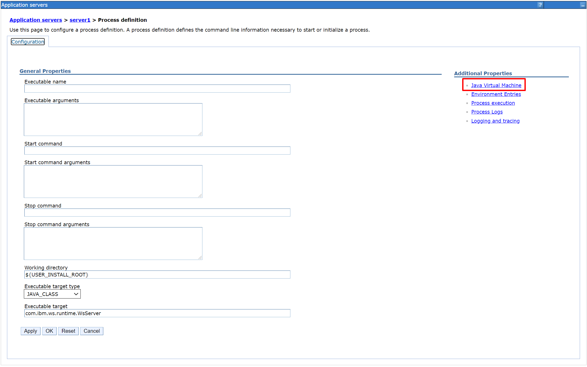

1.  On the Java Virtual Machine page, under Additional Properties, click Custom
    properties.

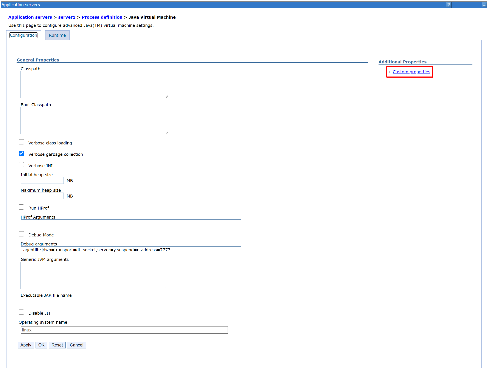

1.  On the Custom properties page, click New to create a new custom property.

   * In the property name, enter __usingCMSubjectCache__.

   * In the property value, enter __false__.

1. Click __Save__.

   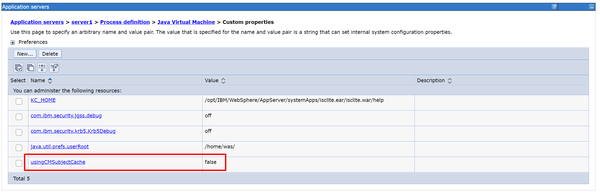

   This will disable the CMSubjectCache for the entire server and may affect other applications on the server. However, if all applications on the server use the ASCP, disabling it has no effect due to the ASCP 2nd level cache. For more information, refer to details of the LocalCacheLifeSpan parameter, in [Existing data source](https://docs.cyberark.com/Product-Doc/OnlineHelp/AAM-CP/Latest/en/Content/CP%20and%20ASCP/Configuring-App-Server-WebSphere-AppServerClassic.htm#_Ref375659814).

1. Restart the WebSphere server.
