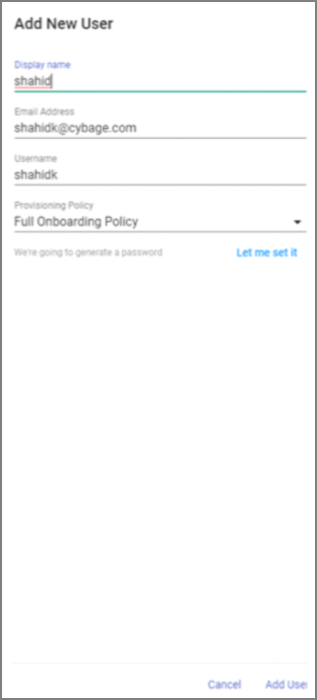
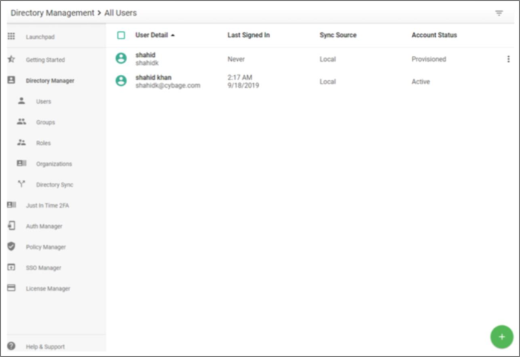
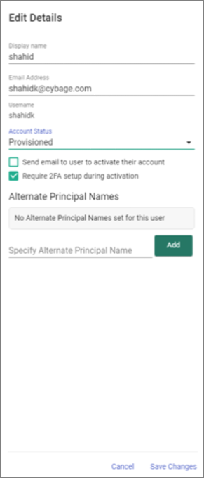
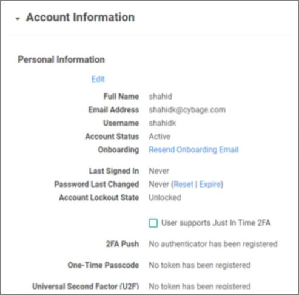

[title]: # (Download the RADIUS Agent Installer)
[tags]: # (agent)
[priority]: # (102)
# Download the RADIUS Agent Installer

## Before you start

   * Ensure you have administrative access to your AuthAnvil on Demand tenant.
   * You should be performing the following on the machine that will host the RADIUS Service.

1. On the left navigation tree, select the __Auth Manager | Agents__.

   
1. Download the RADIUS installer by performing one of the following options:
   * Click the ellipsis to the right of the agent and select __Download__ from the dropdown list.
   * Click the __Agent name__ and select the __Download Installer__ button that appears.

1. Once downloaded, run through the installation wizard on the machine hosting the RADIUS service.
1. Enter in the __ID__ and __Key__ that were copied during the RADIUS client creation.
1. Click __Next__.

   

   >**Note:** Home Realm is the user account used to sign in to the AuthAnvil On-Demand portalhttps://yourcompany.my.authanvil.com.

1. Complete the install steps with the Wizard and click __Finish__ when complete.

   

## Add a User (Example content)

This example shows you how to add a single new user with AuthAnvil’s interactive wizard.

1. Sign in to your AuthAnvil portal.
1. In the left navigation menu, select the __Directory Manager__. The All Users window appears.
1. In the All Users window, click __green plus sign | Add a User__. The Add New User panel appears.
1. Enter the __display name, email address, and username__ with your information.
   * Display name – name
   * Email – xxxx@companyname.com
   * Username – username
   * Choose a policy for the new user

   

   >**Note:** The Default Policy does not send an onboarding email. The Full Onboarding Policy sends an activation email to the specified email address.

1. Click __Add User__. AuthAnvil returns to the All Users view and the new user is now on the list.

   
1. Click the __ellipsis__ next to the new user. The Account Information window appears.

   
1. Click __Edit__.

   
1. Click the __Account Status__ dropdown menu and change the status to __Active__.
1. Click __Save Changes__.
1. Next to Password Last Changed, click __Reset__ to reset the user password.

   
