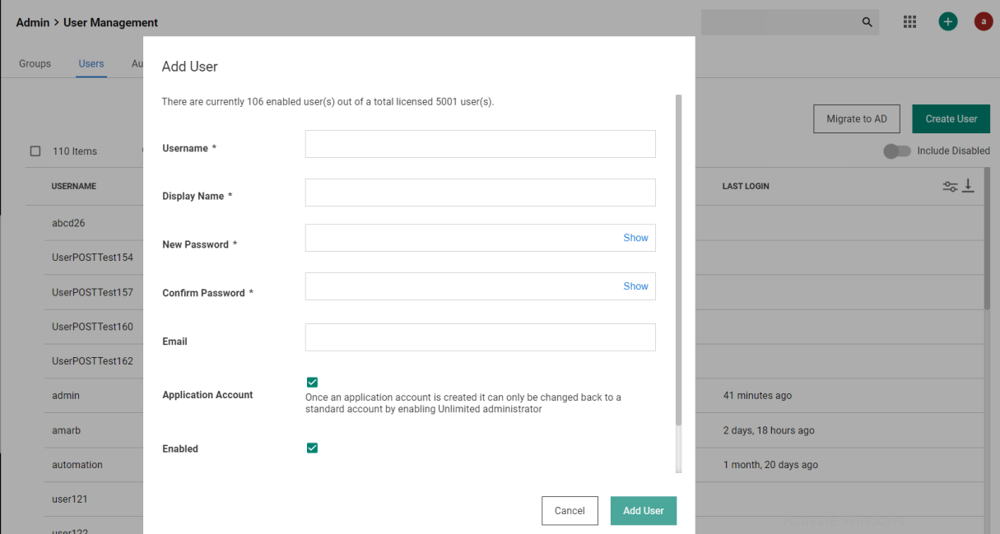
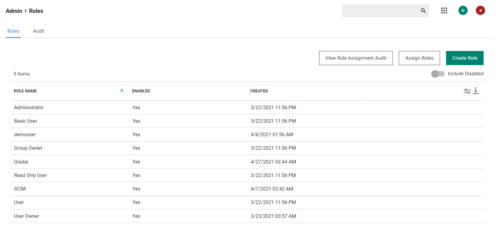
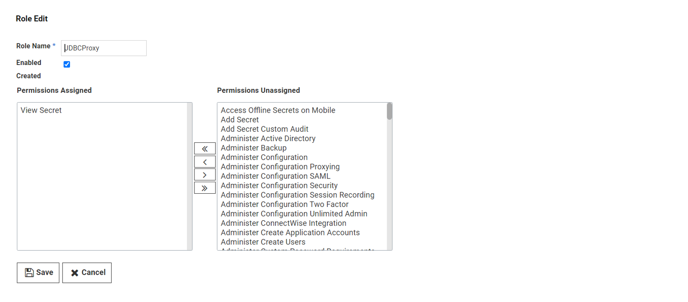
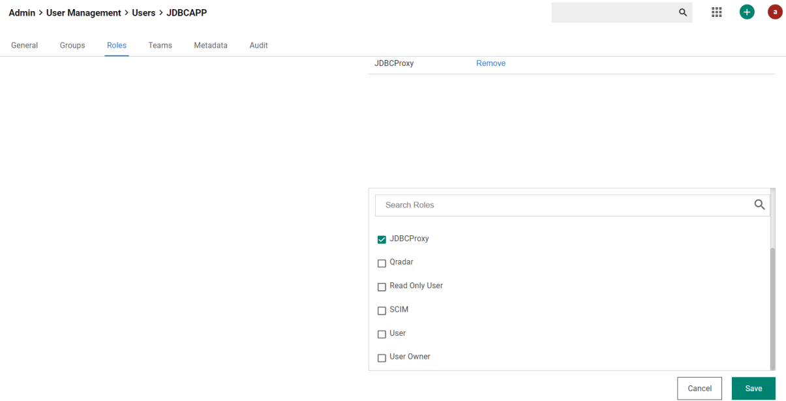

[title]: # (Create App Account)
[tags]: # (application account)
[priority]: # (101)
# Create Application Account in Secret Server

1. Login to Secret Server with admin credentials and click on __Admin | Users__.

   

1. Click on __Create User__ on the User Management page.

1. The __Add User__ details popup will be displayed. Enter the details and click on the __Add User__ button.

   

   >**Note:** Make sure to check the checkbox for __Application Account__.

1. Assign the correct permissions to the created application account by navigating to __Admin | Roles__.

   

1. Click on __Create Role__.

1. Enter the name of Role and select __View Secret__ permission.

1. Click __Save__.

   

1. Navigate to __User Management__ by clicking on __Admin | Users__.

1. Click on the application account created in __Step 3__ above.

1. Click on the __Role Tab__ menu option of the application account user.

   

1. Click on Edit and assign Role created in __Step 6__ above.
1. Click __Save__.

   