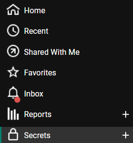

[title]: # (Create a Secret)
[tags]: # (secret)
[priority]: # (102)
# Create Secret in Secret Server

1. Login to __Secret Server__.

   

1. Click on the __Secret Menu__ on left side of the window.

   

1. Click on __+__ icon to create secret.
1. Choose the Secret Template as a __Oracle Account__.
1. Click on the __Create Secret__ button.

   

1. Enter your Database Connection credentials into username and password.

   

1. Navigate to the __sharing__ option on the particular secret and add the user __View Permission__.  

   

   >**Note:** the __Secret ID__ created in the URL. In the above case, the Secret ID is 1160.
